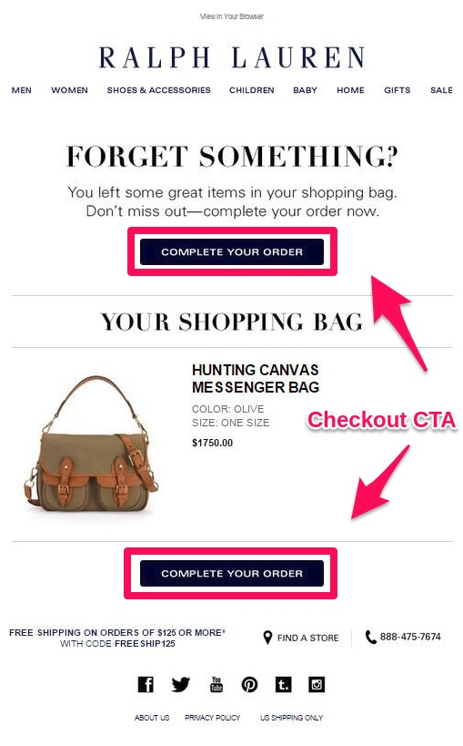
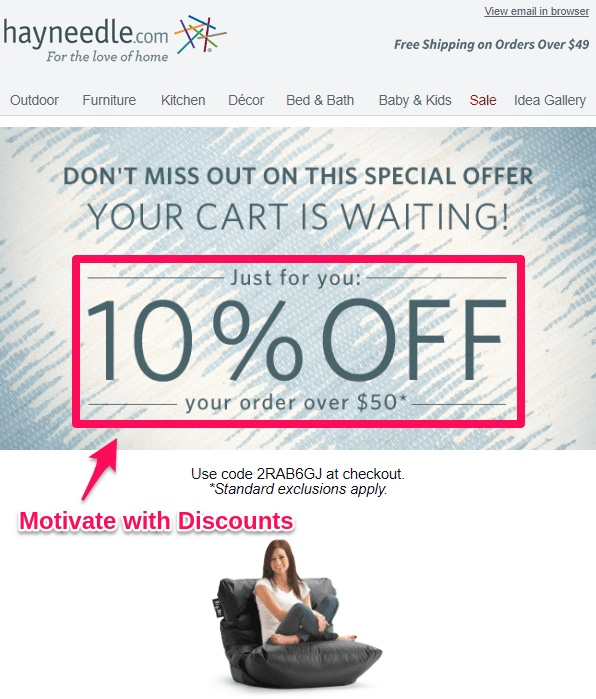
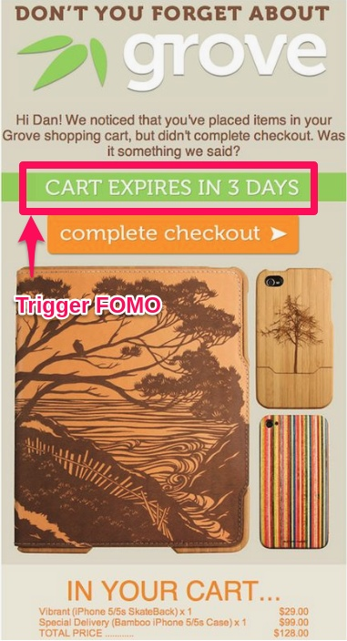
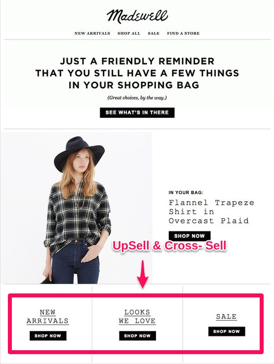
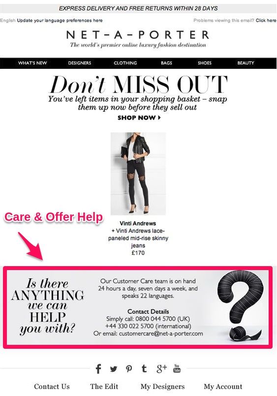
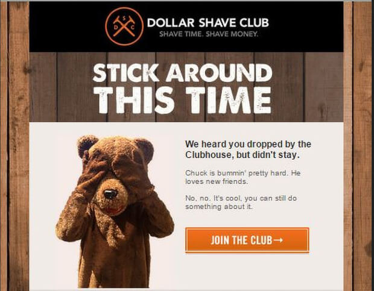
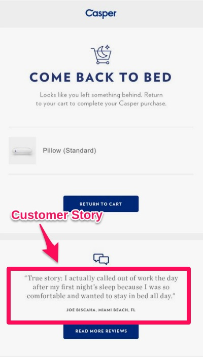

Cart abandonment is a tough reality to accept if you are running an online store. Yes, 70% of your website visitors are going to leave your store without shopping.

Something needs to be done to make customers recover their abandoned carts.

And, that’s what this read is all about.

Grow into a much smarter email strategist by learning from top brands & use those interesting ideas to write irresistible cart recovery emails.

<toc></toc>

## What is an abandoned cart?
How many times have you noticed too many clothes hanging inside a fashion store change room?
That’s because some shopper had the idea to buy it but later decided to leave it hanging, I meant abandoning.  

This same thing can happen to your online store. Website visitors may add products to the cart but exit store without buying. This is what remains to be the biggest concern for eCommerce stores- Cart abandonment.  

So, How are you going to call the customers back and ask them to recover carts?
Of course, by sending emails.

  
## Why send Cart recovery email?

Email marketing is still the lively strategy to <link-text url="https://www.campaignrabbit.com/blog/17-ways-to-increase-your-ecommerce-revenue-through-email-marketing/" target="_blank" rel="noopener">grow your eCommerce revenue</link-text>. You can very well recover 30% to 40% of your abandoned sales with cart abandonment email reminders.

Every established online brand face cart abandonment and it is email marketing what they rely on to win customers back.

And, how they write their abandonment emails is what makes things really interesting.

## 7 Productive Cart Recovery email examples

Want to know their cart recovery email recipe?

The following are some amazing cart recovery emails of popular online brands. Write such abandonment emails & lure customers to recover their abandoned carts.

## Use Simple Checkout button
 
*Nothing Less… Nothing More* - <link-text url="https://www.ralphlauren.com/" target="_blank" rel="noopener nofollow">_Ralph Lauren_</link-text> 

The key focus of every cart recovery emails is to make the customer shop their abandoned cart. And that’s done by adding a prominent call-to-action button.

Provide seamless user experience by using CTA buttons that can directly take your customers to the abandoned cart.

Also, don’t be adding long phrases in your CTA features. In fact, asking customers to buy from your store is the highest level of commitment you can ask for.

So, try to add simple phrases in your CTA instead of asking customers to Buy all in a sudden.

Well, just look how Ralph & Lauren phrased the CTA minimizing the intent of commitment.

### Motivate Customers with Discount
*Feed the Fish - Hayneedle*

Baits get you fish & Discounts gets you Sales. And that’s the simple strategy in WooCommerce which most of you know already.

But, when and where to offer those discounts is the critical part. Because you can’t grow your revenue if you’re discounting in a random fashion.

You see most times people abandon carts because of extra taxes and shipping charges. So, convince the customers to buy the abandoned cart items by <link-text url="https://www.retainful.com/features/woocommerce" target="_blank" rel=“noopener”>sending a coupon code along your cart recovery email</link-text> 

That’s how Hayneedle craft their cart recovery emails. Also, their abandoned cart email is mainly focused on offers. Don’t miss to see how they pitch to increase the average order value by offering free shipping discounts for higher orders.

  
### Spark Buying Intent with FOMO

<link-text url="https://grovemade.com/" target="_blank" rel="noopener nofollow">_Grovemade_</link-text> 

Word Up!

60% of people make reactive purchases because of FOMO, says <link-text url="http://strategyonline.ca/2015/03/09/the-impact-of-fomo/" target="_blank" rel="noopener nofollow">Strategyonline</link-text>.

FOMO… Does that sound alien?

So, have you ever rushed to pre-order a limited edition merchandise of your favorite brand?

Surely, you would’ve and that’s because of the "fear of missing out (FOMO)" got to you.

People rush to make a quick buying decision when there’s a scarcity.

So, what if you let your customers know the products they abandoned are selling fast.

Would that kindle the interest of your customers?

Well, I guess that’s the email marketing strategy of Grovemade. Look how they push customers to recover abandoned carts by writing ‘Cart Expires in 3 days’.
  

###Take the Opportunity to Up-sell and Cross-sell

_See no window, Build one - Madewell Inc._

Ever thought of using emails as sale banners? You could very well try to sell more by sharing the latest product updates in your cart recovery emails.

The best thing about the cart recovery email from ‘madewell’ is that it not only reminds  customers about abandoned carts but also pitches their best selling products. Now, that’s classic Upsell and cross-sell.

  

### Be a Sweetie Pie 

_Net-a-porter_

Sometimes, you just got to the go extra mile which most online stores fail to do.

And what’s that?

Offer Help and care customers. Provide them with contact information in case if any of your customers want to reach you for queries.

This email idea definitely helps in growing your customer loyalty.

It’s more clear that Net-a-porter cares for its customers than just pushing sales. The intentions of the cart recovery email is simple and clear and distinguished with bigger fonts.

_‘Don’t miss out’_ reminds about abandoned cart

_‘Is there anything to help’_ express concern to customer queries.

### Jump out of the Box

_Dollar Shave Club_

Why be serious with all your emails?

Sometimes writing emails the fun way can really win your customer hearts.

This email of Dollar shave company is definitely something unique in the bucket.

Writing the email in their very own style with an engaging call-to-action button and the really cool image of _Chuck_ are the things to look out in this particular caret recovery email.

  

  
### Share customer story 
*The Whisper- Casper*

People might resist trusting your store but are definitely influenced by what fellow customers say. Casper is brilliant in using customer story to their advantage.<link-text url="http://strategyonline.ca/2015/03/09/the-impact-of-fomo/" target="_blank" rel="noopener nofollow">Social proof is the trump card for your eCommerce conversions</link-text>.

People will get interested in the success stories. Writing cart recovery emails with customer stories, testimonials, social proof, and reviews can script the best chances to increase your conversions.

 ## Pro Tips & Tools to send your Cart Recovery emails

-   Create a series of Cart recovery email campaigns.    
Say, 
1st cart recovery email after 24 hours  
2nd after 48 hours   
3rd after 72 hours of cart abandonment.   
- It’s a mobile growing world. So be sure to optimize the mobile user experience.
- Retainful is an exclusive tool to write, schedule, automate amazing cart recovery email reminders. Ain’t gonna speak much on Retainful but you’ll love what you hear next,
<link-text url="https://www.retainful.com/blog/the-simple-way-to-retain-all-your-customers/" target="_blank" rel="noopener">Retainful is EXCLUSIVELY FREE</link-text> 

Enjoy the rest of the day.

Crush it!