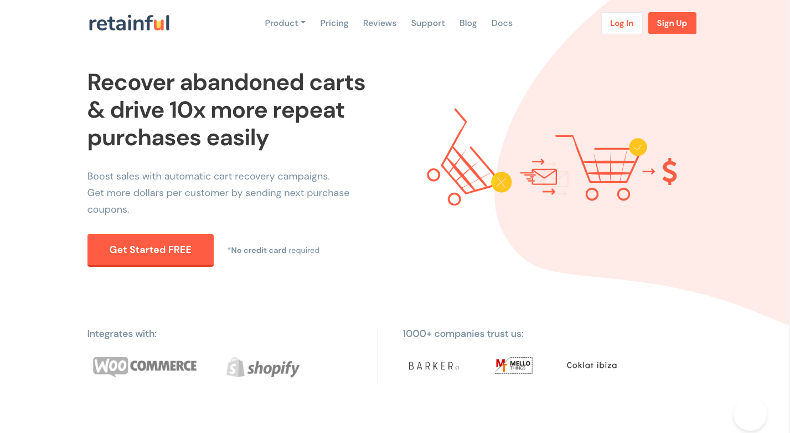
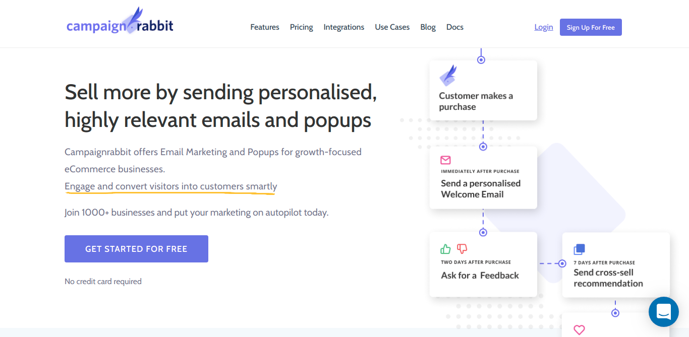
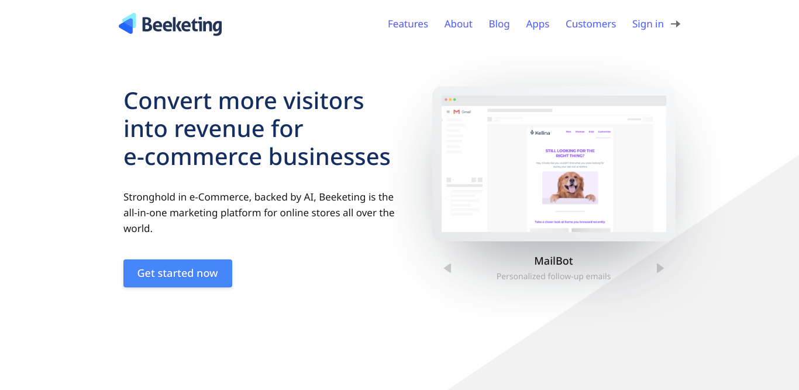
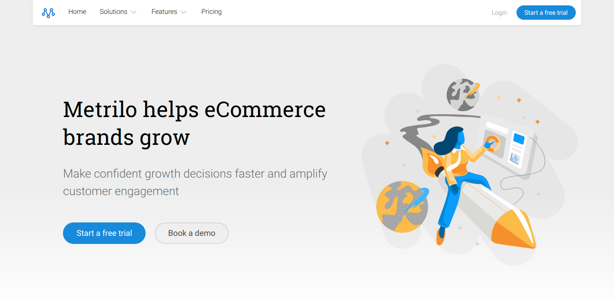
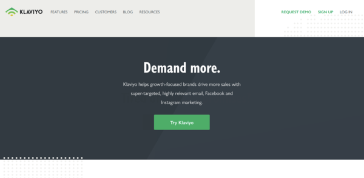

“Customers are the greatest asset for every eCommerce store because without customers there is no trading.” If you ask any successful e-commerce store owner, they would possibly give all the credits to their customers for all they have become.

Customers are more than just profits. They are the ones who are responsible for your business growth. Retaining them and building strategies to impress them is definitely going to lead you to the path you are expecting you would.

Time for some compelling stats!     
**According to [Motista](https://www.motista.com/), your emotionally connected customers spend a whopping annual sum of $699 with you, whereas other customers spend only up to $275.**

Feel the humongous difference. 

<toc></toc>

## List of Customer Retention tools for your eCommerce store
Whatever be your eCommerce platform, we’ve got you covered with this post. For all Shopify, WooCommerce, Prestashop, BigCommerce, Squarespace store owners out there, following is the list comprehended with the best customer retention tools.

### [1. Omnisend](https://www.omnisend.com/)

Ever heard of a multichannel plugin that is specially designed for the ease of all e-commerce platforms? If you have guessed it right, it is Omnisend. Omnisend has been in the limelight for a long time now.

**The best feature that Omnisend is all known for is its email marketing automation**. It allows you to build user-friendly, customizable visual editors with various templates. Moreover, one can create elegant emails with the help of drag and drop visual email builders. 

This plugin concentrates on retaining customers through constant mailing to make them aware of your store's latest moves and inclusion of features. Email marketing is an area with no definite boundaries. It can be used in so many ways to <link-text url="https://www.retainful.com/blog/the-simple-way-to-retain-all-your-customers/" target="_blank" rel="noopener">retain your customers</link-text>. Use Omnisend and see the conversion rates increase by many folds.

____

### [2. Retainful](https://www.retainful.com)

Retainful is a very efficient plugin that has proved fruitful in retaining customers for long-serving period. While many tools focus on email marketing, Retainful does the same with a little nuance.

It comes with a unique coupon code generation that is just another way to please your customer insinuating for another purchase. Setting up <link-text url="https://www.retainful.com/blog/how-to-provide-next-order-coupon-in-woocommerce/" rel="noopener" target="_blank">Next order coupon discount</link-text> encourages customers to make repeated purchases at your online store. The conversion tool helps you create both simple percentage coupons and flat priced coupon discounts.

If you think that's all, you are wrong.     
Retainful takes an active role in helping you out with cart abandonment recovery. It also helps you create timed email remainders.  Well built features all in one simple and productive package isn't it?.

And the best part is that Retainful is FREE.

**Keynotes**
- Easy integration with WooCommerce and Shopify
- Drive repeated sales with unique Next order coupon
- Increase revenue by encouraging customers to retrieve abandoned cart items

____

### [3. CampaignRabbit](https://www.campaignrabbit.com/)

CampaignRabbit is another valuable marketing automation tool to retain customers in huge amounts. Segmentation and automation make Campaign rabbit’s features stand above the rest. 

Engaging your customers through active email marketing is the best strategy to retain them for long. Well, automating your email campaigns is what Campaign rabbit does the best.

What CampaignRabbit does the best?  
Creating and automating the following email campaigns is what going to make your customers stay for long.

- **1. Welcome emails** - Personalize your welcome emails easily with the simple drag and drop email editor.
- **2. Follow-up emails** - Drafting feedback emails and checking on customer satisfaction improves your brand credibility.
- **3. <link-text url="https://www.campaignrabbit.com/blog/reduce-cart-abandonment-recovery-solutions/" target="_blank" rel="noopener">Cart recovery emails</link-text>** -  Automate data-driven emails to customers who have abandoned carts and encourage them to recover carts.
- **4. Customer win-back emails** - Get your inactive customers to shop again at your with coupon carrying emails.

With Campaignrabbit , you can also include potential CTA buttons like ‘add to cart now’ and urge your customers to take necessary actions.

**Keynotes**
- Integration with WooCommerce, Shopify, Shopifyplus, J2Store made simple.
- Powerful email list segmentation based customer behavior
- Data-driven email automation
- Get insights on your online revenue, email conversions, potential sale
- opportunities, abandoned cart value and much more. 

____

### [4. Beeketing](https://beeketing.com)

Beeketing claims to be a popular plugin all around the world these days. Why?  Because it is feature-rich and efficient.

We bet you would have heard about its best of all feature. If you haven't, beeketing is well known for handling personal communication with customers via social media platforms, like Facebook. This makes sure your existing customers come to you every time when they face an issue.

It doesn't just stop here.
Beeketing is the perfect marketing tool, helps you send follow-up campaigns to your customers. Engaging with customers gets easy now right? It helps you sell more to your customers by up-selling and cross-selling methods.

Impressing your customers with coupons have become even easier. You can create coupon pop-ups to motivate your existing customers to purchase more. Beeketing is yet another optimum plugin, in case you want to retain your loyal customers. 

____

### [5. Metrilo](https://www.metrilo.com)

Metrilo is a growth analytic tool that helps eCommerce store runners to perform better and come up with different strategies to achieve success. 

**Metrilo’s crowning feature of retention is, it helps you create a healthy comparison of marketing channels that in turn maximize the ROI.** It goes on with a funnel tracking methodology. Funnel tracking can turn any customer into a paying customer and in case of loyal ones, it encourages more. 

The <link-text url="https://www.campaignrabbit.com/blog/grow-your-ecommerce-store-with-9-effective-automated-emails/" rel="noopener" target="_blank">automated feedback segmentation</link-text> and personalized email conversations are way more elegant and less cumbersome with this plugin. It has in-built tools that help inactive customer engagement. It's a win-win for store owner and the customer. It'll boost your customers to indulge in purchase and drives repeat sales.
____

### [6. Conversio](https://conversio.com)

Conversio is yet another email plugin that helps in the creation of beautiful, personalized emails. To add more, it helps you increase customers lifetime value by drag and drop upsell products.

As mentioned above, it extends a helping hand in email customization. When it also helps in creating newsletter emails to drive sales even better. Referrals have proved successful for the e-commerce store and no one denies that. 

**Conversio helps you send referral emails to serve as an active remainder for your customers to refer their circle.** Your existing customers would be glad to market your brand for free when you give them referral perks. This is not all. Conversion further increases ROI by automated feedbacks. Who wouldn't call this feature rich with all these prominent countenances?

____ 

### [7. Klaviyo](https://www.klaviyo.com/)

Klaviyo is a marketing automation tool that helps brands drive in more sales with marketing strategies such as social media marketing using widely used platforms like Facebook, Instagram. It also helps you to drive more sales using email marketing.

Klaviyo has multiple integrations with CRM platforms like BigCommerce, Woocommerce, Shopify plus, etc. With the help of Klaviyo, you can monitor the sales conversions and ROI.

Key features of Klaviyo includes, **automated email triggerings, follow up emails for abandoned cart recovery, welcome emails**.

Do you know?    
**Shopify stores make a reasonable $85 for every dollar they invest in Klaviyo**. Isn't this just amazing?  
On the other side, Klaviyo's integration with woocommerce helps you in tracking customers who abandon the cart and you can't send them follow-up emails. 

Other interesting features of Klaviyo includes,
- Targeting strategies using customers shopping behaviors and history.
- Creating personalized dynamic coupons.
- Easy to use create emails using drag and drop builders.

**40% of customers say that when they feel satisfied, they stay loyal to a brand, says <link-text url="https://www.inmoment.com/business-and-customer-experience-intelligence/" rel="nooopener nofollow" target="_blank">Inmoment.</link-text>** We always believe if you don't take care of your customers, somebody else well. So, wait for what?. Make use of these well-crafted plugins to retain your customers and create huge profits.