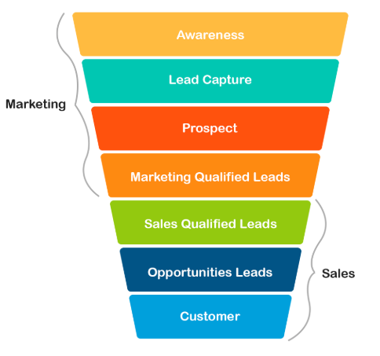
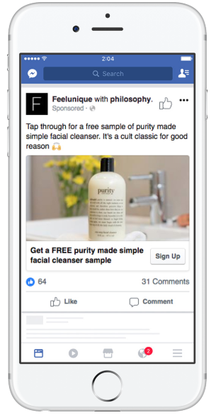
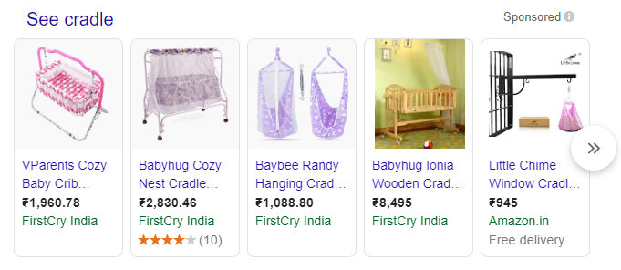
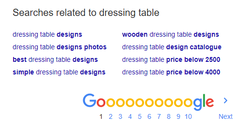
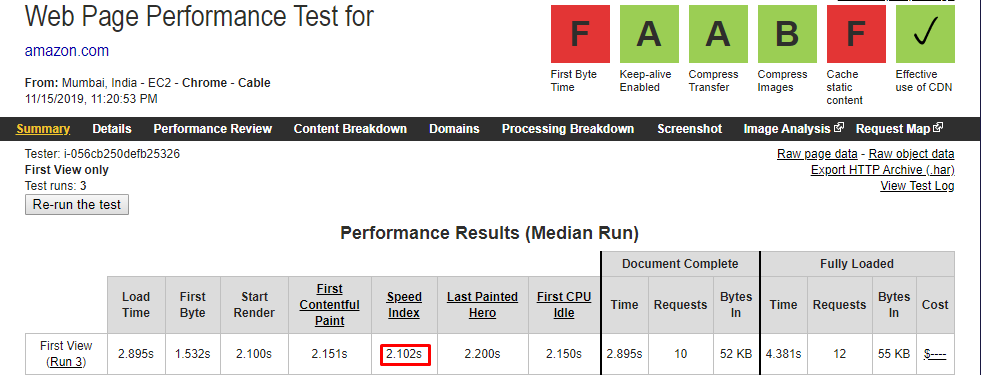
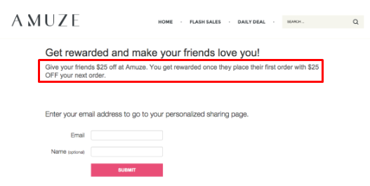

Consistency pays off. Oh yes, it does. It applies to all roles including a WooCommerce store owner. Are you one? If yes, consistency is your savior. You might ponder ‘Consistency in what’?

Data-driven and thoughtful EFFORTS.

Efforts to increase eCommerce traffic.

Efforts to convert website visitors into customers.

Efforts to claim the top spot and remain there.

This informative read focuses on the first step of bringing in more traffic. Indulge, learn effortlessly and take back home a new tactic to better your online business.

<toc></toc>

## Why are businesses obsessed with increasing eCommerce website traffic?

Why on earth would you ask that question?

Of course, you need website traffic to <link-text url="https://www.retainful.com/blog/how-to-provide-next-order-coupon-in-woocommerce" rel="noopener" target="_blank">generate more leads and sales</link-text>. As simple as that.

Its high time you rethink about the importance you have given to website traffic all this while. If you have not bothered much about it yet, take a look at this marketing and sales funnel.  

 
The eCommerce funnel is wider at the top with more number of people coming in initially. At each stage of the funnel, an unimaginable number of prospects drop out, leaving just about 1 - 5% at the end as customers.

If the inflow of prospects takes a hard hit, the conversion rate too might decline if certain precautions are not taken. So, focus on driving traffic to your online store as long as you plan to run your WooCommerce or Shopify store.
  
## How to drive traffic to your eCommerce site?

Meditate on traffic because you need tons of it to reap success in eCommerce. 9 proven sure-shot strategies are discussed here. Read on.

### Run Facebook ads

No one can vehemently deny the fact that Facebook is the torch-bearer for social media promotion. There are many types of Facebook ads that can be leveraged to bring in more traffic to an online store. Video, image, lead, carousel, slideshow, etc,.

Either stick to one type of ad or use 2 to 3 types in rotation to attract consumers. Video ads, lead ads, and retargeting ads are highly recommended.

#### Video Ads

Video ads click because

-   The <link-text url="https://www.business2community.com/ecommerce/9-best-facebook-ad-campaigns-to-boost-ecommerce-sales-02181615" rel="noopener nofollow" target="_blank">interaction rate for a Facebook video is much higher</link-text>than that of a Youtube video. Facebook videos are so valuable.
    
-   The impression that visual content creates stay longer in memory and has a positive effect on sales for eCommerce.
   
Video ads must be all about just one product when it is for the eCommerce sector. Say, you want to promote a new couverture chocolate brand. It is suggested to present a baking or cooking video using that chocolate. Rather than just presenting images of the chocolate, videos sell better.

#### Lead Ads

More leads get more traffic. The only hassle is that lead ads are meant to be used only for mobile devices. Absolutely no issues. It so happens that more people browse and shop using mobiles.

Here is an example.

Philosophy is a beauty brand that used <link-text url="https://www.facebook.com/business/success/philosophy" rel="noopener nofollow" target="_blank">lead ads to generate 9000 leads</link-text> within a span of 15 days. Impressive.
  

**Points to note**

-   Lead ads alone cannot be used to drive traffic because you only get to collect email addresses. Follow-up with email marketing to get them to your website.
    
-   In the example mentioned above, Philosophy used links ads along with lead ads for their campaign. Links ads take the Facebook user directly to the desired webpage.
    
-   Choose your audience to target them better.
    
#### Retargeting Ads

Facebook ads are incomplete without the mention of retargeting. Some even call it remarketing.

This is all about getting in touch with the existent, inactive user base. It also serves as a reminder for abandoned carts. What do you retarget your customers with?

Retarget with

-   A product
    
-   Blog post
    
-   Service offering
    
-   eBook page
    
-   Anything that provides some value
    
### Don’t put behind Google Ads

Let’s discuss two types of Google ads for eCommerce - shopping ads and search ads.

#### Shopping Ads

Creating shopping ads is easy. You just have to create a Merchant account with Google and upload your product feed/information.

Based on the feed, Google will decide if your product needs to be displayed there.  

> **_Tip to nail Shopping ads_**      
See that you are persistent in gathering customer reviews. Star-ratings are displayed in the shopping ads which has a direct impact on the CTR.

Type in the word cradle, and this is what comes up. All eyes are on the second product with the star-ratings. It is only obvious that this particular product will have a higher CTR.

#### Search Ads

The key to getting featured in a Google search ad is using the right keywords. Google Keyword Planner Tool can be leveraged to choose the ones that promise higher conversions.

In the image shown above, the search results are for the search term ‘laptops’. Most people will go for the first and second ad. You know why? It is because of the use of ad extensions. Ad extensions provide the benefit of fitting in more information and links to the website relevant to the search.

>**_Tip for better Google Search ads_**                 
The copy written for search ads must be optimized for keywords. Keywords used by competitors can be utilized to your advantage. Make sure to mention the keyword in the headline itself.

### Master SEO

Search Engine Optimization. This is a must-do to rank better in Google and eventually increase eCommerce traffic.

Google takes into account over 200 factors to rank web pages. Let’s have a look at the most important ones.
  
The concept of ‘keywords’ come running to your mind with the mention of SEO. Yes, keywords are a core component for SEO but there is another component that must be given much more attention and time - backlinks. Backlinks come first and then keywords.

#### Backlinks

Neil Patel says, “The No.1 factor that affects rankings is backlinks.” One of the prime strategies that fall under off-site SEO - creating <link-text url="https://www.sellbrite.com/blog/backlinks-for-ecommerce/" rel="noopener nofollow" target="_blank">backlinks to increase eCommerce traffic</link-text>.

Backlinks are incoming hyperlinks from one web page to another.

Factors that determine backlinks

-   Quality
    
Backlinks from sites with proven domain authority must be given preference. In other words, sites that are very much popular and ones that already have a good reputation with Google search rankings.

-   Quantity
   
Websites that are years old are bound to have a huge number of backlinks in thousands. For beginners, it is essential to start off with at least 25 to 50 backlinks with 70% no-follow and 30% follow.

Prefer quality over quantity, no matter how old your eCommerce business is.

How to start generating backlinks?

-   Copy your competitors’ strategy
    
-   Track down broken links and optimize them
    
-   Start guest blogging
    
-   Reach out via email to get backlinks
    
-   Ask competitors’ to give you a mention
    
#### Keywords

No keywords. No SEO. They both go hand-in-hand.

There is no specific number regarding the types of keywords that can be optimized for SEO. When one blog post mentions about 10 types, another claims the presence of more than 15.

Irrespective of the number, as a WooCommerce store owner, you must be familiar with the following 3 types of keywords.

**Short-tail keywords**

Keywords that have a word count of 3 and less are considered short-tail keywords. For example, in this post, ‘increase eCommerce traffic’ is a short-tail keyword.

Short-tail keywords are

-   Vague
    
-   Not specific
    
Their presence is absolutely important as a starting point for SEO.

**Long-tail keywords**

Neil Patel calls <link-text url="https://neilpatel.com/blog/long-tail-keywords-seo/" rel="noopener nofollow" target="_blank">long-tail keywords</link-text> as the holy grail of SEO with reason. 70% of web searches consist of long-tail keywords. So, he emphasizes concentrating on these keywords that will help generate content that is sought after by the customer.

Long-tail keywords are ones that are

-   Specific in nature
    
-   Low search volume
    
-   High conversion rate
    
Hence, the chances of ranking higher with Long-tail keywords are better.

If you are someone who sells handmade Swiss watches online, ‘buy Swiss watches’ is a short-tail keyword with high search volume. There would be a number of sites that come up along with yours.

When the keyword is specific like ‘buy handmade Swiss watches online’, the search narrows further down and you may attract more eCommerce website traffic.  

**LSI keywords**

LSI - Latent Semantic Indexing. Keywords that have a semantic relation to the main keyword are called LSI keywords.

Google the word ‘dressing table’ and you will find related searches at the bottom of the page. They are the LSI keywords. This is very helpful to write content on a broad theme with information of all the relevant searches.

#### Google Search Algorithm updates

The search algorithm is the one that determines the factors to stay on top of the search results. There has been a recent and very important algorithm update that affects rankings.

BERT update (October 2019)

<link-text url="https://searchengineland.com/welcome-bert-google-artificial-intelligence-for-understanding-search-queries-323976" rel="noopener nofollow" target="_blank">BERT</link-text> stands for Bidirectional Encoder Representations from Transformers.

Google rolled out the biggest ever search algorithm update after Rankbrain. Natural Language Processing is the focus of this update by using Artificial Intelligence and it impacts 1 out of 10 searches, especially the featured snippets.

The search engine giant now understands the relation between words, i.e, the meaning of articles, prepositions, and conjunctions. Earlier on, SEO strategy was all about focussing on keywords. Now, other relative words must be taken into account too while planning the content.

### Craft outstanding Emails

 

<link-text url="https://www.campaignrabbit.com/blog/17-ways-to-increase-your-ecommerce-revenue-through-email-marketing" rel="noopener" target="_blank">Email marketing</link-text> is similar to advertisements. A person comes across hundreds of emails day in and day out but only a few draw attention. Want to get noticed? Get set to create exceptional emails that leave a mark. A positive mark.

 

Sending out emails start with <link-text url="https://www.retainful.com/docs/woocommerce/collect-email-address-before-adding-to-cart-in-woocommerce" rel="noopener" target="_blank">email collection</link-text>. Post <link-text url="https://optinly.com/blog/10-popup-hacks-to-build-your-email-list" rel="noopener" target="_blank">email list building</link-text>, it is a tedious task to bring that person back to the eCommerce site from time to time (not just once) to simply hang around and take a look.

**_Emails are prompts to invite the customer to the website and it starts right after the address gets collected in your database. Email maps the customer’s journey._**

This is a sample flowchart for an email series.

Of course, there are many other email types like promotional, seasonal, upsell/cross-sell, discount, feedback, reminder emails that can be included in this structure and customized as per your needs.

**_The characteristics of an email that drives eCommerce website traffic_**

-   Catchy <link-text url="https://www.retainful.com/blog/13-best-subject-lines-for-abandoned-cart-email-campaigns" rel="noopener" target="_blank">subject line</link-text>
    
-   Personalized, customer-centric content
    
-   High-quality images
    
-   Clearly visible, prominent CTA
    
-   Enticing discounts/rewards.  

### Keep an eye on the Site Speed

A compilation by Kissmetrics says

-   47% of website visitors expect a page to load in 2 seconds or even lesser
    
-   40% of visitors leave the website if the loading time goes beyond 3 seconds
    
Did you know that <link-text url="https://www.bitcatcha.com/blog/6-reasons-why-website-speed-matters-how-amazon-would-lose-1-6-billion-if-it-slowed-down/" rel="noopener nofollow" target="_blank">Amazon will lose $1.6B/ year if the speed of the site slows down by just 1 second</link-text>? This is why they do not take chances. Here are the results for you to see.

**Result 1**

Amazon.com increases eCommerce website traffic with a Speed Index of 1.002s when viewed from Dallas using Chrome.

**Result 2**

Amazon.com has a Speed Index of 2.102s when viewed in India using Chrome browser.

The same website shows different timings when the location changes. This is what you learn here.

> **_Takeaway_**                
Website speed differs based on the geography. But why?

Competitors are taken into consideration when setting up the site. You just have to stay on top. 2.102s must be the best speed in India but definitely not for the USA where the competition is much tougher in the online retail sector.

</call-out>

By the way, Retainful has Speed Index of 2.930s (Yah! Below 3).

Other parameters based on which speed differs are device and industry. Yes, the average mobile page speed for the retail sector in the US is 9.8s. So, take into consideration all of these aspects and decide on how to <link-text url="https://www.flycart.org/blog/woocommerce/how-to-make-your-woocommerce-store-load-quick" rel="noopener" target="_blank">make your WooCommerce store load quick</link-text>.

### Encourage Referral Marketing

 

Without a doubt, <link-text url="https://www.flycart.org/blog/woocommerce/10-best-referral-marketing-strategies-for-woocommerce" rel="noopener" target="_blank">referral marketing strategy</link-text> is one extraordinary trick to increase eCommerce website traffic.

 

 Amuze is a designer label that deals with high-end fashion. The above image is that of their referral program that gives $25 off for the existing customer and the person referred. People will definitely take reins looking at the reward.

What can be the types of rewards?

Rewards can be of any type like

-   Money
    
-   Loyalty points
    
-   A complimentary product
    
-   Early access for flash sales / new product launch
    
Of all, money as reward is the best way to market online store and <link-text url="https://www.business2community.com/marketing/numbers-dont-lie-2016-nielsen-study-revealed-referrals-01477256#TRrVqUTL4gqFCJqb.97" rel="noopener nofollow" target="_blank">77% of Americans vouch for it</link-text>.

> **_Takeaway_**            
Referral marketing works better when there are two-way benefits.

### Count on Content Creation

Content rules the eCommerce empire. When content is used to trigger a purchase by hitting the bull’s eye, there cannot be anything better. Here, we look into 4 types of content.

#### Website Content

Obviously, you wouldn’t start an eCommerce store without setting up a site. Without content, call it a ‘web template’ and with content it is a ‘website’. So, content plays a crucial role in the initial phase of the business itself.

Let’s get more specific. With regards to an eCommerce site, the onus is on product descriptions when it comes to content. Product descriptions are the ones that are most read and the reason can be perceived by anyone - to know the product better.

Here is how to nail it.

> **_The secret to drafting an outstanding product description_**       
Gone are the days when an advertisement boasts about a product. Instead, it is about how the product can make a customer’s life easier or more comfortable. Only this will sell.

Example This pacifier is light-weight and made with toxin-free material.

A light-weight, toxin-free pacifier that soothes your baby in an instant.

Get the difference? The first example is just about the construct of the product while the second one throws light on the benefit to the user.

#### Blogs

Blogs are the best way to market online store. It has become mandatory nowadays and it is a rat-race with hundreds of blogs on the same topic. How to make a blog stand out? It does not happen overnight. A considerable amount of time and effort goes behind it.

A blog gets noticed when it

-   Provides exclusive information
 
 For exclusivity, read blogs of your competitors and check what content they have missed out on. You can garner a loyal following this way.

-   Ranks higher in Google
 
There are certain <link-text url="https://neilpatel.com/blog/optimize-blog-articles-rank-high-google/" rel="noopener nofollow" target="_blank">characteristics of blogs</link-text> that help with higher ranking in Google. Some of them are given below.

1.  Thoroughly researched, in-depth writing
    
2.  Updated content that engages rather than one that promotes
    
3.  Content that covers a wide number of related aspects
    
4.  A word count of 1500 and above but 2000 is a safe bet
    
5.  Ease of readability
    
6.  SEO optimization as per the latest trends
    
7.  Being aware of Google search rank algorithm updates
    
In spite of all these, blogging must be done regularly and over time Google recognizes the strong presence of your WooCommerce online store, thereby increasing eCommerce traffic.

> Reach out to neighboring sites to contribute guest blogs. This is one apt way to gain exposure.

#### User Guides

User guides are an essential part of online businesses to educate people on how to use products. Some people overlook this aspect. When user guides are all about engaging the customer, why not take them into account?

  

  
For example, when a person is a first-time buyer of a makeup kit and is not sure about how to use it, it is indeed a good idea to give them a guide about usage, maintenance, and maybe even a tutorial.

The above image shows a product description page of the Amazon website. It guides the customer on how to maintain the makeup brushes and in addition, an exclusive booklet is also provided with the product for detailed information on usage.

To increase eCommerce traffic, user guides must be marketed via emails and social media and when a customer hesitates to buy the product.

#### Video Content

Let’s take the same example of buying a makeup kit. Rather than buying a product online and experimenting with it, most people depend on influencers for a product review. Video content is booming and with video, Youtube comes to the mind.

Connect with makeup artists and influencers to stream a video using your brand’s makeup kit. The results will be there to see and of course, the to-be-customers also get a free video tutorial.

The same video can be used for driving traffic to your online store by publishing it on social platforms and of course, on your eCommerce website.

> The most preferred social platforms (in order) to post video content are   
>  1.  Facebook
>  2.  Twitter     
>  3.  Linkedln

</call-out>

### Attract with Contests & Giveaways

Customers never shy away from contests, especially when they are assured of a satisfying reward or giveaway. Contests are meant to sell more products, generate leads, get feedback, and more. Here, the intent of the contest is driving traffic to your online store.

How to increase eCommerce traffic with a contest?

Use social media as a platform to promote and <link-text url="https://blog.wishpond.com/post/64125068206/7-steps-how-to-run-successful-contests-on-your" rel="noopener nofollow" target="_blank">run a contest</link-text> so that more people notice it.

Take a look at this sample Facebook contest.

“Pick a product that is on flash sale from our website. Share it via your Facebook handle and tag at least 3 friends of yours in the post. Also, add a link back to our website. Simply tag and get a gift voucher of $5 for your next purchase.”

In this contest, the customer will do some window shopping to choose a product. Later on, tagged friends too do the same. This chain simply multiples and the website traffic skyrockets within no time.

>**_Takeaway_**         
There must be a point of contact with the eCommerce website in the contest where a number of customers tend to spend quality time.

</call-out>

### Turn Loyal Customers into Advocates

The stock market churns out money when the investor is asleep. Only the primary investment matters.

The game of advocacy rather termed ‘advocacy marketing’ is synonymous with this scenario. <link-text url="https://www.retainful.com/blog/boost-your-ecommerce-growth-with-loyalty-program" rel="noopener" target="_blank">Loyal customers boost eCommerce growth</link-text> whole-heartedly by promoting a brand with just partial involvement from the team behind it. But does this happen without expecting anything in return? Not at all times.

How to encourage advocacy?

The company must

-   Initiate a campaign/contest
    
-   Ask for referrals
    
-   Give rewards
    
All of these were discussed earlier. To sum up, advocacy marketing is an aspect that unfolds after a contest is announced or when people are referred.

Stats that prove the worth of advocacy marketing

-   Advocacy increases <link-text url="https://www.socialtoaster.com/18-advocacy-marketing-statistics-for-2018/" rel="noopener nofollow" target="_blank">marketing effectiveness by 54%</link-text>.
    
-   92% of people trust word-of-mouth recommendations.
    
-   76% of individuals count on posts shared by first-hand consumers rather than from brands.
    
Benefits of advocacy marketing

-   Less effort from the side of the company
    
-   Highly cost-effective
    
-   Identify loyal user base
    
-   Get more customers
    
## Final Thoughts

Take a deep breath.

Now for the real truth. The tactics that you have gone through here will not work out for all WooCommerce and Shopify stores. The eCommerce sector does not run on the ‘one size fits all’ concept.

What do you do then?

Pay heed to your customers and collect information on what they expect from you starting from ease of website functionality to customer service. Optimize your online store with the right strategy and open the door to greater opportunities.

Times are changing. ‘Cater to your customers and then for the search engines’, says Neil Patel. He can’t be wrong because he leads by example.