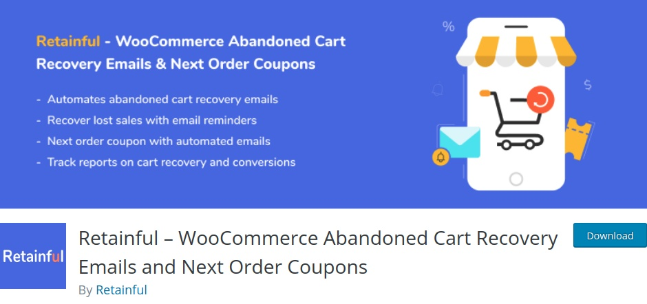
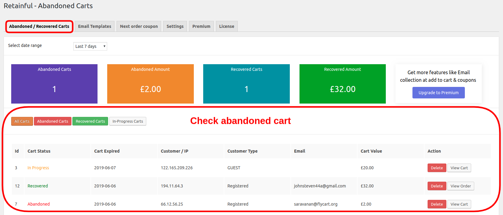

Cart abandonment is one of the bigger challenges faced by eCommerce stores. What makes it more challenging is not knowing how many carts have been abandoned. Let's learn how to find the abandoned carts and recover them in your WooCommerce store.

### What is cart abandonment?

About 70% of the shoppers abandoned their carts, according to research firm Baymard Institute. People visit your online store, browse through various product categories, add products to the cart but most of them leave the site without buying. That is called cart abandonment.

___

<toc>
</toc>

### Why people abandon cart?  
People abandoned their carts for a variety of reasons. Understanding why customers abandon cart can put you forward in knowing how to reduce it.

Following are some of the most common reasons for people abandoning your online cart: 
  

- Unexpected shipping cost and additional taxes or fees
- Asking to create a New user account
- People just checking your online store
- No coupons and discounts available
- No transparent privacy and return policy
- Complex payment gateway or less payment choices. 

______
      
## How to check abandoned carts in WooCommerce?

Even the most robust eCommerce platform- WooCommerce experiences cart abandonment. And WooCommerce doesn’t provide a feature to check the abandoned carts, unfortunately. 

Recovering abandoned carts is possible only when you know your cart abandonment rate.

Luckily, you can use plugins to find out carts abandoned by the customers. In this blog, we are going to the use Retainful, the most versatile and poopular Abandoned Cart plugin for WooCommerce.

Retainful allows to check the abandoned carts in real-time. That is you can see live carts (customer is adding and checking out), abandoned carts (customer abandoned it already), recovered cart (by using Retainful's automated recovery tools).

You can also view your site-wide statistics for cart abandonment - how many carts are abandoned, how many are recovered, what is the value of the recovered carts, items in the abandoned cart and more.
  
### Steps to check WooCommerce shopping abandoned carts
____

### Install & Activate Retainful       

- <link-text url="https://wordpress.org/plugins/retainful-next-order-coupon-for-woocommerce/advanced/" target="_blank" rel="noopener">Download Retainful</link-text>
- Install and Activate the Retainful plugin

### Set up Retainful in 2 minutes

Once installed, you must decide when should a cart be considered as abandoned?

This holds priority because you don’t want to be disturbing customers who haven’t actually abandoned their carts.
 
-   Go to the Settings tab and set the time limits on when to consider cart as abandoned.       

 

 

### Checking abandoned carts with Retainful

Now, just go to your WordPress Dashboard -> WooCommerce -> Retainful to check your abandoned carts. Retainful offers one of the most simple and clean dashboard. 

- Toggle to abandoned/ recovered carts in the plugin dashboard  
- You can then find the list of abandoned cart details.

### Dashboard & Cart Recovery Ideas
- You can track three type carts in your WooCommerce store.
- Abandoned Carts, Recovered carts & In-progress carts.  
    While the first two are self-explanatory, the third type- In progress cart is an exclusive Retainful feature.    
- The in-progress cart or live cart shows the list of online carts that are being actively shopped at that particular moment.   

Also… you can retrieve a lot of useful data with which you can plan your cart recovery email strategy.
- Cart Status says whether the cart is abandoned, recovered or live. Interestingly, the color given to each cart status makes it much simpler to identify the cart types.
- Cart Expired date- The success of every cart recovery email campaign depends on how often you send the cart recovery email reminders. Getting to know when the cart abandonment date helps to <link-text url="https://www.campaignrabbit.com/blog/grow-your-ecommerce-store-with-9-effective-automated-emails" target="_blank" rel="noopener">schedule and automate your recovery email campaigns</link-text>.   
- Customer name/ IP- Track customers who abandon carts and offer them with special <link-text url="https://www.flycart.org/blog/wordpress/how-to-create-a-user-role-specific-coupon-code" rel="noopener" target="_blank">customer based coupons.</link-text>
- Customer type and email show whether the customer is registered or a guest user.
- Cart Value- Until you see how much sale volume is abandoned, you won’t really push harder. Measure the success of your cart recovery email campaign by comparing the values of the abandoned and recovered cart value.

### Recover abandoned carts

Now you have seen the abandoned carts in your WooCommerce store. The next step is to recover them.
Retainful comes with an easy, automatic cart recovery feature as well. You can create a sequence of abandoned cart recovery emails, which are sent in well-timed intervals.

For Example:

- Send an email 1 hour after customer abandons the cart
- Do another email follow-up 3 hours after the cart is abandoned
- Remind the customer again 1 day after the abandonment
- Still not recovered, send one more reminder 2nd day.

These emails can be automatically sent using the Retainful. You can create this email sequence using Retainful in minutes.
<link-text url="https://www.retainful.com/docs/woocommerce/retainful-abandoned-cart-recovery" target="_blank" rel="noopener">Here is a step by step guide to creating abandoned cart recovery email reminders</link-text>.

**Going the Extra Mile…**  
As mentioned above additional taxes and zero coupon availability are the two major reasons for cart abandonment.  
Here’s something you can do about that & that too for FREE.

- Offer Payment based discounts with <link-text url="https://wordpress.org/plugins/woo-payment-method-based-fees-and-discounts/" rel="noopener" target="_blank">Payment method based fees and discounts for WooCommerce</link-text>
    
- <link-text url="https://www.retainful.com/blog/how-to-provide-next-order-coupon-in-woocommerce" rel="noopener" target="_blank">Create Next order coupon codes</link-text>  with Retainful and drive repeated sales.
    
Enjoy the rest of the day.

Cheers!
