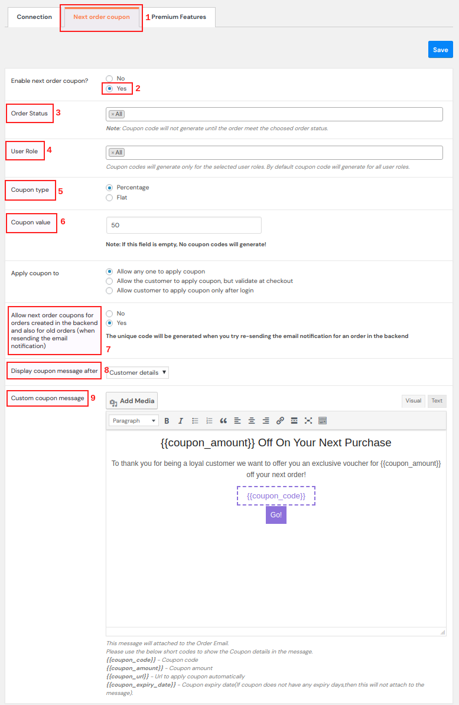
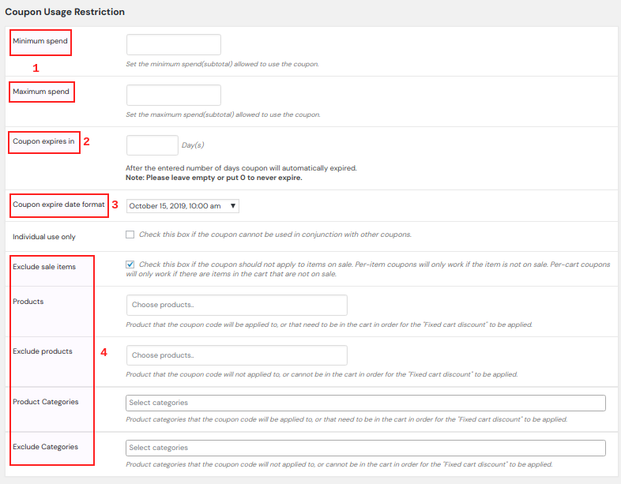

<toc></toc>

## Next Order Coupon and Customer Retention

*<underline>Quick Start</underline>- Customer retention saves 5 times more than the cost to acquire a new customer*

Earlier...  
You make a Sale.  
And send a plain order confirmation email. Do you?  
Sorry to say this. You have failed to impress your customers.

What if…  
You create a smart coupon and ask the customer to use it on the Next purchase.

* The Next order coupon drives your WooCommerce store with repeated sales.
* The customers shop continuously at your store. Hence, Customer Retention achieved.

<underline>Easter Egg</underline>- Pay ZERO! Install FREE!
<link-text url="https://www.retainful.com/" target="\_blank">
RetainFul is the FREE WordPress plugin</link-text> to create amazing Next order coupons and achieve 100% customer retention.

Now with RetainFul...   
You make a Sale.  
And send an order confirmation mail with a Next order coupon code.
Congrats! You have retained your customer.

### Quick Guide - How to create Next order coupon in WooCommerce

Before you start, please download and install the <link-text url="https://www.retainful.com/" target="\_blank">customer retention strategy plugin- RetainFul</link-text>. The guide assumes that you already have the WordPress plugin installed and activated.

#### Step 1- Creating the Next order WooCommerce coupon

* Select <underline>Coupon Type</underline> - Simple Percentage or Flat price discount.
* Enter the <underline>Coupon Value</underline>
* Set the coupon condition in <underline>Apply coupon to</underline> field. This coupon scenario allows the coupon to be used by anyone apart from your direct customer.
* Where in the email should coupon be displayed? <underline>Display coupon message</underline> after order details
* Add the <underline>Custom Coupon message</underline> that needs to displayed in the order confirmation/ transactional email,

### Short Codes

Use the following shortcodes to show the coupon details in the email text,

* {{coupon_code}} - coupon code
* {{coupon_amount}} - coupon amount
* {{coupon_url}} - URL to apply coupon automatically
* {{coupon_expiry_date}} - coupon expiry date. If the coupon does not have any expiry date this will be attached to the message.

### Step 2- Setting usage restrictions of the Coupon

RetainFul offers you with all the advanced usage restriction features.

* The minimum and maximum spend value are set. The coupon is valid if the customer shops between the set values.
* Coupon Expiry- The next order coupon is set to expire in 10 days for this coupon scenario.  
 **Note**- The validity of the coupon starts from the day of the first purchase.
* You can also create the next order coupon for certain products and categories alone at your WooCommerce store.
* Click on <underline>Save</underline> to make your Next order coupon campaign go active.

Yes, It takes no more than 2 minutes to create your Next order coupons in WooCommerce.

What makes you wait? Is it the plugin price worrying you?

The price you need to pay to retain all your customers is ZERO. <link-text url="https://www.retainful.com/" target="\_blank">RetainFul is FREE!</link-text>

<link-text url="https://www.retainful.com/" target="\_blank">Download the plugin now</link-text> and create a beautiful customer experience.
