A cart that is abandoned is lost forever if timely action is not initiated. The startling truth is that the customer is lost too. Using a strategic plan to get back customers to complete the purchase is crucial to retain them for a longer time and to recover lost sales.

In a nutshell, the seeds that you sow now (abandoned cart recovery campaign) will bear fruit in the future (money and loyal customers).

Be it Shopify or WooCommerce, this is the basis for all platforms.

For now, in this blog post, I will walk you through the process of recovering a WooCommerce abandoned cart.

And, we are going to use Retainful plugin for this.

Recover abandoned cart WooCommerce plugin, Retainful, can be downloaded for FREE from <link-text url="https://www.retainful.com/product/features/woocommerce" target="_blank" rel="noopener">here.</link-text>

<toc></toc>

## How to recover WooCommerce abandoned carts with Retainful?

To make things easier and more understandable, the whole process of recovering abandoned checkouts with Retainful for Woocommerce by sending emails can be divided into three sections.

-   Configuration
    
-   Email creation
    
-   Monitoring
 
### Configuration

This is the basic configuration that is necessary to start the abandoned cart recovery campaign.

Go to the ‘Settings’ tab of Retainful to do this.
  

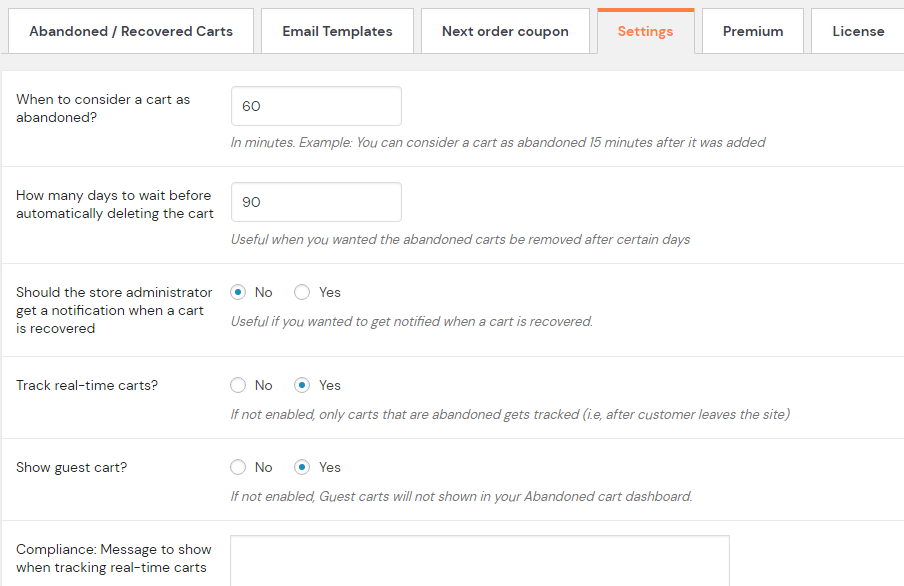

The following details must be given importance.

**Time after which the cart is considered abandoned**

This is of most importance to consider a cart as abandoned. The cart will be considered abandoned after the time mentioned in this field if it in inactive. Here the example is given as 60 minutes.

**Number of days to wait to delete the cart**

Cart recovery is not always a success. It happens that some abandoned carts remain in the database forever and get piled up. To avoid this, the cart will get deleted automatically from the plugin if it is not recovered after the time mentioned here. Here the example is given as 90 days.

**Notification for cart recovery**

It is obvious that you might want to know when a cart is recovered. This feature does this work. When enabled ‘yes’, you will get notified of a recovered cart.

**Real-time cart tracking**

Live tracking of all carts is possible with this. You can see who and what people are adding to their carts with this is enabled.

**Display of guest cart**

It is recommended to keep this enabled because abandoned guest carts also hold back some revenue just like the logged-in users.

**Compliance message**

This is mandatory if plan to track real-time carts. Letting people know about this with a message is the ethical way of doing it as per the GDPR law.

Save the inputs given.

### Email creation

Before we get into details of how to create an email for WooCommerce with Retainful, take a look at some important questions.

  

**Why is email still preferred by a majority of businesses?**

Do you think that the age of the email is coming to an end?

I suppose you are treading the wrong path if you are affirmative to this. This proves it.

As of 2018, <link-text url="https://www.oberlo.com/blog/email-marketing-statistics" rel="noopener nofollow" target="_blank">81% of SMBs rely on emails to acquire customers and 80% for customer retention.</link-text> There you go. There cannot be any better proof which points out that email marketing is still the first choice for many businesses to grow their eCommerce empire.

This shows the importance of sending out WooCommerce cart recovery emails.

Now that you have realized the importance of abandoned cart recovery emails, let’s move on to the next question.

**How many abandoned cart emails would be ideal to bring back a customer?**

This, in fact, must be decided on at the initial stages itself for a smoother workflow. The choice is up to you but experts say that 3 abandoned cart emails can create magic compared to one or two emails.

A study conducted by Omnisend in 2018 has proven this. The study revealed that 3 abandoned cart emails resulted in 69% more orders than a single email.

**What are the sender details that must be considered for cart recovery emails?**
In the Retainful plugin, click on ‘Email Templates’ tab and enter the following details

*From Name -* The sender’s name that must appear in the email

*From Address -* The email ID used for sending out cart recovery emails.

*Reply To Address -* The email ID to which the customer must reply.

  

  After this step, simply save the information.

Here comes the real deal of drafting the email.

**The First Email**

To start with, click on ‘Create New Email Template’ CTA from the ‘Email Templates’ tab.

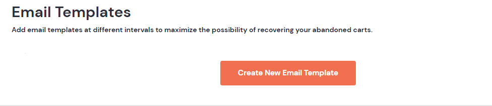
  

You are taken to the ‘Add or Edit Email Template’ page.

Enter the following details.

Template Name

This is purely for your sake to identify the templates. Let us name our maiden email as ‘First Email’.

Template Subject

This is what gives the first impression - the subject line. Give it your best shot here. We have given it as ‘Where have you been?. This creates a curiosity to click open the email.

Send this email in

The number that you mention here is of prime importance because the timing of an email is as equally significant as the content. We have given it as 1hour. So, the first email will be sent one hour after the cart abandonment.

Send a test email to

A final look at how the email will appear when the customer views it. This is optional.

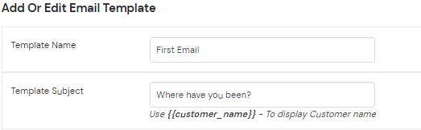

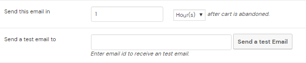

  
**Email body**

Keep it simple for the first email. Just plain text with an enticing image - all of this without using a template.

Things to take note of in the email

-   The image

It is so colorful and welcoming. The chosen image is in sync with the subject line ‘Where have you been?’

-   Personalization

Personalization takes your email a notch higher because it indicates friendliness and concern. This email uses ‘Ryan’ as the customer name. When the email is automated to be sent to multiple people, {{customer_name}} - a short code can be used. This will automatically include the customer name from the cart details.

-   Cart details

This is just a reminder for the reader to reignite the spark to complete the checkout.

-   Link to cart

The hyperlink is highlighted in contrasting color so that it gets noticed similar to a CTA.

-   Incentive

The email body also emphasizes on an undisclosed incentive at the checkout. This also, just like the cart recovery link, is highlighted.

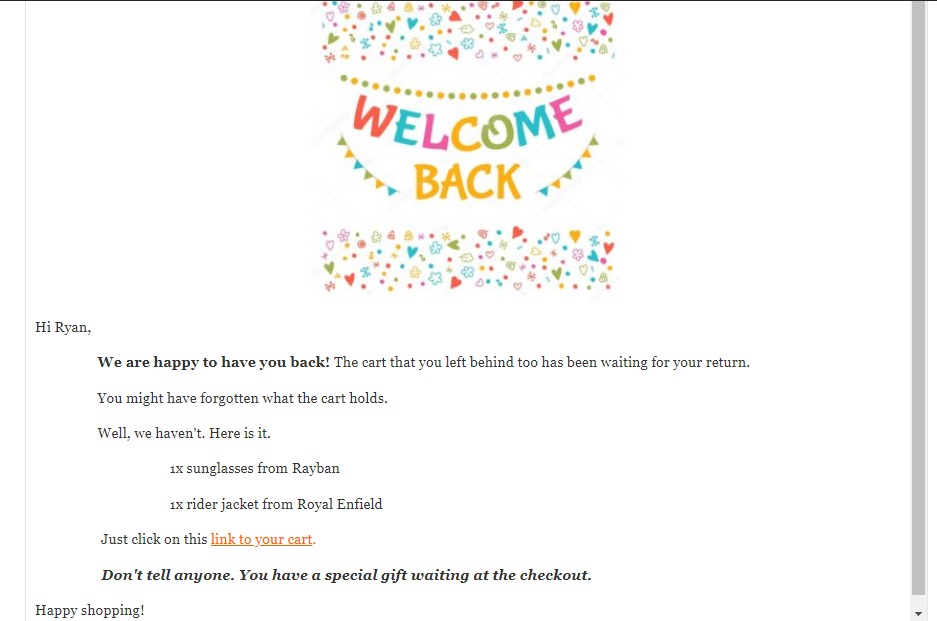

This first email proves that the WYSIWYG  editor of Retainful is so flexible and any kind of email can be drafted.

Save the template created and you will be taken back to the ‘Edit Template’ page where the details of the first email created will have been updated.

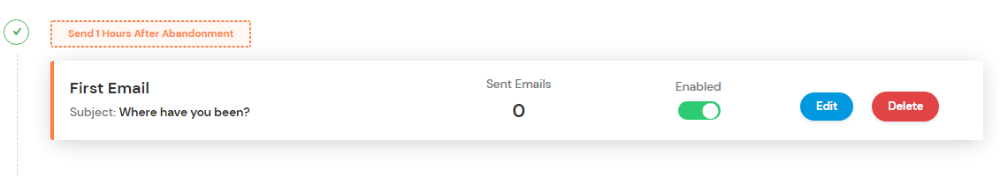

Repeat the same process for the second and third emails too.

  

**The Second Email**

The details of the email are the following.

Template Name - Second Email

Template Subject - {{customer_name}}, your cart is still waiting.

Send this email in - 3hours

**Email Body**

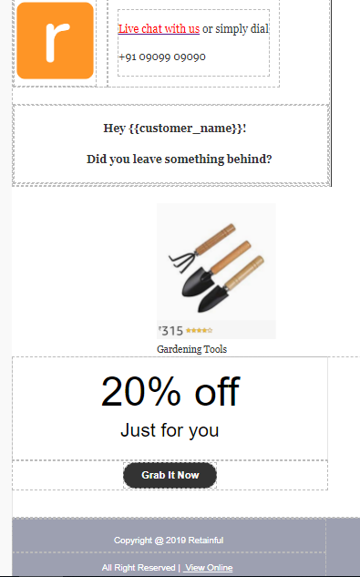

This second email is drafted with the help of an email template available in Retainful. This is the next level after just plain content in the first email.

Things to take note of in the second email

-   Logo

There is a provision in this template to include the company logo. The size can be adjusted.

-   Chat option
   
The availability of the live chat option will make the customer react instantly by connecting to the chat if there is any issue.

-   Headline

The headline poses a question that sets the customer thinking It is also personalized with the short code.

-   Image

The image is that of the product in the cart with the mention of the price and the star rating. The star rating helps remind the customer of the quality of the product chosen and assures that he has made the right choice.

-   Incentive

An offer is always irresistible. So, give one when you want your customer to check out the abandoned carts.

-   CTA
 
The CTA says ‘Grab It Now’. The text can be changed to anything that you prefer by clicking on the CTA and choosing the edit option.

Now, the ‘Edit Template’ page will look like this.

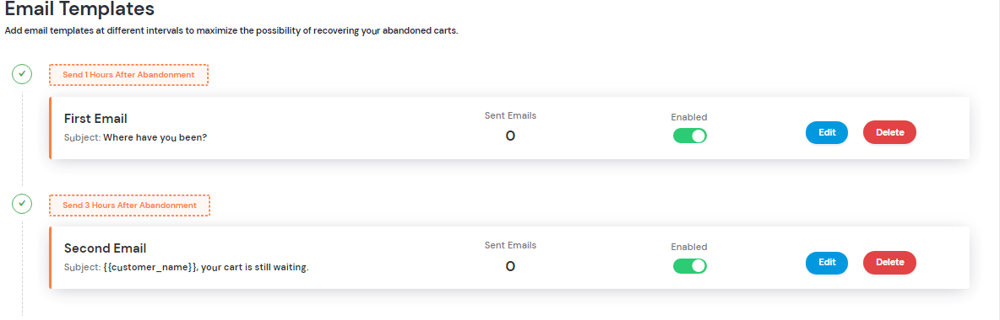

  

**The Third Email**

Here are the details.

*Template Name -* Third Email

*Template Subject -* The sale is coming to a close {{customer_name}}. Not much time left to save your cart.

Send this email in - 24hours

**Email Body**

Here again, a template available in the Premium version of Retainful has been used for the third email.

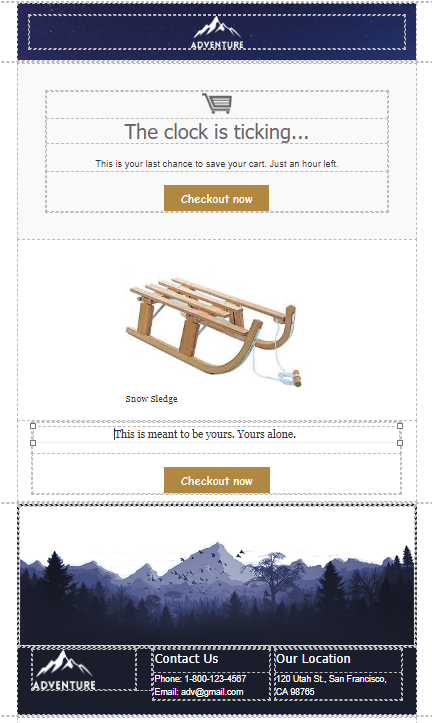
Things to note in the third email

-   Content

The content creates a sense of urgency to act fast. It also mentions the time left to save the cart.

-   Design

The design is captivating and demands attention, especially with the hues.

-   CTA

There are two CTAs if you have noticed. One reason for 2 CTAs is convenience and the second is that it sends out a message to the customer to act fast immediately.

The ‘Edit Template’ page after creating the 3 emails will look like this

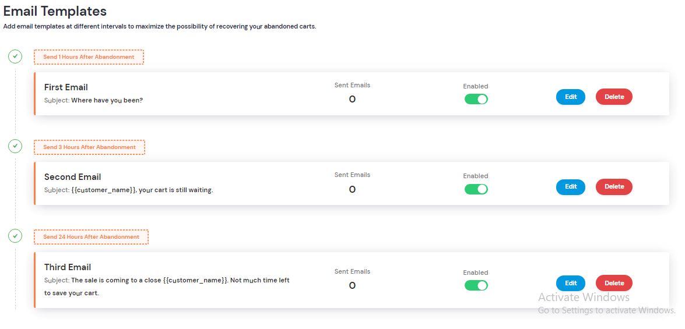

All the three emails created are enabled as shown above and gets triggered automatically when a cart abandonment takes place.

### Monitoring
How do you know that carts have been abandoned and some have been recovered?

This is where monitoring comes into play.

Retainful has a dashboard which gives details of WooCommerce cart abandonment and recovery.

As you can see in the image below, the following can be monitored with the help of Retainful dashboard.

-   Three types of carts
-   Abandoned
-   Recovered
-   In-progress
-   Abandoned amount    
-   Recovered amount
 

When there is cart abandonment activity, the dashboard will look like the below image with extra details of cart status, customer IP, and email.

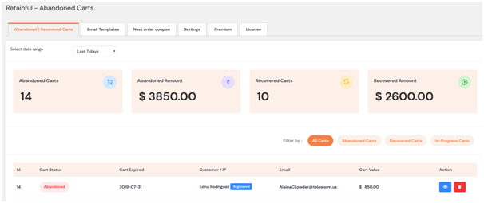

A comprehensive dashboard like this allows you, as the WooCommerce store owner, to decide on how to take the cart abandonment campaign forward and bring about changes in due course to get better results.

## Closing thoughts…

Cart abandonment issues must be addressed without much delay. The earlier the better. Don’t forget the fact that you can still rely on emails for cart recovery.

So, get down to the business of creating <link-text url="https://www.campaignrabbit.com/blog/7-abandoned-cart-recovery-email-ideas-for-shopify-and-woocommerce" rel="noopener" target="_blank">abandoned cart recovery emails that convert.</link-text>

There are more supporting features in Retainful that allows you to make WooCommerce abandoned cart recovery much better and easier.

Stay tuned and keep checking this space for more.