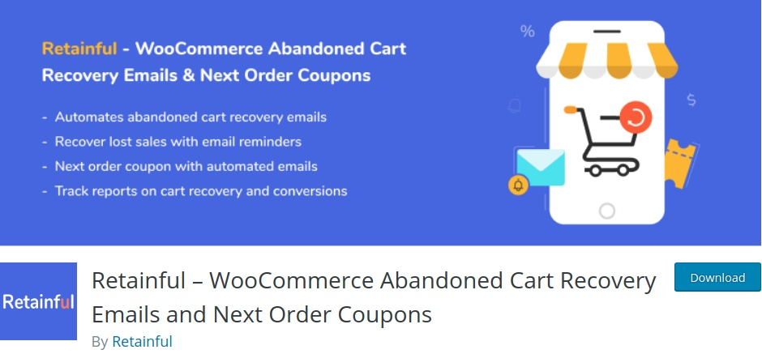
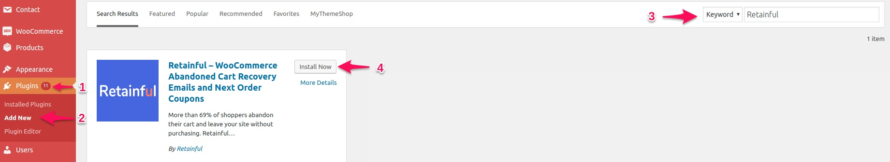
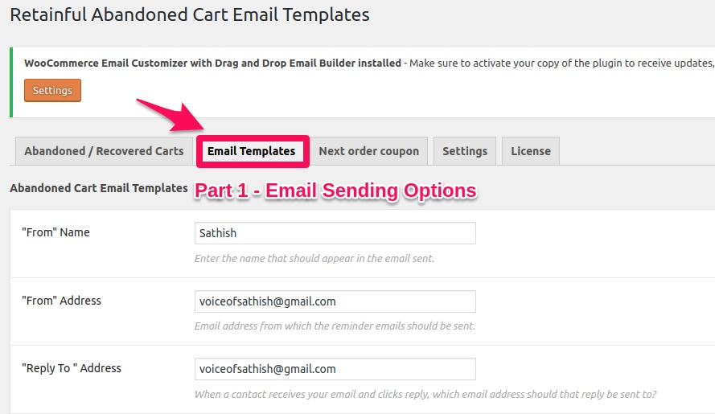
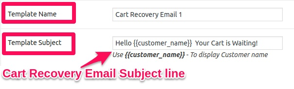
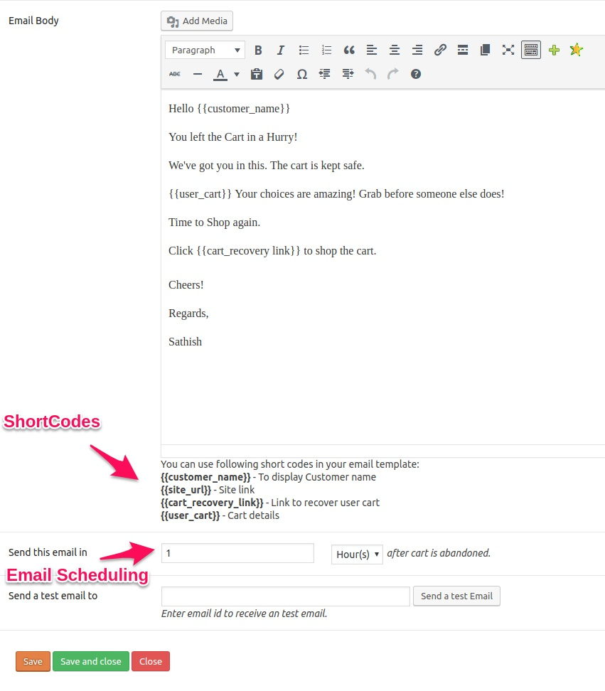
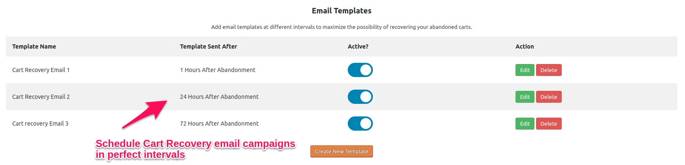
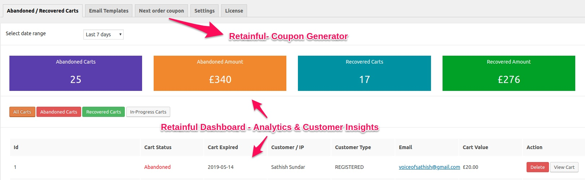

Howdy WooCommerce user,   
If you are reading this you’d already be knowing the importance of recovering your abandoned carts to increase online revenue.
Well, cart abandonment has been the biggest nightmare for eCommerce store owners. 

7/10 online shoppers abandon their cart and eCommerce store owners are in desperation to find a solution.

And the hardest part of having a WooCommerce store is the impossibility to send cart recovery emails by default. 

So, here is the post to show how to recover your lost sales- Hold.., you may find many such posts on the web, I guess…    

But, there’s something interesting in here.    
The post says ***How to send FREE cart recover email reminders*** in WooCommerce.

<toc></toc>

## Why should you send cart recovery emails
Well, the reasons to recover your abandoned carts are simple
- 70 % of your potential sale volume is stalled in abandoned carts- So, recovering those abandoned carts can increase your sales volume by 70%
- The most efficient and simplest method to recover abandoned carts is email marketing- Because cart recovery emails can recover at least  40% of the total abandoned sales.
- Sending cart recovery email reminders is FREE now- So, why not try it and make the best of opportunity to increase sales.

## How to send FREE cart recover email reminders in WooCommerce
In spite of having many useful plugins in WooCommerce, it is quite hard to find a true plugin which offers premium features for FREE. But we’ve got the fish for you. 

### Retainful - The FREE Cart recovery email plugin for WooCommerce
 

Retainful is a FREE WordPress tool to automate cart recovery email reminders. You can schedule and automate unlimited email reminders to customers. Well, it’s just more than just an email tool. Retainful is also a next order coupon generator plugin.

And for now, let’s dive into the simplest guide to send your cart recovery emails

_____

## 3 Step Guide to create abandoned cart recovery emails in WooCommerce

Retainful offers the most simple steps to create your cart recovery email reminders.
All you gotta do is follow these 3 simple steps.

### Step 1 - Install & Activate Retainful

1. Hover to **Plugins** in your WordPress dashboard
2. Click on **Add** New 
3. Enter the keyword **Retainful** in the search box
4. **Install** and **Activate** the plugin

### Step 2 - Define What you consider an abandoned cart

Once activating the plugin, you can find Retainful in your WordPress dashboard under WooCommerce.

Firstly before creating cart recovery email campaigns, you gotta be defining when can the customer cart be treated as an abandoned cart. 

This is important because you don’t wanna bother customers who haven’t actually abandoned their cart.

To set the condition, hit the **Settings** tab

Then,   
**When to consider a cart as abandoned?**  
This is the time to consider your customer cart abandoned.  
Say, if the time is set to 60 minutes, the WooCommerce cart will be considered abandoned when your customer left the cart unpaid for 60 minutes.

**How many days to wait before automatically deleting the cart?**   
This is to automatically delete the abandoned cart items after certain days if the WooCommerce customer still hasn’t recovered the abandoned for the set duration.

<call-out>
Be Optimistic to leave the field empty because your cart recovery campaigns are definitely going to recover the abandoned sales.
</call-out>

**Inform store admin when the Cart is Recovered**   
Well, make sure to enable this check-box to stay updated every time an abandoned cart is recovered.

**Track real-time carts**    
Tracking live cart is one exclusive feature that is offered by Retainful.

Enable the checkbox to see the list of customers who are actually using the cart at that particular moment.
<cta-box>
**Note**    
If tracking real-time carts, make sure to display a compliance text message. It’s mandatory under GDPR to let customers know if their activity is tracked.
</cta-box>

Lastly, **Save** the Settings.

### Step 3 - Creating the abandoned cart recovery email campaign

You are one step less in automating your Cart recovery email campaigns.

Head to **Email Templates** tab to start scheduling the email reminders

To easily understand the process,    
**Let’s split the ‘Email Templates’ page into two parts**

**Part 1** - Email Sending Options

Enter the name and address you want your<link-text url="https://sleeknote.com/blog/abandoned-cart-emails" target="_blank" rel="noopener nofollow"> abandoned cart recovery emails</link-text> to be sent from.

That’s all about configuring the email settings.   
Now, click on **Create Template** to write your abandoned cart recovery email.

Initially, enter the cart recovery email template and subject line. The **Template name** is for the reference of the store owner and not gets displayed to the customers. 

The **Template subject** is actually the subject line of your recovery email and so that’s going to be seen by your customer.

<call-out>
Simple and precise subject lines will achieve to improve email open rates.
</call-out>

 
Next, enter the body of your cart recovery email. The text editor may seem like the regular WordPress editor but the interesting part is the availability of shortcodes.   Shortcodes allow you to personalize the emails with the customer’s name, cart details, cart recovery link and more. 

The following screen shows you the proper way to structure your email using shortcodes. 

Lastly, schedule your recovery email reminders. Let the minimum time to send the first cart recovery email to be 1 hour. 

<call-out>
The smart thing is to schedule and <link-text url="https://www.campaignrabbit.com/blog/7-abandoned-cart-recovery-email-ideas-for-shopify-and-woocommerce/" target="_blank" rel=“noopener”>automate a series of cart recovery emails</link-text> with different Subject lines at different time intervals.</call-out>

And Better will be your cart recovery email conversions if the time you sent those emails are perfect.

**Here’s an idea to schedule your cart recovery email campaigns in a perfect time interval.**    
Cart Recovery Email 1 - After 1 hour    
Cart Recovery Email 2 - After 24 hours   
Cart Recovery Email 3 - After 72 hours   

**Additional Features of Retainful**

Retainful offers you with the most comprehensive dashboard.
- Track revenue easily by comparing the abandoned cart values and the recovered cart values.
- Get actionable customer data along with cart status reports. Track the list of customers who have abandoned, recovered their carts. You can even see the customers who are using the cart at that particular time as well.
- **Bonus!**       
<link-text url="https://www.retainful.com/blog/how-to-provide-next-order-coupon-in-woocommerce/" target="_blank" rel=“noopener”>Retainful - Next order coupon</link-text> generator
Retainful is just not a cart recovery email plugin. It’s a coupon management plugin. It allows you to generate coupon codes automatically whenever a customer purchases and shares it along with with the order transactional emails. Hence your customers are motivated to use the coupon codes on their next purchases.

More Sales, More Revenue.

**Keynotes to Remember**

TIMING… is the most important thing that may win your cart recovery email campaign. Make sure you get the timing right with the following tasks
- When should a cart be considered abandoned
- When to send the series of cart recovery email reminders

So, that’s basically how you effectively time your recovery emails. Do a lot A/ B testing to find out which is the right instance to send the email reminders so that maximum conversion is achieved.

Found the post useful, do share your thoughts and ideas to grow our WooCommerce community.

<link-text url="https://wordpress.org/plugins/retainful-next-order-coupon-for-woocommerce/" target="_blank" rel=“noopener><cta>Download Retainful</cta></link-text>

 
Well, if you want to know the list of other tools to <link-text url="https://www.retainful.com/blog/7-sales-conversion-tools-for-shopify-and-woocommerce/" target="_blank" rel=“noopener”>increase sales conversion in your WooCommerce store</link-text>, don’t forget to check this useful post. 

Cheers!