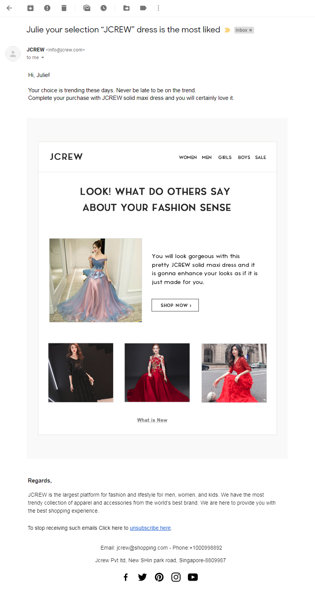
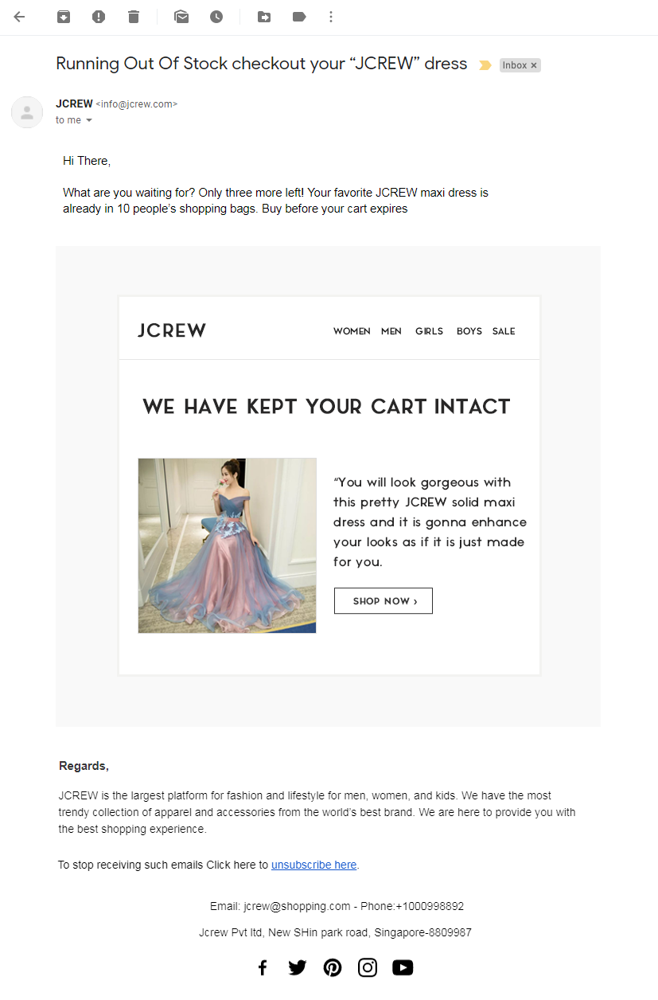
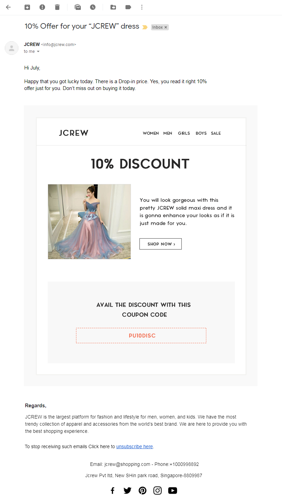
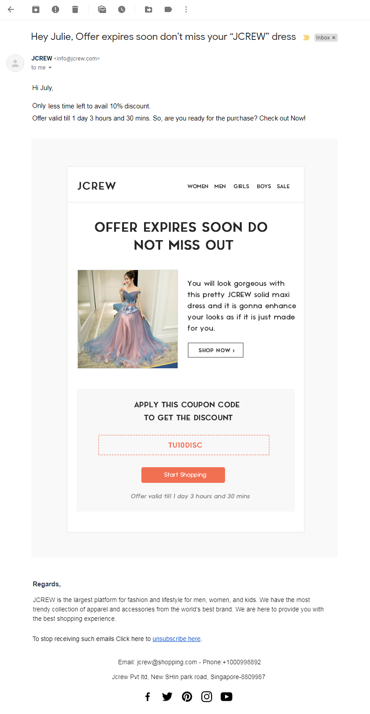

Seven out of ten customers do abandon their shopping carts after adding products to it!

Abandoned cart holds potential revenue in a dormant state. And you have to take the initiative and necessary steps to convert the dormant revenue into active ones.

According to Marketing peers suggestions

One of the promising places where you can start marketing is where cart abandonment happens. And one of the great clients to whom you can start marketing are those who abandon shopping carts.

Now comes the question, “Why people add products to their cart and why abandon the same? And how do we recover abandoned carts?”

So the answer to this is, by sending recovery emails using <link-text url="https://www.retainful.com/product/features/shopify" rel="noopener" target="_blank">abandoned cart recovery email plugins</link-text>. I am suggesting to use one because cart recovery plugins not just enables you to send recovery emails, but assists you to draft a successful email, evaluate the success rate and also automate them to be triggered at regular time intervals.

Now let us discuss the most successful abandoned cart recovery process. What makes it successful? The need to emphasize on factors like email series, successful templates and much more in an elaborate manner.

<toc></toc>

## What is an abandoned cart?

Imagine you are running an online Shopify store. Your customers are actively adding products to their carts. But not everyone ends up buying those products. They just leave it in the cart. 

Shopping cart with products selected for buying, but not yet checked out is an abandoned cart.

____

## What are the reasons for cart abandonment?

-   Expecting discounts, free shipping, gifts, add-ons, coupons
    
-   Thinking about buying it later
    
-   Would not like to miss out on the product
    
-   Interested in similar products
    

-   An error in the website or payment gateway
    
-   Security concerns related to payment and data
    
-   Hassle in return
    
-   Forgetting what they wanted to buy
    

There can be still more reasons but we need to prioritize and address the most obvious ones.

The first two reasons highlighted are the most important reasons. Trying to rectify them can yield great results.

The first reason talks about cutting the product cost but before doing that we should send a reminder. What if in case it works?!

As the primary reason revolves around cutting the cost, surprising your customers with offers and coupons can give you promising results.

So we have to figure out how do we convert reminders into attractive content which gets clicked and converted to revenue.

____

## What is an abandoned cart recovery email?

You have abandoned carts and you intend to recover them. So you decide to <link-text url="https://www.campaignrabbit.com/blog/grow-your-ecommerce-store-with-9-effective-automated-emails" rel="noopener" target="_blank">send reminder emails</link-text>.

A reminder sent to motivate customers to check out products in their carts is an abandoned cart recovery email.

____

## Why is it necessary to send abandoned cart recovery email?

Take an effort to remind your most potential customers. Make them buy the products which they gave a thought about buying by adding them in their carts. And when there are <link-text url="https://flexicloud.in/top-5-best-woocommerce-abandoned-cart-recovery-plugins/"   rel="noopener" target="_blank">cart recovery plugins</link-text> to help you automate and generate promising emails. Then why not give it a try?

___

## Why is it necessary to send a series of abandoned cart recovery emails?

While making an effort to remind your customers to buy the products which they had abandoned if you just send a single reminder email, the chances of it going unnoticed is very high. There is data suggesting increased recovery when you send more than one abandoned cart recovery email. And <link-text url="https://techylearners.com/woocommerce-abandoned-cart-recovery-email/"   rel="noopener nofollow" target="_blank">abandoned cart recovery plugins</link-text> makes the work easier.

___

## How many abandoned cart recovery emails should I send?

While setting up your abandoned cart recovery email series, do not stop with just one reminder email. Send a series of emails at regular intervals thereby reminding them, again and again, enabling them to buy.

At the same time make sure that you do not spam them with a lot of emails. Also, do not waste the potential of your emails.

___

## Here is a recommended sequence suggested by eCommerce Expert

**The first email** - after one hour of cart abandonment

**The second email** - on the next day of cart abandonment

**The third email** - two days post cart abandonment

**The fourth email**- after five days of cart abandonment

**The fifth email** - after a week of cart abandonment

____

### Writing successful Cart Recovery Emails

**While you send a series of emails, consider the following aspects.**

-   Email content
    
-   The time gap between one email with the next
    
-   Total number of emails
    
-   The product image or video if any
    
-   Exact product info
    
-   Adding details about the product demand
    
-   <link-text url="https://www.flycart.org/blog/wordpress/social-proof-role-in-ecommerce-conversion"   rel="noopener" target="_blank">Social proofs</link-text>/Social media links
    
-   Stock availability
    
-   Offers available now for the product
    
-   Offers available for the next purchase
  
    

### Email Content

“Content is the king.”

No matter what exciting offers you provide. No matter what strategy you use for marketing. One bad email can ruin everything. So do pay attention to what you write in your cart recovery emails.

### Subject

The most important part of a cart recovery email is the subject line.  <link-text url="https://www.retainful.com/blog/13-best-subject-lines-for-abandoned-cart-email-campaigns"   rel="noopener" target="_blank">A catchy subject line</link-text> increases the probability of it getting clicked and opened. While a less attractive or underplaying subject might not even secure a click! So try to market your product right here. Do mention the customer’s name for a better response.

### Body

Convey everything that you wanted but never write too much. Concentrate on the placement and the number of occurrences of Call-To-Action(CTA). Do not provide too much as well as too few CTAs. Do not miss out on anything you wanted to convey at the same time, keep it crisp. At the same time try to keep the design attractive.

### Single Click buttons

Make sure you provide single-click buttons that link to the cart, landing page, website or a video. Furthermore, always provide CTA as a bold single click option.

----------

## Best email series for abandoned cart recovery (with Templates)

Most importantly, see to it that the following factors are covered in your cart recovery email series.

1.  Reminder
    
2.  Brand value
    
3.  Scarcity
    
4.  Discount
    
5.  Urgency

### 1st Email template
 

**Sending day:** A few hours post cart abandonment or on the day of cart abandonment.

**The above example is just a Reminder?**

So the above email is just a reminder email for abandoned cart recovery. Is that enough?

Did you know? Just a notification or a reminder could do wonders by recovering your Shopify abandoned carts. So never miss out on this “just notify” part of abandoned cart recovery emails.

  

Mention the customer name and product name in both the subject line and email content. Also, give the product image. Provide the CTA link either on the right side or below the product image.

 **Reminder**

The entire set of abandoned cart recovery email series is certainly reminders emails. They can be specially designed for increased abandoned cart recovery. But when you start sending abandoned cart recovery email on the same day or a few hours post abandonment, dedicate a mail just reminding your customer.

Let us hope that works out and no need for further emails, as reminder emails are programmed to stop immediately after checkout. Further plain notification email helps you track the performances of reminders over other addons and strategies used for cart recovery.

----------

### 2nd Email template
 

**Sending day:** On the 2nd day of cart abandonment

Here in the above example, do you notice anything signifying brand value?

“JCREW” the name of the brand is mentioned in a crystal clear fashion. Adding the brand name makes it familiar and it is the first step towards establishing brand value. Further links to its social media posts and pages can make people follow, interact by which you can try to establish your brand.

 **Establish Brand value**

No matter how big or small, develop your brand value. Recognition and trust developed through brand is the greatest asset for a company. Approximately 59% of customers would prefer to buy products from familiar brands. Therefore make your brand familiar with a solid brand building process. So, do not forget to establish brand value for your online Shopify store.

Unforgettable rules for brand development

-   Identify your focus audience
    
-   Establish your brand and make the name and icon visible
    
-   Bring in social proofs with social media. There will be impacts based on factors like who says it and how many are saying it.
    
-   Research on brands of your similar niche
    
-   Convince over competition
    
-   Give an outline of the key benefits you provide
    
-   Never forget to include Call-To-Action

----------

### 3rd Email template
 

**Sending day:** 2-3 days post cart abandonment.
 

Here in the above template, there is a mention about stock availability

The number of products left implies product scarcity. That product being selected by other customers implies product demand. Further, a bold text indicating cart is available for checkout in spite of its high demand. These can considerably increase the scope of the customer buying it.

**Scarcity**

“Rarity makes gold to be valued as gold.”

Imagine a scenario where gold is available wherever you dig. Will it be costly or valuable as it is today?

No, right?

Similarly, you have to make your product appear valuable so that customers do not want to miss it when it is available.

Address cart abandonment recovery issues by including scarcity marketing strategies like the following.

-   Give updates about how many of that product is available in stock?
    
-   How many customers have brought it so far?
    
-   How many customers have shown interest in that product and are willing to buy the same?

----------

### 4th Email template
 

**Sending day:** 4-7 days post cart abandonment.]

**Offer is the highlight in the above template**

The text indicating the offer value is mentioned very boldly. Moreover the entire focus of the content shifts towards the offer. A randomly generated coupon code is mentioned. This can be used once and applies directly to the cart. The direct application of the coupon to the cart signifies that the code need not be copy-pasted during checkout.

**Discounts**

Discounts are delightful if you plan to shop. Discounts will even give you reasons why you need to shop. A price-drop is the reason to shop even when you do not plan to shop.

You can expect loyalty only if you incentivize your customers.

Using discounts and Coupons you can also motivate customers to purchase repeatedly at your Shopify store. You can start building your customer base with the help of discounts.  

Types of discount

-   Free shipping
    
-   Percentage discount
    
-   Flat discount
    
-   Next order coupons/discount

Efficiently choose what to give.

-   Set the value for discount
    
-   Avoid giving multiple discounts depreciating the product value
    
-   If in case you do not want to give a discount for a particular product you can promise them with a discount for their next purchase
    
-   Set up free delivery and high discounts only for higher cart values

----------

### 5th Email template
 

**Sending day:** after 1 week of cart abandonment.

**Noticed the timer in the above template?**

Adding validity to the offer fastens cart recovery rates. Mention the existence of timer, both in the subject and body of the email along with the coupon code. The number of buyers will tremendously increase during the limited offer period is a well-known fact.

**Urgency**

Did you know?

Food products and groceries face the least abandonment rates.

You know why?

They face dire necessity and mostly needed urgently.

But when it comes to other items like luxury items customers do not feel that the product is urgently required. So as a result buying gets procrastinated. This results in high rates of abandoned carts.

Urgency marketing tactics avoid procrastination in buying. There is an urge that has to be created to get things done. So try to convince your customers that this is the right time to buy by triggering FOMO. Basically, the “Fear Of Missing Out” strategy will motivate customers to check out abandoned carts sooner.

----------

## Summary

Summing up on abandoned cart email series never compromise on the content and design. In specific emails where there is a focus on addons like a discount, do not fail to include essential elements like CTA, product image, social media links, and certain other important contents.
 

So as a final piece of advice there are simple rules to flourish with recovered abandoned carts.

1.  First email (1 hour after abandonment): Keep this very simple reminder. No addons.
    
2.  Second email (Second-day post abandonment): Reminder with a brand value like “social proofs”. Make customers notice your brand, gain some trust & interest.
    
3.  Third email (after 2 days of abandonment): Reminder with emphasize on the scarcity by letting customers know about the stock availability.
    
4.  Fourth email (Five days post abandonment): Reminder with a surprise like discounts or coupons.
    
5.  Fifth email (a week after cart abandonment): Reminder with a FOMO factor triggering customers to checkout as soon as possible.

Identify your niche audience and target them. Create your own marketing strategy with  <link-text url="https://www.retainful.com/blog/the-simple-way-to-retain-all-your-customers"  rel="noopener" target="_blank">Shopify abandoned cart recovery</link-text> plugins. There is a huge potential to support Shopify stores by enabling marketing automation based services. Also, feel free to experiment by customizing your email templates, email timings, creative content, add ons like specific discounts. Watch out what works the best for your eCommerce stores.

Suggest some more ideas in the comment section. Having a fruitful discussion might help you get more ideas to recover abandoned carts even faster.
  