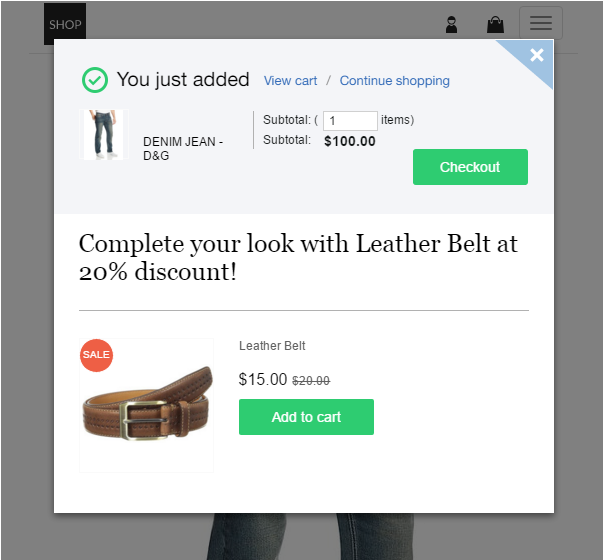
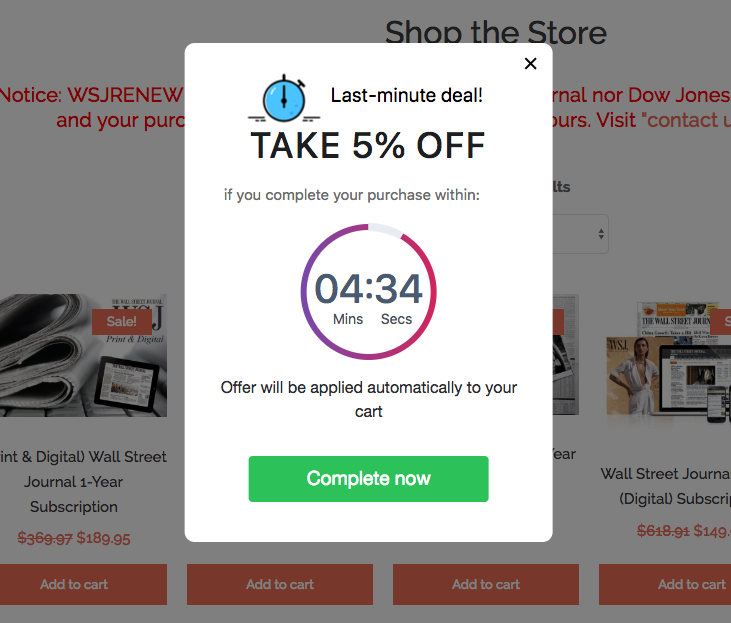
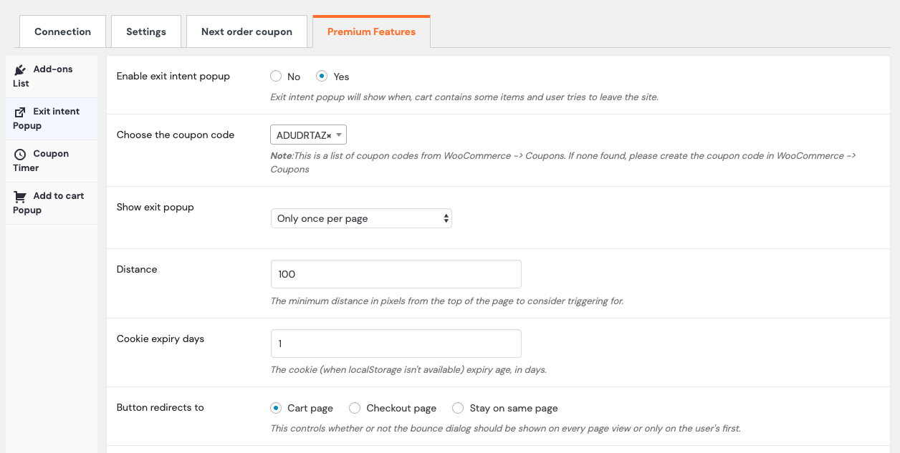
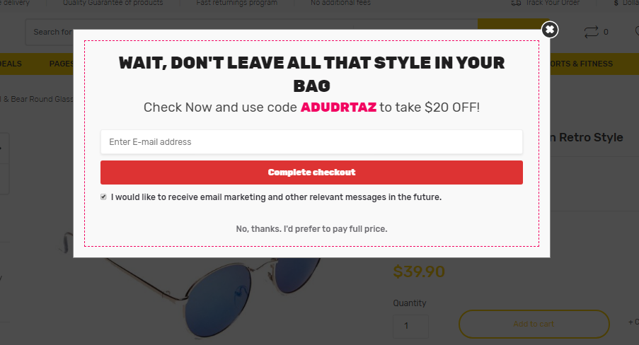

Digital marketers try and try until the last breath, no matter what, to <link-text url="https://www.retainful.com/blog/10-Proven-Ways-to-Convert-Your-Abandoned-Cart-Website-Visitors-Into-Loyal-Customers" rel="noopener" target="_blank">convert a visitor into a loyal customer</link-text>. To deal with this, different technologies have come and gone but this one is here to stay and reign - the exit-intent popup for WooCommerce.

Let’s call the exit-intent popup as the ‘king’ of popups and that is with reason. There is no other technology with a capacity to convert a customer and generate leads instantly at the verge of exiting the page.

Know about it in detail.

<toc></toc>

## What is an exit intent popup?

You definitely must have experienced this. When you go into a brick-and-mortar store, a sales agent follows you closely looking at what you are about to purchase. If they find you unsatisfied and leaving, they immediately come up with sweet words accompanied by a probable offer so that the sale is alive.

When this scenario gets digitized, it turns out to be popup exit-intent Shopify or WooCommerce technology.

With exit-intent popup, the technology tracks the movement of the mouse and site visitor. If by any chance, the mouse moves towards the top as to close the tab and abandon the page, a popup appears with some interesting content to engage the visitor and get them subscribed or complete the purchase.

## How does exit intent popup benefit the eCommerce sector?

The benefits of using an exit-intent popup for eCommerce stores are primarily two.

**Timing**

Exit-intent popup is the one and only method to change the mind of the customer just seconds before leaving a page. A visitor stays on a page after adding items to the cart if he is in a dilemma. Those moments are the ones that the exit-intent technology uses to tap into the mind of the site visitor. Each and every second count and with exit-intent, it is put to good use.

**Conversion rate**

The conversion rate for a regular popup ranges anywhere between 3% and 10% but it goes as high as 53% for exit-intent popups. Considering the fact that these are last-minute conversions before exiting, the numbers are extraordinary. It so happens that even <link-text url="https://www.retainful.com/blog/how-to-write-abandoned-cart-emails-in-woocommerce" rel="noopener" target="_blank">email marketing for cart recovery</link-text>, that might take days or weeks, is nowhere closer to this number.

## Different uses of exit intent popup

 

Time to apply the effectiveness of exit-intent popups. Let’s move on to different exit-intent <link-text url="https://www.campaignrabbit.com/blog/20-popup-ideas-to-make-your-woocommerce-shopify-customers-click-convert" rel="noopener" target="_blank">popup ideas</link-text>.

There are many ways to impress a customer during the last minute and for various purposes. The purpose of a popup - exit intent, is what is being discussed here. The extent to which the exit-intent popups can be put to use in eCommerce is huge. Mentioned below are some of them.

### Newsletter/Subscriber Sign up

Your eCommerce business is never going to take off without an email list - the primary source to get in touch with the customers. Using an exit-intent popup for Shopify or WooCommerce is a sensible and impressive tactic for email list building.

 

This is the <link-text url="https://www.uberpopups.com/blog/10-best-exit-intent-popup-hacks-to-grow-email-list" rel="noopener" target="_blank">best exit-intent popup</link-text> by design from Lush. It demands attention with the copy, borderless design, darkened background, and simplicity.

### Abandoned Cart Recovery

 

Using an <link-text url="https://www.retainful.com/docs/woocommerce/exit-intent-popup" rel="noopener" target="_blank">exit-intent popup for cart recovery</link-text> is one last-minute hack to bring back a customer and keep the sale alive. Even if the sale does not happen, email details can be furnished from the customer to follow-up with an abandoned cart recovery email.

### Cross-sell/Upsell

A sale never ends even when you are about to leave the store. The sight of chocolates at the billing counter and pamphlets for the next purchase are proof of it. Similarly, an eCommerce store can sell more with an exit-intent popup too. This also acts as a method to guide the customer to choose better products.

### Customer Service & Feedback

Site visitors do seek help even during the last step of purchase if any sort of confusion or issue arises. They might have doubts regarding the return policy, payment methods, or any other. When the visitor does not know where to look for help, he will abandon the page. This is an apt time to use an exit-intent popup with a live chat option to get things resolved.

## Exit intent popup for Abandoned Cart Recovery

This is going to be the point of focus for the rest of this blog.

A final request can be displayed to not abandon the cart and own the items wished for with the help of exit-intent popup. But will a simple request alone do wonders? Never.

Check out what must be done in the first place.

### Types of exit intent to address cart abandonment

To get site visitors converted into customers, some techniques need to be deployed that triggers the person psychologically.

Play with minds and reap success.

#### Give a discount

A discount is what every shopper is on the lookout for. The chances of backing out from shopping when he sights one is rare. So, discount is the bait here.

You need to provide a discount with the exit-intent popup that does not burn a hole in your pocket but at the same time satisfies the customer. It is also a better idea to apply the discount directly to the cart so that the customer need not type in the code.

Pro Tip: Make the discount personalized with an automatically generated coupon code.

#### Get the email

An email is essential when dealing with guest users of a Shopify or WooCommerce eCommerce site. The information is crucial for email marketing purposes, especially if the person has created an abandoned cart.

The example given here is not a regular cart recovery exit-intent popup that asks for an email. The usual ones only get the email for future use but this popup does two things - saves the shopping cart to the email and the site visitor furnishes the contact information.

_**Takeaway:** Give the customer a reason to get the email details._

#### Create urgency with countdown timer

Instilling a sense of urgency by using a countdown timer is one effective way to get the visitor purchase the products in the abandoned cart.

The example below shows an offer coupled with the countdown timer which makes sense otherwise the purpose of the timer is lost.

You would never want to make the deal when taking instant action within the stipulated time frame shells out the same money as the normal purchase.

_**Takeaway:** A discount or some other special offer is a must when using a countdown timer._

#### Bring in product scarcity

You might think ‘Should I really wipe out the products from my inventory to use this tactic?’ The truth is that you need not. After all, it is a strategy.
  
Customers are never going to know if your claims are right or wrong. When you say ‘Only 2 items left’, they take it for real. Emphasize on this scarcity in the exit-intent popup when visitors abandon a cart to win them back.

_**Pro Tip:** Do not use this method often. If done so, this might turn against you for faking scarcity._

## How to set up exit intent popup with Retainful for WooCommerce?

 

WooCommerce exit-intent popup feature is available only in the premium version of <link-text url="https://www.retainful.com/product/features/woocommerce" rel="noopener" target="_blank">Retainful plugin</link-text>. Install and upgrade to the premium version to get things started.

<cta url="https://app.retainful.com" rel="noopener" target="_blank">Try Retainful</cta>

Next comes the configuration part which is quite easy and hardly takes minutes.

### Configuration Page

Enter the following details.

Enable exit-intent popup

Click on ‘Yes’ for the exit-intent feature to work.

**Choose the coupon code**

The coupon code that is chosen here will be displayed in the WooCommerce exit-intent popup to avail the discount. Here the code is ADUDRTAZ.

**Show exit popup**

This option gives the liberty to choose the number of times the exit-intent popup must be displayed to the site visitor. The option chosen here is ‘only once per page’. With this, the WooCommerce popup plugin, Retainful will display the popup only when visitor tries to exit the page for the first time.

**Distance**

The value entered here is 100. This value refers to the pixel distance away from the top of the page when the popup must be triggered. In other words, when the mouse is 100 pixels away from exiting the page, the popup gets displayed.

**Cookie expiry days**

The website cookie records the session of a site visitor for the number of days given here. After this, the record gets deleted automatically.

**Button redirects to**

Here the option ‘Cart Page’ is chosen. The CTA button on the exit-intent popup will redirect the visitor to the cart page to complete the purchase.

**GDPR Compliance**

This is completely optional but as per the GDPR guidelines, it is mandatory to get user permission to collect information. The information collected here is the email and so it is a wise decision to keep this field enabled. You must also type in the message that needs to be shown to the visitor.

**Choose the template and customize**

Two templates are presented here. Choose any one and customize as per your needs. The customization needs to be done using HTML coding. Shortcodes are used here to make the exit-intent popups personalized.

Beyond this, there is also a provision to type in the HTML code from scratch if you prefer to design a brand new template.

**Email collection form design**

The email form can be designed and customized by using the attributes like text, height, width, and color for the text field and the CTA button.

Save the details entered on the page.

### The Output in Storefront

This is how the popup plugin for WooCommerce, Retainful will display the designed exit-intent in the storefront.

Besides exit-intent, <link-text url="https://www.retainful.com/docs/woocommerce/collect-email-address-before-adding-to-cart-in-woocommerce" rel="noopener" target="_blank">email collection popup</link-text>. feature of Retainful WooCommerce plugin needs special mention. It collects the email form the customer even before he/she adds an item to the cart. This step is to follow up later on in case the person abandons the cart.

### A CTA tip to nurture

 

A photographer, <link-text url="https://optinmonster.com/how-scott-wyden-imagery-reduced-woocommerce-cart-abandonment/" rel="noopener" target="_blank">Scott Wyden, recovered 21% of abandoned carts</link-text> and grew his email list to 3x with WooCommerce exit-intent popup.

What did he do?

He included 2 CTAs in the exit-intent popup like in the above image. You give the option of a ‘no’ to the site visitor. This makes the popup look more credible.

  

More examples of 2 CTA buttons.

  

 

 

 

The text of the CTA buttons also matters a lot. When the ‘yes’ button tends to send out the message about the customer being benefitted, the ‘no’ button portrays losing the exclusive offer or benefit.

## Conclusion

 

Exit-intent popups are so beneficial to <link-text url="https://www.retainful.com/blog/how-to-recover-abandoned-checkouts-in-woocommerce" rel="noopener" target="_blank">recover WooCommerce abandoned carts</link-text> when implemented the right way. The right way to do it is to cater to the expectations of the customer. The offer, either monetary or content-wise, that is provided must suffice the potential site visitors from within to turn into customers.