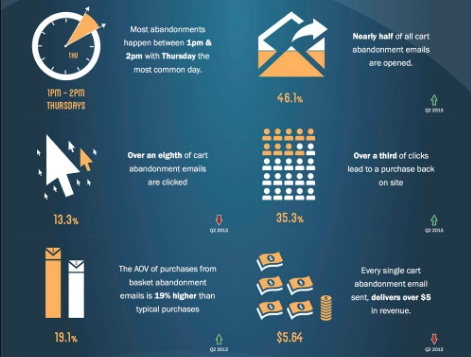

Say,  
You are Goldrush-ing.   
Will you spill gold dust?   
That’s an Absolute No.      

Well, that’s the same thing you got to do when it comes to abandoned carts in your WooCommerce store.

Keeping things simple, let’s say Your WooCommerce store is running successfully with a healthy amount of traffic. And your online revenue is pretty solid as well. But still, there's a lot of sales left behind in your online carts.    
Yes, on an average 70% of your website traffic exit store without buying.

The ratio percentage of the total number of inbound customers to the number of customers who exit store without buying is Cart abandonment rate, We say technically.

Whatever be your eCommerce niche, get to know the average cart abandonment rate of your industry from the image below,

*Statistics By: Optinmonster*
### What if you can recover the abandoned carts?
____

Words Up!   
70% is your abandoned cart rate. That’s more than “Two-third” of your sales volume remaining passive in the shopping carts.

Say, your store is making $1000 every month.
Speaking reality, let’s say you can recover at least 45% of your abandoned carts. Now, that’s an additional $900 added to your online revenue.

Almost double of what you are making.
Doing your Math?...
Well, follow the read to know the online marketing strategy to achieve 45% of cart recovery in WooCommerce store.

### What is an abandoned cart email? - The Simple way to convert an abandoned cart into a successful sale
____

Ask any eCommerce marketer for the <link-text url="https://www.campaignrabbit.com/blog/17-ways-to-increase-your-ecommerce-revenue-through-email-marketing" rel="noopener" target="_blank">best strategy to grow online revenue</link-text> and to recover abandoned shopping carts.
They say Email Marketing.
Abandoned cart emails are targetted emails send to customers who have abandoned shopping cart without completing their purchase.

Unlike any other promotional campaigns, cart recovery email has the best email open rate of 46%. And, interestingly 35% of cart recovery email click drives customers back to your online WooCommerce store.

*Statistics By: SaleCycle*

### How to write Glamorous abandoned cart emails in WooCommerce?
____

Unfortunately, email is one thing that people hate to check daily. But still, you got to be sending your abandoned cart emails until finding zero cart abandonment in your store (that’s hypothetical)..

So, how to write irresistible abandoned cart emails?... How to make your customer click open and read the cart recovery email?

Following are the tips to write best abandoned cart emails (explained with abandoned cart email examples)

### What should be included in your cart recovery email? - Abandoned Cart Recovery Email Checklist
____

#### Catchy Subject Line

Whatever be your email content, your customer is not going to open the abandoned cart email if the email subject line is like “You Left Something in the cart”.

How well you write the abandonment cart email’s subject line is what makes your customer click open the email. You got to tempt customers to check what’s in the email with catchy subject lines.  

Don’t be sending cart emails with subject line saying You left something..., Hurry..., You missed something… People are tired of seeing such patterns in email subject lines.

Instead, choose to appreciate your customer selection, express your concern to help and make your email subject line, the best line in your entire cart email.

***Sample abandoned Cart email Subject Lines:***  
  
Subject Line 1- We’ve Saved it for You!     
Subject Line 2- Can We Help?      
Subject Line 3- You got an Amazing sense of Fashion!      

  
Well, look how caring ‘Casper’ has made the email subject line. “Come back to Bed” sounds caring and no customer leaves this abandoned cart email unopened coz’ it has an emotional connect.

#### Show the customer what’s left in the cart
 
Well, you can absolutely track and <link-text url="https://www.retainful.com/blog/how-to-check-abandoned-carts-in-woocommerce" target="_blank" rel="noopener">check abandoned carts in your WooCommerce</link-text> store. But your customer may not actually remember the date of cart abandonment or what’s left in the cart.

So, make sure your cart recovery email reminds customer of what’s left in the cart. Showing the abandoned cart items should be the primary content in any abandoned cart email.

Look how ‘Ashford’ effectively used the email space to show the abandoned cart item. It’s obvious that this part showing the abandoned cart itmes gets the maximum customer attention. 
 

 
#### Single-click Checkout (Call to action button)

The abandoned cart emails you send aren’t just for reminding customers about abandoned carts. But actually to make the customer complete the abandoned purchase this time.

Who knows, the reason for your customer to abandon the shopping cart in the first instance may be because of a complex checkout process.

So, don’t add much complexity with the Call to action buttons provided in your abandoned cart emails. Add a fast, single-click checkout button that directly takes customers to the checkout page.   
 

 

  ‘Michael Stars’ adds only two Call to action buttons in the above cart recovery email.
-   Return to your cart- to take customers to the cart page so that he can add or remove products before checking out.
-   Checkout Now- to take customers directly to the checkout page where the customer is just asked to complete payment.
  
#### Tempt with discounts & Free Shipping

Ever asked customers the reason for cart abandonment?
Well, here’s what Statista has got to say when it comes to Why People abandon shopping carts.  
You can clearly see that the majority of people abandon shopping cart when they get no coupon discounts and see high shipping charges on the checkout page.

  

*Statistics By- Statista*

So, what if the customers are shared with FREE shipping coupons and discount offers along with the cart recovery emails? In this case, you are providing a valuable solution for your customers to recover abandon carts.

‘Nordstorm’ had done a clean cart recovery email copy & makes pretty sure that the free shipping discount is highlighted (Green Text box).

#### Share Support Details

Sometimes your customer might have few queries regarding the product delivery, return policy, coupon restrictions, etc. and because of that could have abandoned cart.

In this case, you got to make sure that every query of your customer is answered. And that’s done by sharing the support details in the WooCommerce abandoned cart email.

I guess ‘Poppin’ is pretty obsessed to offer excellent customer support. Look how casual they write the support column in their cart email. Also, the support details they share shouldn’t be missed reading- it includes the support number, support availability (work timing), and email address to send feedbacks.

Complete. Isn’t it?

#### Add Customer reviews

Online shoppers are always obsessed with social proof. They look for product reviews before making an online purchase.

And when a business shares social proof (customer reviews and testimonials), the credibility on the product and the trust in the company grows tall. In fact, Social Proofing is one among the list of [17 Growth hacks to grow online business](https://www.campaignrabbit.com/blog/how-to-easily-to-grow-your-online-business-17-growth-hacks).

Its ‘Casper’ again.

  

They write solid abandoned cart recovery email.
-   Engaging email subject line
-   Simple call-to-action button and,
-   Social Proofing- Sharing customer testimonial.

Customer testimonials in cart recovery email can offer the best reason for customers to recover abandoned carts.
Now that you know how to write best abandoned cart emails, you definitely need a tool to automate cart emails. Because tracking and sending cart recovery emails to every customer individually is something that reality won’t accept.

### Best tools to automate cart recovery emails & reduce cart abandonment
____

I’ve made sure not to confuse you when it comes to cart recovery tools. Following are two popular tools to automate cart recovery emails- one of which is premium & the other completely FREE to send email cart for WooCommerce.

-   <link-text url="https://jilt.com/product/automations/abandoned-cart-recovery/" rel="noopener" target="_blank">Jilt</link-text> - Premium email marketing tool to track, schedule and automate your cart recovery email campaign
-   Retainful - Popular WooCommerce abandoned cart plugin to <link-text url="https://www.retainful.com/blog/how-to-send-free-cart-recovery-emails-in-woocommerce" target="_blank" rel="noopener">send FREE cart recovery emails</link-text>.
  
Need more WooCommerce plugin choices for sending abandoned cart emails?  
Try this <link-text url="https://www.retainful.com/blog/top-7-abandoned-cart-recovery-plugins-for-your-woocommerce-store" rel="noopener" target="_blank">7 Best abandoned cart recover email plugins for WooCommerce</link-text>.

Cheers!
