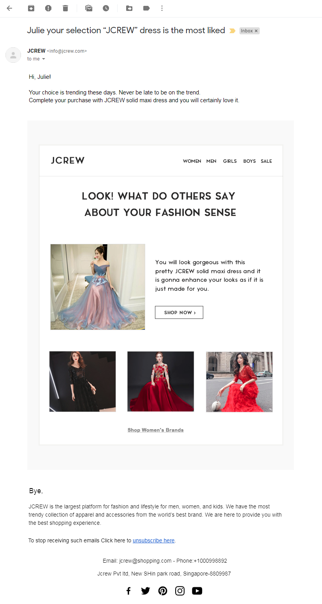
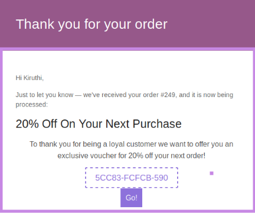
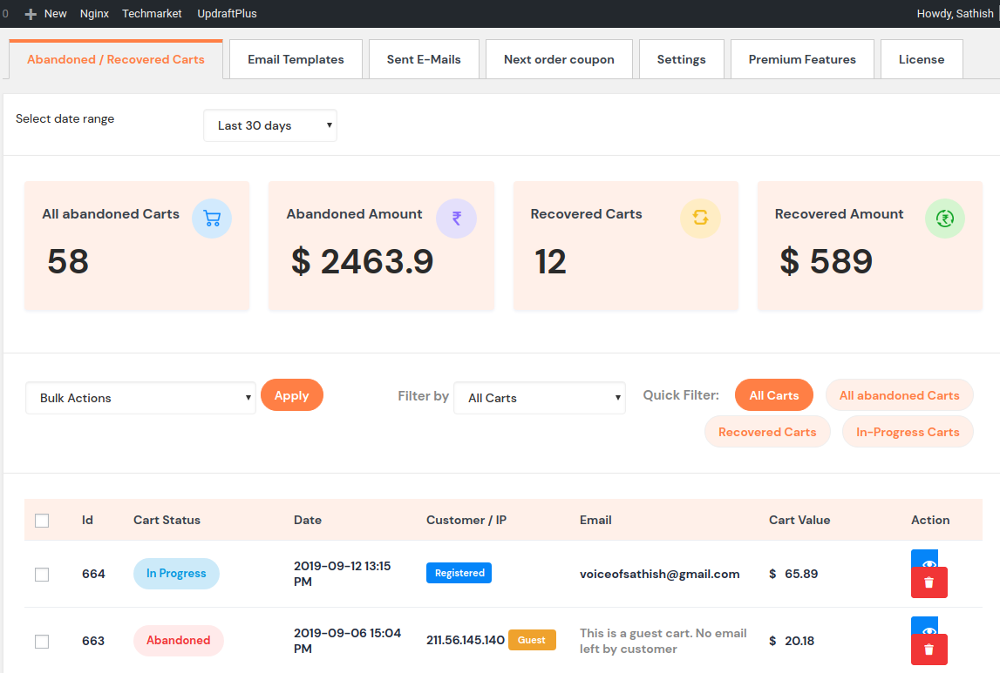
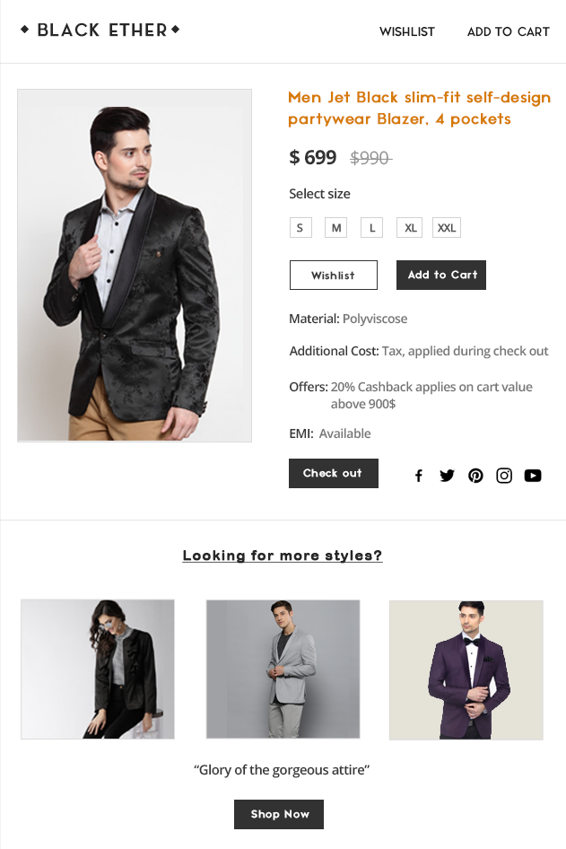
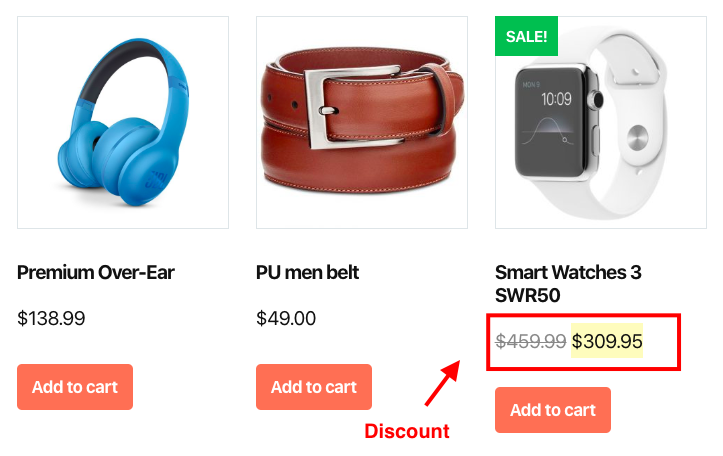
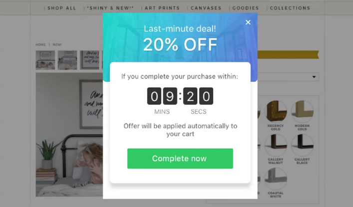

Being an eCommerce store owner I know something is bothering your sales. Opportunities knock at your door but disappear be80-20 rulefore you could grab them.

Yes, customers show interest in certain products by adding them to their shopping carts but many of them end up not checking them out. Here store owners have to do something in order to convince and motivate them so that they go ahead and purchase. Along with it, every store owner would dream about achieving a sustainable business with ever-growing sales.

Now ask yourself what steps have you taken to make your customers feel that they need to make the purchase then and there?

And did you know that you can achieve all of these by implementing a marketing strategy? Further, it can be easily automated and there are <link-text url="https://wordpress.org/plugins/retainful-next-order-coupon-for-woocommerce/" rel="noopener nofollow" target="_blank">plugins</link-text> and applications to do it.

Go ahead and read up if you are one among those waiting to recover your abandoned carts!

Or just a person looking for a good marketing strategy.

Or a new business person who has just started your <link-text url="https://woocommerce.com/" rel="noopener nofollow" target="_blank">WooCommerce,</link-text> Shopify or any other eCommerce store.

<toc></toc>

## Abandoned carts and why recover them?

Abandoned carts are customer shopping carts awaiting checkout and there are multiple reasons why an effort has to be taken to recover the same. Some of the most promising reasons are you can achieve increased sales results using an easy and economical method.

In addition to this, it helps store owners discover the reasons for fewer sales which can be addressed with even a small discount. Hence abandoned carts are the regions where your potential revenue lies.

---

## How to recover abandoned carts?

One of the simplest ways to start with abandoned cart recovery is by retargeting your customers and reminding them to check out their carts. Because targeted marketing is a promising marketing strategy that will certainly scale up your eCommerce business. This can be done using the following methods.

1.  Sending abandoned cart recovery emails
    
2.  Pop-ups
    
3.  Push notifications
    
4.  SMS marketing
    
5.  Messenger marketing
    
6.  Social media marketing
    
7.  Search engine marketing
    
### 1. Sending abandoned cart recovery emails

Among these methods, using email for retargeting is the proven and widely used strategy for abandoned cart recovery.

**When to send abandoned cart email**

It is recommended to send a series of abandoned cart recovery emails when a cart gets abandoned and stop it as soon as the cart gets recovered.

**Best time to send abandoned cart emails**

Success is time dependant, likewise, emails sent during certain time periods will have a greater response. In this case, the <link-text url="https://www.retainful.com/blog/how-to-send-successful-abandoned-cart-email-series" rel="noopener nofollow" target="_blank">cart recovery email series</link-text> can be set to get triggered at predefined time intervals. Here is a set of recommended time periods for cart recovery.

**1st email** - Half an hour post cart abandonment

**2nd email** - Six hours post cart abandonment

**3rd email** - Two days post cart abandonment

**4th email** - Four days post cart abandonment

**5th email** - One-week post cart abandonment

**Abandoned cart recovery email example**

  
**Abandoned cart reminder app**

There are applications in the form of plugins/add-ons that can help you recover abandoned carts. They are not just the ones that allow you to send and automate reminder emails. They also provide you with a wide variety of options, customizations with expert’s guide.

**Retainful**

Retainful is an easy to use abandoned cart recovery plugin that helps you tremendously increase your sales.

**Get started immediately**

Retainful allows you to get started immediately with very few steps to be followed for abandoned cart recovery.

-   Once you install and activate the plugin, choose the parameters for the email to be sent like the recipients’ email list, cart settings and so on.
    
-   Get started with your email design by editing the existing template.
    
-   Try sending a test email.
    
-   After setting up all the necessary options you can automate cart recovery with just one click.
    
***Additional steps for bonus points***

**Customize your abandoned cart settings**

In the settings it allows you to set up the following parameters.

-   Time for considering a cart to be abandoned
    
-   A valid time period for a cart can be set up after which it will be deleted
    
-   Cart recovery notifications
    
-   Real-time (active) carts
    
-   Guest cart details
    
-   Message to be shown
    

**Customize your content**

Retainful offers you with pre-existing templates to use, try using them as reference. At the same time try creating your own designs.

**Next Order Coupons**

Grow your customers as well as retain them. Here Retainful offers a special add-on feature called "Next Order Coupons" with plenty of customizable options. With these coupons, you can provide offers for your customer’s next purchase.

In the below example there is a personalized message stating that there is a 20% discount on the customer’s next purchase.

  

With the Next order coupon in addition to cart recovery, it also helps for customer retention.

**Always, there is a scope for improvement**

Retainful plugin allows you to analyze your success rate due to the recovery process.

Fetches data like the one mentioned below

Using this, you can compare your sales before and after using the cart recovery strategy.

You can make your abandoned cart recovery graph by collecting data at different time points

You can also compare revenue yield after using different add-ons like

-   Coupons
    
-   FOMO
    
This helps you choose your best recovery strategy.

### 2. Popups can recover abandoned carts?

Popups are the ones that appear suddenly on your window. Well, you can use them for multiple purposes like email collection, user data collection, advertising, notifications and so on. While you intend to recover abandoned carts you can display your customer’s abandoned cart contents through popups.

### 3. Push notifications

 

With <link-text url="https://webengage.com/blog/push-notifications/" target="_blank" rel="noopener nofollow">push notifications,</link-text> you can send abandoned cart recovery notifications. The reach is high. Useful information regarding the stats like open rates and CTR rates can be achieved. There will be obviously higher engagement rates as relevant notifications are sent to relevant customers.

There are two types of push notifications, one of which is app-based while the other one is browser-based. With app-based push notifications, you get notifications only if you install the application whereas in browser-based you get push notifications once you agree for the same while browsing a website.

### 4. SMS marketing

One of the old methods of marketing post the advent of cellular phones. Because during that time SMS became famous. It was one of the economical modes of communication and marketing found its way through SMS. For this, you have to fetch the customers’ mobile numbers.

Even after the advent and advancement of new technologies that supposedly replaced SMS messaging to date, it is being used for its advantages.

-   Can bring in lost customers like the ones who were locked out of their user accounts
    
-   Always catches the eyes through default notification
    
-   SMS option available as default in almost all mobiles
    
-   Using OTP you can reconfirm orders, payments, etc,
    
-   There is no spam filter for messages
    
### 5. Messenger marketing

Social media helps you get personally connected to each other. Adding to its benefits it is free of cost and convenient to get connected with your customers. Here a personal message can be sent to a customer who left their shopping cart abandoned.

Recently Facebook messenger marketing is known to get high open and click-through rates. This is mainly due to a step ahead in a personalized approach that involves sending a marketing message to a person who reacted to relevant social media posts. Moreover, many people find it interesting to check their social media inboxes.

### 6. Social Media marketing

Have you ever noticed your abandoned carts appearing through your social media feeds?

This is nothing but Social Media Marketing. It has got immense power to involve and engage the customers and bring in more website visitors, raise brand awareness and most importantly helps you interact. And a study states that advertisements or notifications through this means will catch the sight of the customers almost 50% of the time.

Further social media platforms are known for high response rates with Instagram topping the rest. So, the better you engage your audience and build a network easier it will be for you to achieve your marketing and remarketing goals.

Eg: Advertisements published on Facebook, Instagram and Twitter

### 7. Search engine marketing

Search engine marketing is an apt choice for a competitive market environment as it helps you place your product over others in front of more and more number of interested customers. Here you can advertise abandoned carts through the customer’s search engine results page. By this, the customer can directly get connected to their carts through the CTA link provided in the advertisement and complete the checkout process. There are very feeble chances that carts advertised through that means will go unnoticed.

Eg: Google AdWords

---

## Other things you need to improve for better cart recovery

There are certain important aspects that are listed below which you need to concentrate to improve sales with cart recovery.

-   Website display
    
-   Discounts!
    
-   Site speed
    
-   Sync user account
    
-   Hassle-free checkouts
    
-   Customer loyalty
    
-   Communicate
    
-   Personalization
    
### Website Display

"How do the contents of a web application look like?"

"How eye-catchy your cart recovery notification looks like?"

"Is it noticeable?"

The above factors play a key role in the cart recovery process.

1.  Paying attention to your website design and easy usability increases sales. This includes an attractive design, well-placed contents, call to action links and so on.
    
2.  Concentrate on how do you design the template and contents of your cart recovery emails. There are readymade templates and a <link-text url="https://www.flycart.org/products/wordpress/woocommerce-email-customizer" rel="noopener" target="_blank">drag and drop email builders</link-text> that can contribute a great deal towards presentability.
    
Eg: A cart recovery email with the name of the product in the cart mentioned in the subject line and the product image displayed in the email body.

**Customize your content**

Do not let emails be "just reminders" instead turn them into engaging, lively content.

Content is the core reason why you are valued. So just do not rely totally upon the existing template styles. Try creating your own brand value and add value to your reminder emails.

### Discounts!

 

Discounts can contribute a great deal towards cart recovery provided you know the tricks and hacks. And there are <link-text url="https://www.flycart.org/products/wordpress/woocommerce-discount-rules" rel="noopener" target="_blank">discount plugins</link-text>  with plenty of advanced options and support that facilitates you to provide them to your customers that can potentially yield conversions.

But here what you need to do is <link-text url="https://www.flycart.org/blog/woocommerce/beginners-guide-to-woocommerce-discount" rel="noopener" target="_blank">smartly use the discount rules</link-text> and achieve your expected conversion results.

 

 
In the above example, there is a 20% discount that can be availed within the above mentioned time period. This can effectively create FOMO(Fear of Missing out) and trigger abandoned cart recovery even faster.

**Avoid Hidden costs**

_"Hidden costs are rude shocks"_

They are going to discourage customers from checking out resulting in abandoned carts. And it is one of those top-grossing factors causing cart abandonment. So, try calculating all of those additional costs like taxes, shipping, and pending dues upfront and displaying them.

### Site speed

_"Hurry up, your customers are impatient"_

Irrespective of all your efforts, if there is a delay in the site loading time, then it is directly going to reflect on abandoned carts.

A review suggests that with an increase in the loading time of a website over three seconds, the bounce rate exponentially increases. So keeping a considerably fast loading time is going to give a heads up for the recovery process.

### Sync user account

_"Customers lost while transiting?"_

Changing from one device to another might end up losing cart data. So make sure that you take the necessary steps to ensure whether the customer’s email Id and other details are synced with their carts.

So that even if there is a change in the device, carts details will be saved and resumed. By this the chances of the customer checking out the cart after changing the device increases.

### Hassle-free checkouts

The checkout process itself should be easy without complicated steps or with too many fields to enter. Further, guest checkout facility, support for multiple payment gateways and overall security ensuring the process can act as added advantageous points in the process of cart recovery.

### Customer loyalty

**How to earn customer loyalty?**

-   Quality product/service
    
-   Timely delivery
    
-   Optimal pricing
    
-   Satisfying discounts/offers
    
-   Good customer and feedback support system
    

**How to earn out of customer loyalty?**

-   Reward loyalty with credits
    
-   Membership schemes
    
-   Brand collaboration
    
-   Social and referral Rewards
    
-   Discounts for loyalty
    
-   Loyalty program with a philanthropic aspect
    
### Communicate

_"Hi there, may I help you"_

Customers tend to have queries, suggestions, and feedback that needs to be addressed. Having an FAQ section, live chat or a customer support system can be of great help. By this, we get much more opportunity to understand and address customer’s needs and issues by doing this.

### Personalization

_"Everyone likes to be special"_

Personalization gives a rememberable shopping experience. This has many benefits both from the customer and the retailer's end. With a focus on the benefits from the seller’s end, firstly customer satisfaction will be developed. This will reciprocate in the form of repeated purchases, word of mouth promotions, customer loyalty and much more.

---

## Conclusion

High rates of cart abandonment give rise to a high chance of earning revenue through them. Even with baby steps towards the abandoned cart recovery process, you are opening up avenues that will help you take a giant leap in your online business.

Every store is unique, so is the reason for cart abandonment. Try identifying the concerns revolving around cart abandonment, what shop owners generally do when they face cart abandonment, their good, and bad experiences. And never hesitate to efficiently reach out and engage your customers through remarketing or retargeting tactics.

In the meanwhile retargeting through email is one of the proven ways that helps abandoned cart recovery. Plus it comes with tools/plugins with <link-text url="https://www.flycart.org/blog/woocommerce/beginners-guide-to-woocommerce-discount" rel="noopener" target="_blank">expert's guide</link-text> and ample scope for customization. This allows sending timely emails, designing engaging content and above all, a personalized approach.

Ever tried recovering abandoned carts? What worked and what did not? Share your experiences.
