Have you ever come across a Shopify store with no record of abandoned carts? Silly question, is it? It is well known that there is no eCommerce store with zero cart abandonment rate. At least, it does give a head start to the topic right. 🙂

The reality of shopping cart abandonment is that the future of it cannot be predicted. As of now, there are plenty of <link-text url="https://www.retainful.com/blog/why-customers-abandon-shopping-cart-and-proven-ideas-to-recover-abandoned-carts" rel="noopener" target="_blank">reasons for cart abandonment</link-text> and with each reason as the focus, a number of cart recovery apps can be designed and developed.

Companies put their best foot forward to resolve customer issues but when one is resolved, a thousand others crop up. After all, we are dealing with stuff that has an amalgamation of human behavior and machine thinking. So, issues are bound to recur.

This implies that there is not going to be an end to shopping cart abandonment but it can be brought under control and lowered to the minimal level possible with some of the best Shopify apps for cart recovery.

Check them out.

<toc></toc>

## Recart FB Messenger Marketing
 

 
More than 2 billion people use Facebook every month and this is why Recart has chosen Facebook as the best medium to recover lost sales and revenue. The email has taken a back seat according to Recart and FB Messenger marketing is the future where people spend most of the time rather than sending and reading emails.

No wonder why Recart is the best Shopify abandoned cart app.

<h3>Features</h3>

**Create Messenger campaigns for**

- Abandoned cart recovery
- Welcoming a customer
- Sending shipping & delivery information
- Getting product reviews & feedbacks
- Announcing promotions & flash sales

**Grow Messenger list just like an email list by using**

- Discount box
- Order page subscription

	
<h3>Highlights</h3>

-   There is no worry about low open rates and click-through rates. Delivery of message is assured in the FB Messenger rather than worrying about ending up in the spam folder of an email.
    
-   Simple and easy to handle editor to create campaigns with options for text, images, coupons, audio, video, file attachments, and more.
    
-   Improved chat where discounts can be given to prospective customers.
 
<h3>What customers say?</h3>

“This App is the Best and a Must Have for your store. I use it to recover Carts, to send Discounts to my Customer and Customer Chat. Each job it does have generated additional revenue. It is easy to install and is User Friendly.” - The Sparkle Place

Users of Recart are also very much satisfied with the customer service the team provides.

<h3>Pricing</h3>

The pricing is variable based on the extra sales made.

Upto $1,000 extra sales - $29 per month

Upto $2,500 extra sales - $49 per month

Upto $5,000 extra sales - $89 per month

And so on...

28-day free trial available.

<cta url="https://apps.shopify.com/recover-my-cart" rel="noopener nofollow" target="_blank">Get Recart</cta>

## Retainful
 

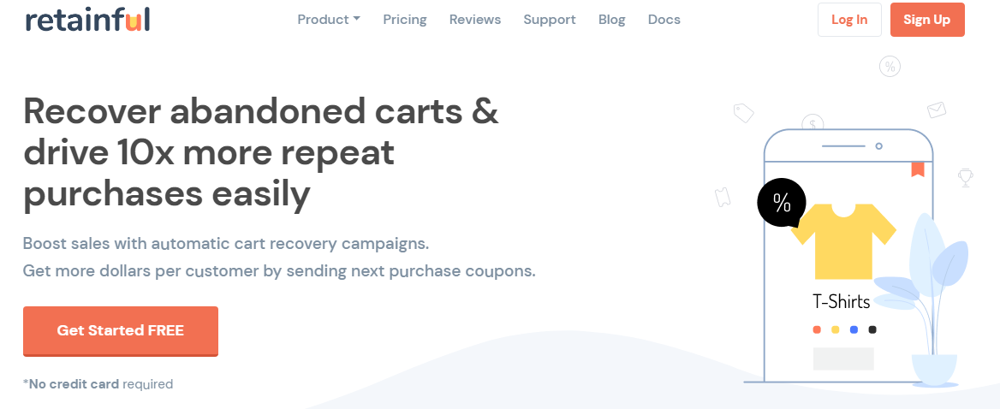

Retainful is the best free shopping cart recovery plugin in the market for your Shopify store. 1000+ companies who trust Retainful can never go wrong. It is with a reason that the app has gained trust.

Get to know the features.

<h3>Features</h3>

**Abandoned cart recovery emails**

Abandoned carts of both logged-in and guest users can be tracked effectively to send out cart recovery emails. The time interval between emails can be pre-set as per the needs of the Shopify store.

**Next order Coupons**

Give away coupons after completion of purchase so that your customers always return in the near future.

<h3>Highlights</h3>

-   Installation that is as easy as pie.
    
-   Send out 1000 cart recovery emails per month (free plan) and unlimited in the higher plan.
    
-   Set up an automated drip campaign to recover carts well ahead of time.
    
-   Ample number of email templates to choose from.
    
-   Email template editing gets easier with a drag and drop visual email builder.
    
-   A dashboard that captures all cart details to give an overview and take instant action.

<h3>What customers say?</h3>

With 5-star rating and 400+ active installations, it is super easy to integrate Retainful with any Shopify store.

Bourji Rachid says, “This product has worked great for our business and has allowed us to convert customers that we most likely would not have. It’s very easy to set up and the plugin provides tremendous support if needed.”

<h3>Pricing</h3>

There are two plans available for Shopify

Free - $0 forever

Pro - $69 per year

## Abandoned Cart Recovery by Marsello 

 

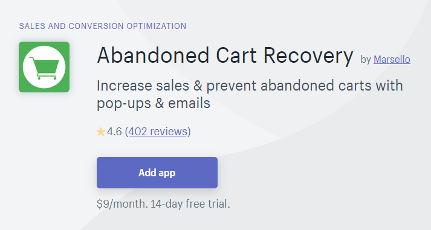

Shopify customers claim that the app simply works on its own after the initial customization and this is what is called automated abandoned cart recovery. This is what every eCommerce store owner needs - a dedicated app that truly pays off.

<h3>Features</h3>

Abandoned Cart Recovery by Marsello keeps it simple by focussing on just two main features to recover lost revenue.

-   Abandoned cart emails
    
-   Exit-intent popup

<h3>Highlights</h3>

-   Project your brand by adding a logo to the emails and popups.
    
-   Images of abandoned cart products are automatically included in the email.
    
-   Add a discount if necessary.
    
-   Order checkout is equally possible across all devices including mobiles and tablets.
    
<h3>What customers say?</h3>

I must say that Marsello is being true to what they claim.

Here is proof.

“I've been using this for a few months now...no glitches and it has recouped over $300 already. I can't comment on support because I haven't needed any, how great is that?!” - Divella Designs

<h3>Pricing</h3>

$9 per month

14-day free trial available.

<cta url="https://recovermycart.squarespace.com/" rel="noopenernofollow" target="_blank">Abandoned Cart Recovery by Marsello</cta>

## Recapture Abandoned Carts 
 

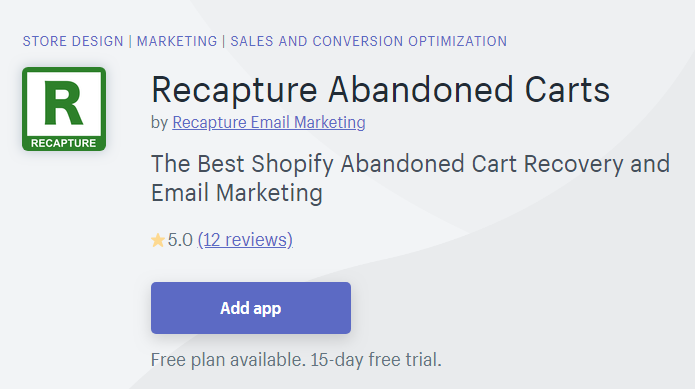

Wicker Central is known for high-end outdoor wicker furniture and so the worth of a single abandoned cart can easily go beyond $1,000. With the help of Recapture, the company could recover an average of $72 per abandoned cart email sent.

Recapture makes Shopify abandoned cart recovery a cakewalk.

<h3>Features</h3>

Recapture provides the following

-   Cart Recovery emails
    
-   Email collectors and popups
    
-   Review reminders
    
-   Targeted email marketing
   
<h3>Highlights</h3>

-   Mess-free 5 minute set up.
    
-   Pre-written emails that can be edited and customized.
    
-   Supports multiple languages and currencies which is automated.
    
-   Email reports about cart recovery on a daily basis
    
-   Actionable insights in the form of analytics with details of carts, revenue, cart abandonment rate, and emails sent.
    
-   Live cart feed with four sections - active, abandoned, recapturable, and converted. The live cart feed is unique with information about the customer (name and email), time, and product image if available.

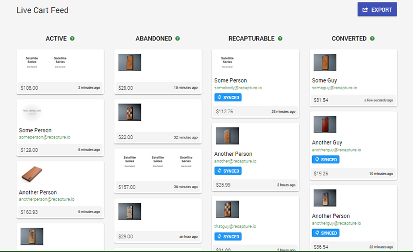

  
<h3>What customers say?</h3>

As on April 15, 2019, Caravan to Midnight has this to say about Recapture

“We have recovered over $5,700 in revenue that would otherwise have been lost. You cannot run an online store without Recapture - this is simply the best app.”

That’s pretty impressive.

<h3>Pricing</h3>

Base plan - $29 per month for upto $2500 recovered sales.

Highest - $399 per month > $20,000 recovered sales.

15-day free trial available with the freedom to try all features.

<cta url="https://recapture.io/" rel="noopener nofollow" target="_blank">Get Recapture Abandoned Carts</cta>

## Moonmail Recover Checkouts 
 

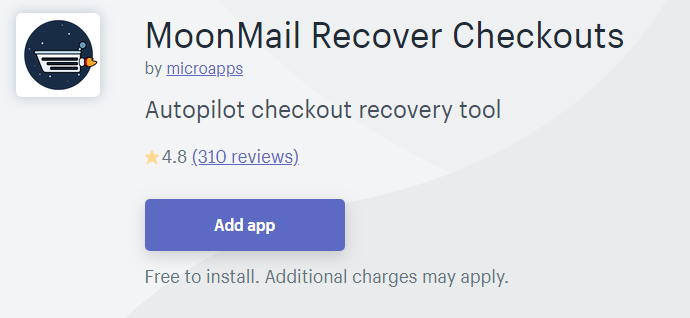

Let me be frank here. This app is nothing like the out-of-the-world type. It is just a basic abandoned cart recovery app for Shopify stores with sole focus on a single feature - abandoned cart emails.

<h3>Highlights</h3>

-   5 different cart recovery emails are sent out rather than the usual 3.
    
-   Templates can be customized using the email editor. (Company gives out paid template designs if needed).
    
-   Choose between manual and automated email process in higher plans.
    
-   Geo-target the emails by choosing the ‘billing country’ when setting up a template.
   
<h3></h3>

The reviews are mixed with a majority of them being positive ones.

Khomo Accessories says “This app really helps me to get plenty of abandoned carts orders back. I highly recommend it for your website.”

<h3>Pricing</h3>

The pricing is based on the number of emails you might want to send out in a month.

20 emails - free

50 emails - $2 per month

100 emails - $8 per month

200 emails - $10 per month

500 emails - $19 per month

1200 emails - $45 per month

5000 emails - $99 per month

10,000 emails - $149 per month

<cta url="https://apps.shopify.com/abandon-app" rel="noopener nofollow" target="_blank">Get Moonmail Recover Checkouts</cta>

## Checkoutify 
 

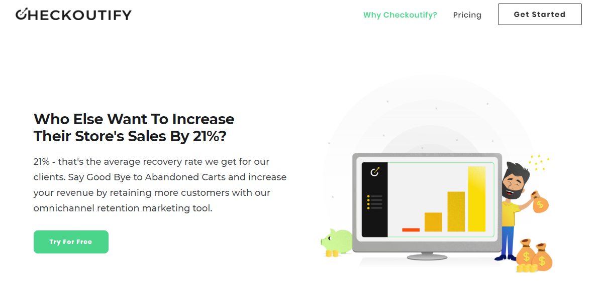

Emails do top the charts when it comes to cart recovery but push notifications are not bad either. Checkoutify combines the power of these two to bring back customers. With very few but all positive reviews and a queer name, this app just could not be ignored from the lot in the Shopify store.

<h3>Features</h3>

-   Abandoned cart recovery emails
    
-   Automated push notification for cart recovery and email collection
    
-   Manual campaigns for push notifications
   
<h3>Highlights</h3>

-   Insightful dashboard with abandoned carts data to decide on how to proceed further.
    
-   Clutter-free email editor with 3 editing tabs - text, design, and HTML.
    
-   Autofill option for the checkout page.
    
-   Schedule push notifications for the future.
    
-   Intelligent cart tracking.
    
<h3></h3>

This is a quite recent review.

“Love the app & love how well it works in reality.

I stumbled upon this app when I was browsing the app store and to be honest it was all worth it.

Quite the unique features that I am excited to try out as well

Recommended & approved.” - Cocosmile.se

<h3>Pricing</h3>

30-day free trial available.

The plan is of five types based on extra sales made.

<table class="table table-bordered">
<tbody>
<tr>
<td>

<strong>Plan type</strong>

</td>
<td>

<strong>Extra sales range</strong>

</td>
<td>

<strong>Price per month</strong>

</td>
</tr>
<tr>
<td>

Starter

</td>
<td>

$0 - $4999&nbsp;

</td>
<td>

$25.99

</td>
</tr>
<tr>
<td>

Advanced

</td>
<td>

$5000 - $14999

</td>
<td>

$49.99

</td>
</tr>
<tr>
<td>

Premier

</td>
<td>

$15000 - $29999

</td>
<td>

$99.99

</td>
</tr>
<tr>
<td>

Elite

</td>
<td>

$30000 - $50000

</td>
<td>

$149.99

</td>
</tr>
<tr>
<td>

Supreme Pro

</td>
<td>

50k+

</td>
<td>

$349.99

</td>
</tr>
</tbody>
</table>

&nbsp;

<cta url="https://apps.shopify.com/checkoutify" rel="noopener nofollow" target="_blank">Get Checkoutify</cta>
  
  

## CartKit
 

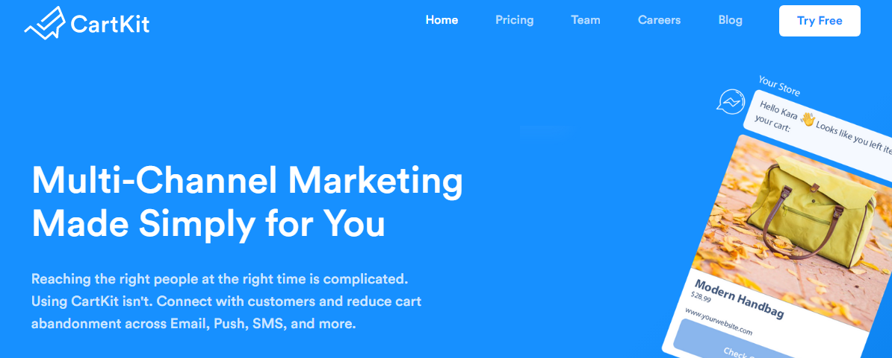

  
CartKit, previously named Consistent Cart, is one of the best cart abandonment Shopify apps. The app claims to be a 10-in-1 tool to support multi-channel marketing rather than getting sidelined with just one marketing tactic.

According to me, there is no other Shopify abandoned cart app with so many diverse features integrated into one.

<h3>Features</h3>

-   Abandoned cart email campaigns
    
-   Push notifications
    
-   Add to cart popup
    
-   Shop pops to indicate recent sales
    
-   Flashing title bar
    
-   Facebook Messenger Marketing
   
P.S. Facebook Messenger Marketing feature will be removed from CartKit app with effect from August 1, 2019.

<h3>Highlights</h3>

-   Email campaigns are available for sending birthday wishes and thank you emails.
    
-   Simple and neat email sequences with plenty of white space.
    Getting premium Abandoned Cart email templates
-   Real-time activity monitor with separate tabs all features included in the app.
    
-   Syncs logged-in carts across devices for a smoother checkout.
    
-   Shop pops with social proof that create FOMO.
    
-   Demands attention with a customized title bar.
   
<h3></h3>

Getting a 4.8 star rating from over 8000 reviews is no joke and Consistent Cart has done it.

Here is a testimonial.

“GREAT APP, really helped me retarget customers and increase sales! Wish this app was free! Recommended buy for sure!” - Portable Puppy Bottle Co

<h3>Pricing</h3>

Basic plan - Free (only monitoring and cart syncing)

Pro plan - $29 per month + charges based on extra sales

14-day free trial available.

<cta url="https://apps.shopify.com/consistent-cart" rel="noopener nofollow" target="_blank">Get CartKit</cta>

## PushOwl Web Push Notifications
 

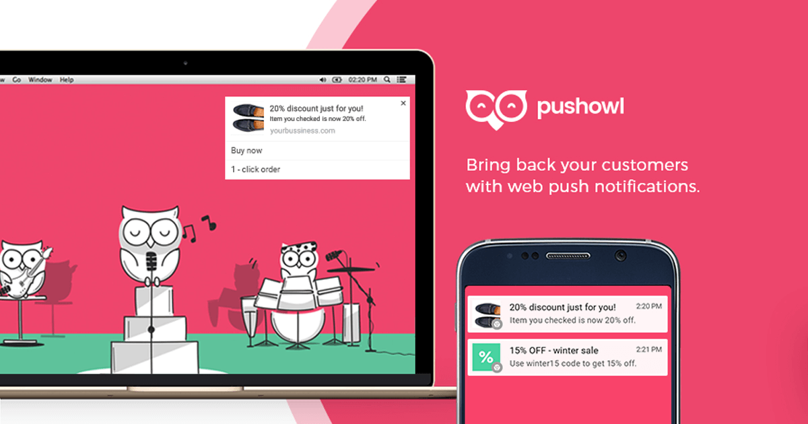

According to PushOwl, push notifications generate more conversions than emails. This cannot be denied because the success rate and reach of this app is living proof.

<h3>Features</h3>

Push notifications for

1.  Abandoned cart reminder
    
2.  Welcoming a customer
    
3.  Back-in-stock message
    
4.  Price drop announcement
    
5.  Shipping
    
6.  Flash sale
    
<h3>Highlights</h3>

-   Sends notifications to mobiles if eCommerce store does not have an app.
    
-   Receive up-to-date reports with accurate data to study the campaigns.
    
-   Test and change marketing strategy with ‘Click maps’ that reveal how customers use notifications.
    
-   Include Call-To-Action, images, and emojis in push notifications.
    
-   Auto-expiry for notifications.
    
-   Multi-language support.
    
<h3></h3>

Most users of PushOwl love the app for starting to recover sales as soon as it is integrated with the Shopify eCommerce store. Literally, one customer was astonished to 80X ROI with just abandoned cart notifications alone.

Another customer says, “Able to generate thousands of dollars extra with push notifications” - Andar Wallets

<h3>Pricing</h3>

Basic - Free for a lifetime

Business - varies from $19 to $76 per month

Enterprise - undisclosed (known for tailor-made plans with a dedicated Strategy Manager)

P.S. The free plan does not include the push notification feature for abandoned cart recovery. Upgrade to Business plan if this is your requirement.

<cta url="https://apps.shopify.com/pushowl" rel="noopener nofollow" target="_blank">Get PushOwl Web Push Notifications </cta>

## Kit Karts 

 

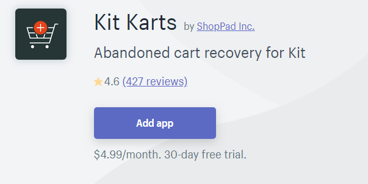

  

Kit Karts is solely meant to be used in integration with Kit CRM - a virtual marketing assistant to run targeted Facebook campaigns to win back customers and more.

<h3>Features</h3>

-   Works with an SMS interface
   
As an eCommerce store owner, you receive information about all the abandoned carts every day via SMS.

-   A text triggers the abandoned cart reminder emails

Just by replying to the SMS, the Shopify app sends out reminder emails to recover the sales.

<h3></h3>

With 4.6 rating from 427 reviews, Kit Karts does a fairly decent job with abandoned cart recovery.

Coins and Connections, LLC says, “Already recovering carts within 7 days. Thanks so much. I would recommend using the free trial to see if this is right for you.”

<h3>Pricing</h3>

$4.99 per month

30-day free trial available.

 <cta url="https://apps.shopify.com/kitkarts" rel="noopener nofollow" target="_blank">Get Kit Karts</cta>

## Abandoned Cart Reminder by SpurIT 

 

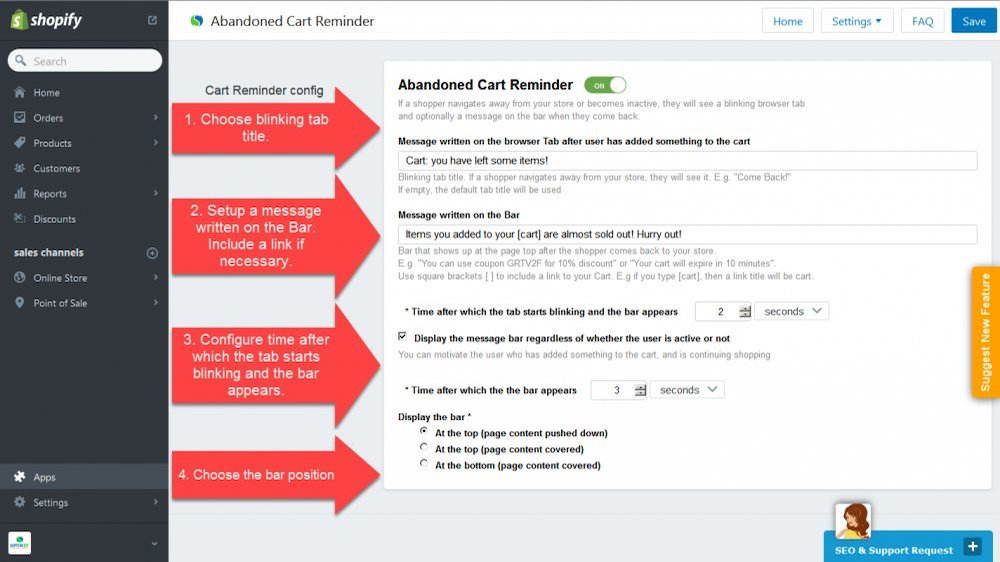

 
This app by SpurIT was a random choice at first to be included in the list. After giving it a read, I felt that it deserves to be here for its uniqueness. Kudos to the brains behind it.

Do you think emails, popups, and discounts, are the only way to recover carts? If so, I am afraid you are wrong.

Heard of a blinking tab?

I see you getting curious. Check out the features.

<h3>Features</h3>

-   The Blinking Tab
   
A person who usually abandons a cart is mostly in a situation of dilemma and hence just skips that tab and moves on to another one rather than closing it. Abandoned Cart Reminder uses this instance as an opportunity to recover sales.

When a person moves on to browse in another tab, the tab where the visitor abandoned the cart starts blinking with a message on it. It gets noticed and the visitor returns.

-   The Bar

On return, the visitor finds a bar which displays a second message to complete the purchase. The messages displayed here usually creates a sense of urgency to act fast.

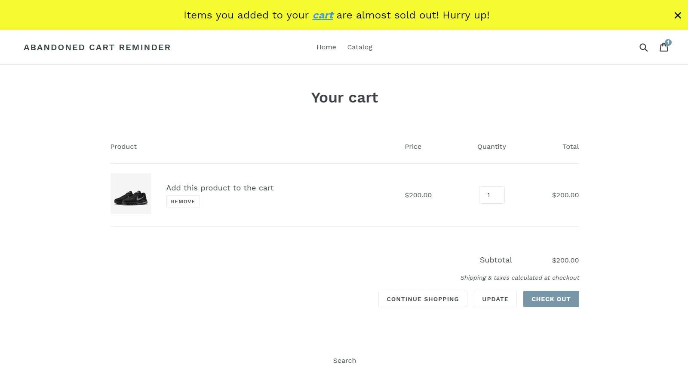

<h3>Highlights</h3>

-   One-click installation.
    
-   Cart recovery has never been faster. It happens in seconds.
    
-   Fully customizable messages.
    
-   Discount code can be included in the bar.
    
-   Follow-up recovery emails can be sent if the visitor closes the tab rather than switching.
    
<h3></h3>

Here is a statement from one of their customers which shows that the functionality of the app exceeds expectations.

“Sorry but I wanted to rate this App 10 but only found 5 stars! …Helpful team and easy to use app. Well done!” - Volanie Creative Designs

<h3>Pricing</h3>

$8.95 per month.

5-day free trial available.

<cta url="https://apps.shopify.com/abandoned-cart-reminder" rel="noopener nofollow" target="_blank">Abandoned Cart Reminder by SpurIT</cta>

## A brief analysis…

I am not sure if you noticed. Of all the 10 apps that have been detailed in this post, Retainful is the only one that has the yearly payment option at such a low price.

When you have to pay $29 minimum + extra charges almost every month for most of the Shopify apps, Retainful sticks to $69 /year with all of the prime features available in the free plan itself.

If you are a startup looking to make it big in the world of eCommerce, then look no further. Retainful is just a click away.

If quality and service are what you are concerned about, opt for the below apps.

For abandoned cart emails - Retainful

For FB Messenger marketing - Recart

For Push notifications - PushOwl

Analyze for yourself, make the right choice, and witness your business grow.
  
  

  
