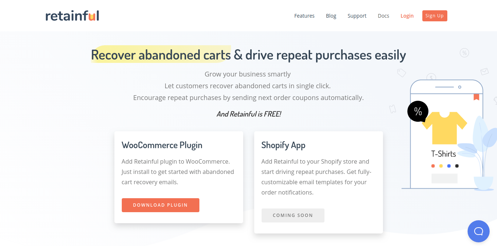
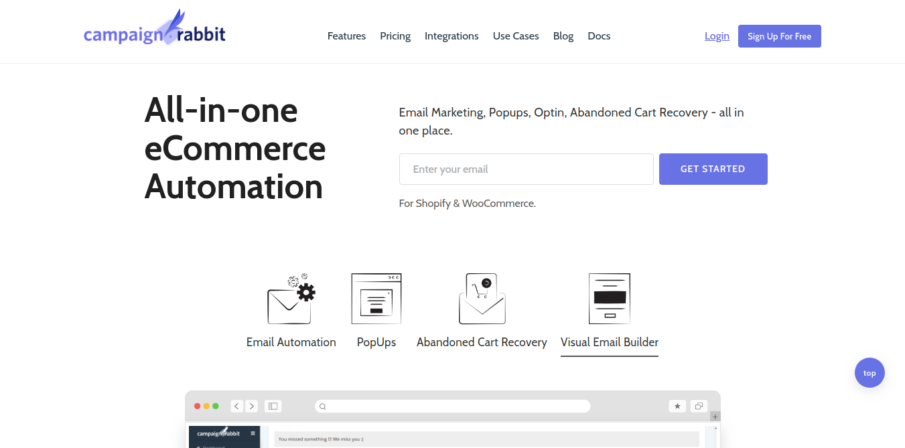
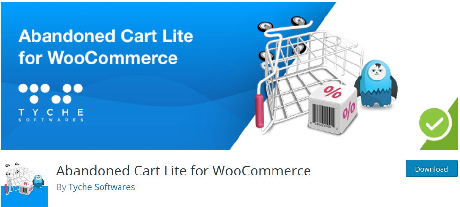
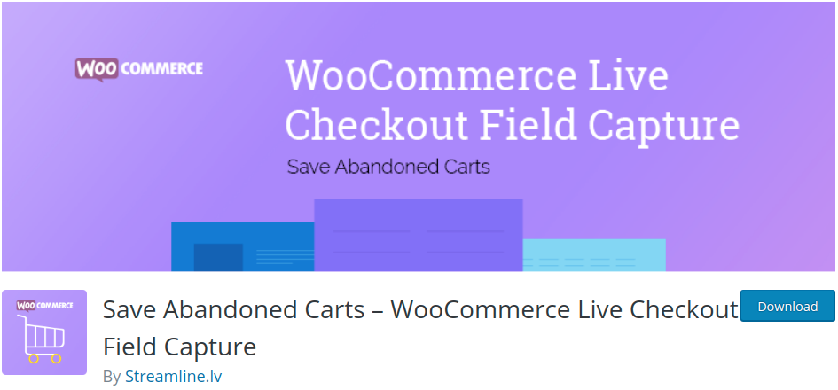
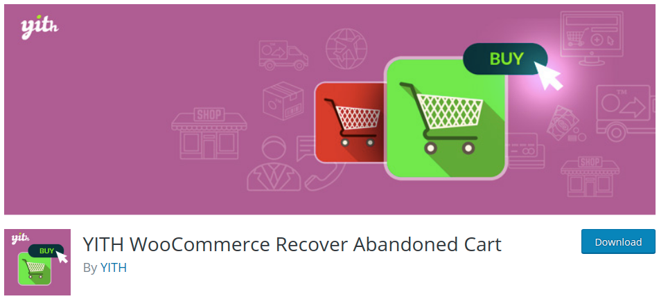
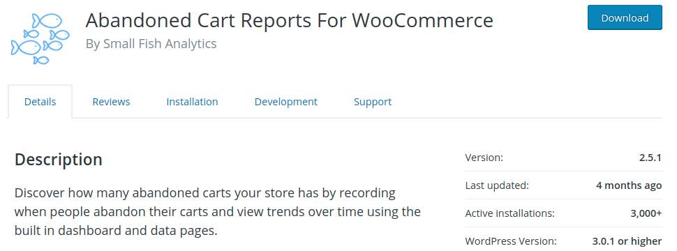
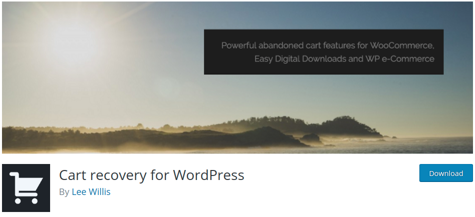

It is no more a secret that over 60-80% of the shopping carts are abandoned every year. This is to say, that online business loses a vast count of customers every time when a cart is abandoned and left without a purchase.

While it is too hard to take in the fact, <link-text url="https://www.salehoo.com/blog/shopping-cart-abandonment-statistic" target="_blank" rel="noopener nofollow">Here is proof!</link-text>  **A  whopping amount of $1.79 trillion USD worth of goods is abandoned every year.** 
Yes, You read it absolutely right. 
The loss is unbearable for any e-commerce business to say the least. 

However, there are a few plugins that can help you make successful sales conversions.

First things first. Cart abandonment can be due to several reasons. Starting from Shipping charges to quality of product and even due to customer's personal reasons. 

A study issued by Barilliance says, smaller the size of the screen, more is the chance of cart abandonment. This implies mobile screens suffer up to <link-text url="https://www.barilliance.com/cart-abandonment-rate-statistics" rel="noopener nofollow" target="_blank">85.65% of cart abandonment.</link-text> It takes so many factors to come out of this jeopardy. 

The issue is addressed and assisted with the help of plugins. And here is the list of preferred WordPress plugins that helps in cart recovery.

<toc></toc>

## 7 Top WooCommerce abandoned cart recovery plugins
___

<h3>1. <link-text url="https://wordpress.org/plugins/retainful-next-order-coupon-for-woocommerce/" target="_blank" rel="noopener">Retainful</link-text>- WooCommerce abandoned cart recovery emails and next order coupons </h3> 

RetainFul is a very efficient plugin that helps you in recovering abandoned carts for your WooCommerce stores and successfully transforming them into sales conversions with a single click.  

 Looking out for plugin that is affordable and constructed with the best of features? 

Did I say affordable? Yes. I did because RetainFul is a FREE plugin. You pay nothing to download this plugin. All you need to get started is to download! 

RetainFul is a profitable plugin that has its integrations with a powerful e-commerce platform like WooCommerce. Also, It is soon to be integrated with Shopify App. 

 **Retainful has the following features to facilitate with cart recovery**   

- Helps you send unlimited cart recovery emails.   
- You can schedule an automated cart recovery email reminders.   
- Trigger reminders at regular intervals.   
- Single-click recovery through emails is now affiliated.   
- Record all abandoned carts, be it guest or registered ones, once the cart is deserted. You send them follow-up emails.   

These features are like adding a cherry to the cake. Meaning, it is what that makes Retainful a very successful plugin out of the lot..

Customers are psychologically attached to your store and when provided with a motivation factor, they assuredly will come back for a purchase. Talking about what? - <link-text url="https://www.retainful.com/blog/how-to-provide-next-order-coupon-in-woocommerce/" target="_blank" rel="noopener">COUPONS!</link-text>

Coupon creation and management have been made simple and unique now. No more generic coupon codes. Unique, single-use, future order coupons all the way to the win.  Set validity and criteria for the coupon usage and get started. 

<link-text url="https://www.flycart.org/blog/woocommerce/5-best-discount-coupon-generator-for-woocommerce" target="_blank" rel="noopener">Coupon creation</link-text> is now not a tedious, stressful process. Check it out yourself! 

Thinking that is all? Absolutely not! What if I say, you can track customer behaviors. RetainFul helps you compare abandoned cart value vs cart recover value. 

A complete package constructed carefully with all the necessary features one is looking for Woocommerce cart recovery is here.

 If such a plugin was placed in front of you, you cannot afford to miss especially after knowing that is the best of the lot.

**Pricing**<link-text url="https://www.retainful.com/" target="_blank" rel="noopener">FREE</link-text> 

----------

<h3> 2. <link-text url="http://campaignrabbit.com" target="_blank" rel="noopener">CampaignRabbit</link-text></h3>  

Campaign Rabbit integrates incoherently with successful e-commerce platforms like WooCommerce and Shopify. How it helps with cart recovery be the question? The reply would be through one of the most efficient strategies of the coming age. 
Wondering what that might be? Email marketing undoubtedly. 

Any strategy that involves email marketing is a win-win factor. How do we prove that? Out of all cart-retention intended emails that you sent, a staggering 45% of them are opened and to add delight to this fact, almost 50% of the <link-text url="https://moosend.com/blog/cart-abandonment-stats" target="_blank" rel="noopener">emails are successfully converted to purchases.</link-text>  

**To recover WooCommerce abandoned carts, Campaign Rabbit does the following,**

- Automated email reminders
- Triggers exit-intent popup when a customer leaves your website without making it to a successful purchase.
- Follow-up emails when a customer abandons the cart and asks them what's wrong. Feedback will do.

The crowned feature of the plugin? Sends timely and relevant messages on autopilot and let your customers know they're valued.

<link-text url="https://www.campaignrabbit.com/blog/7-abandoned-cart-recovery-email-ideas-for-shopify-and-woocommerce/" target="_blank" rel="noopener">Abandoned cart recovery campaign</link-text> is now a step away with emails that work well on platforms like Shopify and Woocommerce.

**Pricing:** 

Campaign rabbit quotes, **"Pay as you grow"**. Much true to their quote, the pricing is segmented accordingly. Offers a free trial for 30 days.

- 0-100 customers - Free.
- 100-2000 customers- $14/m
- 2000-5000 customers- $29/m
- 5000-10000 customers- $49/m
- 10,000- 25,000 customers - $69/m
- Above 25,000 customers, <link-text url="https://www.campaignrabbit.com/pricing" target="_blank" rel="noopener">CampaignRabbit</link-text> calls you for a direct interrogation.

----------
    
<h3>3.<link-text url="https://wordpress.org/plugins/woocommerce-abandoned-cart/" target="_blank" rel="noopener"> Abandoned cart lite for WooCommerce</link-text></h3>  

A purchase so close yet so far? It’s just a step away from checkout but the products are left abandoned in the cart. We have to accept that we can't cut down cart abandonment completely yet, there are ways to recover abandoned carts and build grow a healthy customer relationship.
 
Abandoned cart lite for WooCommerce serves the recovery of Woocommerce abandoned carts just well and right.

**Works in the backend and does the following,**
- Sends email notifications to both guest customers and the logged-in. Reminds them about their carts, which haven't successfully made to a conversion.
- Enables the creation of well-timed email reminders to be sent to customers who deserted their shopping carts.
- Facilitates in the creation of unlimited email templates.
- Once, the WooCommerce cart recovery is done, the email notifications are ceased automatically.
- Also, tracks abandoned orders vs recovered orders. 
Comes in two versions, the lite and the Pro.

**Pricing:**
Free for the lite version and Pro for single WP site is $119/ year

----------

<h3>4. <link-text url="https://wordpress.org/plugins/woo-save-abandoned-carts/" target="_blank" rel="noopener nofollow"> Save abandoned carts - WooCommerce live to check out field capture</link-text></h3> 

WooCommerce live checkout captures and saves individual activities of customers. You can check who abandons the cart without making the purchase.

**Features of the plugin are as follows**

- Captures WooCommerce checkout field data before submission to save abandoned carts.
- For a guest customer, the remember checkout field will allow them to refresh the checkout page after entering the information, without previously losing the data entered data in the checkout form.
- For logged - in customers, the cart will be recorded as soon as he adds products to the cart or abandons the cart.
- Exit-intent pop-up helps you capture emails of customers and later remind them about their shopping carts.
- Helps you in contacting your visitors and remind them about the abandoned carts.
- If the cart is recovered successfully, the user receives a thank you message.

 To win them back, you can also offer an additional discount on a cart by sending coupons through emails.

**Pricing:** Free Lite Version
- **Single Site license:** $37 
- **Up to 5 site license**: $82.
- **Developer license:** $642

----------

<h3>5. <link-text url="https://wordpress.org/plugins/yith-woocommerce-recover-abandoned-cart/" target="_blank" rel="noopener nofollow"> YITH - WooCommerce Recover abandoned carts</link-text></h3>
 

What this plugin does?

  
Contact, Remind and Invite - 3 job roles of YITH - WooCommerce Recover abandoned cart plugin. You can choose the activity of recovering carts. Meaning, You can choose to send bulk email notifications or single ones. Helps you contact customers who did not successfully make it to conversion.
- Sends emails to customers who abandoned carts.
- You get to choose the number of emails to be sent according to a time span and can customize your own email content.
- Multiple language support is offered. Meaning, when a customer from a different country visits your e-commerce site, you can automate your email in his language.

**Pricing:** 
A bit expensive compared with the rest and the pricing goes this way

- Single site - €72,99
- 6 Sites - €99,99
- 30 Sites - €169,99

----------

<h3>6. <link-text url="https://wordpress.org/plugins/yith-woocommerce-recover-abandoned-cart/" target="_blank" rel="noopener nofollow"> Abandoned cart reports for WooCommerce </link-text></h3>
 

Before we begin, it is important for you to know that<link-text url="https://optinmonster.com/cart-abandonment-statistics/" target="_blank" rel="noopener nofollow"> 76 out of 100 shoppers are just walking – clicking, rather – away from their carts.</link-text> 

Do we even need any more convincing? In order to get rid of abandoned carts, you need to know the complete information on your store carts. Abandoned Cart Reports for WooCommerce is all known for this functionality. 

You can now discover the number of carts that are abandoned. Also, the plugin helps you know the trends using the dashboard and data pages.

**How does the cart work?**
- Records cart abandonment and other activities of individual customers.
- Follows-up using the email address of the customers.
- The data page updates every single move. Say, when a cart is abandoned, it says "Abandoned ". When a cart is recovered, the page will display, "Recovered".  

**Pricing:** The plugin is Free to download from the WordPress repository.

----------
   
<h3> 7. <link-text url="https://wordpress.org/plugins/cart-recovery/" target="_blank" rel="noopener nofollow"> Cart Recovery for Wordpress</link-text></h3>
 

Cart recovery brings customers who abandon carts to your Wordpress store. This plugin holds integration with Wordpress GDPR compliance.
With real-time statistics, you can track and view abandoned carts. Then follow customers via <link-text url="https://www.retainful.com/blog/7-Successful-Cart-Recovery-Email-Examples-to-Bring-Customers-Back" target="_blank" rel="noopener">recovery emails</link-text> until they choose to come back to your store.

**Functions**

- Flexible enough to pick timings of when an email should be sent.
- Can also generate multiple emails at a stretch.
- Generates dynamic use discount coupons.
 
**Pricing:** Free!

Here's a fact! Online shopping<link-text url="https://www.creditdonkey.com/shopping-abandonment-statistics.html" target="_blank" rel="noopener nofollow">cart abandonment rates across the globe</link-text>  are estimated at 75.2% as high as ever. !

WordPress cart recovery is now absolutely attainable and manageable with the help of the above plugins. Implement the above solutions by picking the best and see your sales grow. Remember! You cannot cut down your cart abandonment rate to 100% but you can always win your customers back with certain strategies that are well created to perfection. 