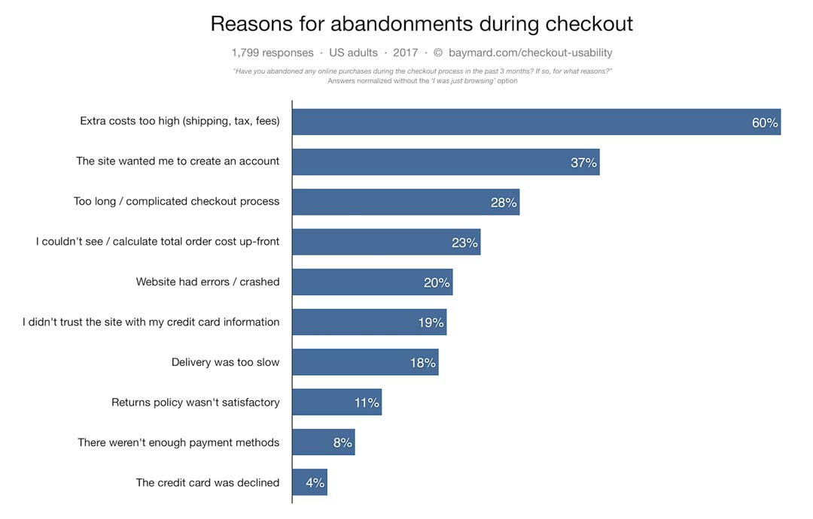
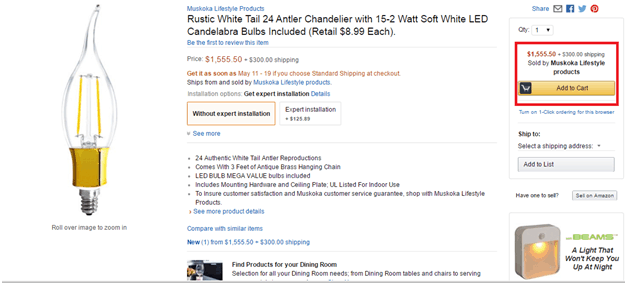

Individuals differ in color, race, religion, gender, beliefs, esthetic values, morals, and whatnot. In a similar fashion, the reasons behind an action too differ from person to person. The action we are talking about here is shopping cart abandonment.

Yes, you never know why a person abandoned a cart but you can make an assumption. Not all assumptions are wrong. To make it easy for you, many organizations have conducted surveys to study the factors that lead to cart abandonment.

Below shown is a graphical representation of a survey conducted by Baymard Institute.

This survey identified 10 reasons but there are many others.

Read on to know more.

<toc></toc>

<h2><highlight>13 reasons for shopping cart abandonment</highlight></h2>

This post sums up findings from different surveys and describes briefly the top reasons for shopping cart abandonment along with some suggestions to <link-text url="https://www.retainful.com/blog/the-simple-way-to-retain-all-your-customers" rel="noopener" target="_blank">recover the already abandoned carts</link-text>.

### Hidden costs that spike the product price

The cost of a product is one deciding criteria when purchasing online for most people. And to see that same cost increase unexpectedly at checkout is disheartening and even frustrating. This eventually leads to cart abandonment instantly, almost without a second thought.

In all the surveys conducted to uncover the reasons for cart abandonment, hidden costs have taken the top spot throughout. These hidden costs include shipping, taxes, and maybe even a fee for a complementary product. They are not revealed in the product pages and only after the checkout.

Why not reveal an estimated cost earlier in the process? Amazon does this perfectly by mentioning the cost earlier in the product page itself.

### User account creation

According to a study by Baymard Institute in 2017, 37% of people revealed that the need to create a user account was one of the top reasons for shopping cart abandonment.

A first-time user being bombarded with the pop-up ‘Login or create an account’ in the midst of online shopping is an incident worth abandoning the cart. Even though registering as a user or member has benefits in the long run, people consider the procedure as an obstacle.

The problem arises when the account creation is made mandatory. Do the following as an alternative.

-    Allow customers to checkout as a guest user.
    
-   Prompt the customer to sign up as a member after the purchase is done using a pop-up or a noticeable CTA when the transaction details are shared.
    
-   Give an option to turn down the offer too.
  
### Complicated checkout

No one likes to fill up forms. People are always in a hurry and would like to finish it quickly when the need arises. This is something that cannot be avoided for the checkout process when shopping online but the flow of the can be made smoother and easy for the customer. Research reveals that around 28% of people abandon their carts if checkout creates a ruckus.

Other elements that contribute to shopping cart abandonment during checkout are

-   Multiple pages
    
-   A non-interactive form
    
-   Distracting images
    
-   Slow loading
    
-   Internal links
 
In the absence of all these, the checkout will function without much hassle.

### Payment issues

Issues with payment is another reason why customers abandon shopping carts. You cannot expect all of your customers to choose from a single payment method of your liking. This might actually make you look untrustworthy.

I actually abandoned a cart last week due to the same reason. It happens all over the eCommerce domain and can be reduced if multiple payment options are put forth.

### Unsatisfactory return policy

Customers do take policies very seriously, whether it is a refund or return policy. The return policy, in particular, is the most sought after in the eCommerce sector especially for the fashion retailers. The mention of the return policy in the checkout page encourages the person to carry on with the payment rather than abandoning the cart.

The return policy must be devoid of any legal terms and in simple and clear words for better understanding. The return policy literally acts as a trust badge and when people are unable to find it, they hesitate to take the process forward.

### No coupon code

Where there is a deal on one side, there is a customer at the other end waiting to grab it. An online shopping site that does not provide coupon codes is considered nearly useless. As per a survey conducted by Blippr, <link-text url="https://www.blippr.com/about/coupon-code-stats/" rel="noopener nofollow" target="_blank">people who use coupon code spend 37% more than people who don’t.</link-text>.
 
 
This statistic itself reveals the possibility of a higher cart abandonment rate in the absence of a coupon code. Isn’t it a smarter idea to provide <link-text url="https://www.flycart.org/blog/woocommerce/5-next-order-coupon-plugins-for-woocommerce" rel="noopener" target="_blank">coupons codes</link-text> generously especially when you, as a store owner, can decide to whom and when to deliver them?

### No express delivery

In eCommerce, one aspect that people look into is the estimated delivery date for the products chosen. And if it is a last-minute buy, it is no wonder that the customer might expect a quicker delivery than the regular one at any cost. I mean it - AT ANY COST because the purpose has to be realized here.

There is nothing more infuriating than finding a ‘No express delivery available’ tag at the time of checkout. The customer obviously leaves the page and goes on to shop from another online retailer who provides this support.

No customer will ever call up the customer support and inquire about the same. They simply leave.

### Website crash / Technical snags

There cannot be anything more embarrassing than this. Loads of errors in your website can lead to a crash when hundreds or even thousands of shoppers have loaded their carts to proceed to payment. Get rid of this with proper and regular maintenance checks in each and every page of the website.

### Just browsing

Shopping cart abandonment is an after-effect of casual browsing too, according to a study conducted by WorldPay. The Baymard Institute seconds it with jaw-dropping stats from a latest study - <link-text url="https://baymard.com/lists/cart-abandonment-rate" rel="noopener nofollow" target="_blank">58.6% of US online shoppers have abandoned a cart because of ‘just browsing’</link-text> Another reason that was closely related is ‘not ready to buy’.

There is nothing to wonder here. In this age of the internet, people either get themselves involved socially via social media or loners like me prefer to simply check out some products from eCommerce stores. You would have done this too, right?

### Security problems

Information is what keeps the internet running and information consists of data. Customer data is meant to be kept confidential and it is to be put into practice.

Most people are worried about the misuse of banking details when a credit card is being processed by the retailer himself. Even with the slightest of doubt, you can lose sales with an increase in cart abandonment rate. Make your website trustworthy by including industry-standard trust logos that assure data security.

### No customer support

Even though this point does not appear in most of the cart abandonment surveys, it is a matter to be concerned about. Help must be rendered to the customer in times of trouble when shopping online. When someone is out there to clarify things, people never mind facing issues and still come back for more.

Customer support is crucial to build a good rapport and build trust with the customer base. Failing to achieve this milestone will result in unexpected shopping cart abandonment.

### Found the same product at a lower price in competitors’ site

Lower the prices, the higher will be the number of customers buying from you. What if your competitor has even lower prices? Your customer base will hit a low in no time.

Since there are e-Commerce stores mushrooming every now and then, quality and low price are two factors that people always look out for.

It is pivotal to keep a note of your competitors’ pricing strategies and catch up soon.

### Not compatible with mobile devices

There is evidence that shopping using mobile devices is on the rise and the possible revenue through this medium will only rise higher than ever. There is no wonder even if this surpasses the mark of revenue generated by shopping using desktops.

With more customers making online buying handy, it would be absurd if your store is not compatible with mobile devices. The website must be tested in all major mobile devices to reduce the cart abandonment rate.

___

<h2><highlight>Tips to recover abandoned carts</highlight></h2>

Sometimes things go out of your hands even when all the 13 problems addressed above are set right. Others might be in a situation ready to implement the necessary measures but unsure about what to do with abandoned shopping carts.

Recover them!

It is easier said than done. So, here are some ideas that might help you get back the lost revenue.

### Craft a subject line that clicks

Open rates are always higher than the conversion rates and that is because of the enticing subject lines. They create the first impression of what to expect in a cart abandonment email. Some ways to  <link-text url="https://www.retainful.com/blog/13-best-subject-lines-for-abandoned-cart-email-campaigns" rel="noopener" target="_blank">write the best subject lines</link-text> include personalization, mention of a discount, and creating urgency.

### Provide dynamic and unique coupon codes

The coupon code mania is never going to fade. Customers would be happier than ever to receive more of it. The problem here is that sending the same coupon code for all the abandoned carts is not advisable. Instead, you can very well auto-apply a coupon code to every abandoned cart email using an application.

### Send the first email of the recovery campaign series without much delay

When there is a delay in reminding the customers about shopping cart abandonment, the probability to change their minds into buying drops drastically. The general consensus is that the first cart recovery email must be sent within an hour after the cart abandonment.

### Segment your customers

The biggest mistake that you can make is to send the same cart recovery email to all owners of abandoned carts. This is a complete no-no. To avoid this, you must first segment your customers.

You must draft at least 3 to 4 emails with a focus on various things like discounts, product recommendations, customer support, and the like. Segment the customers and send different emails to the groups. The chances of conversion are higher when this is done.

**Wrapping up...**

Every customer base is different. So, you will have to identify the reasons for the increasing cart abandonment rate for your website and it is no cakewalk. You might have to initiate a survey or rectify glitches on your website by using this post as a guideline.

Identify the problem.

Arrest it.

See you cart abandonment rate decrease.
