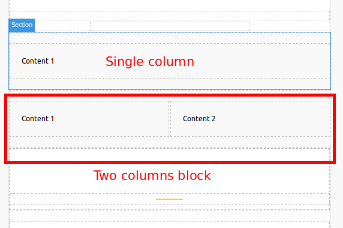
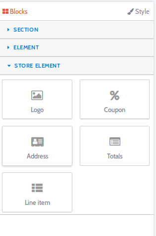
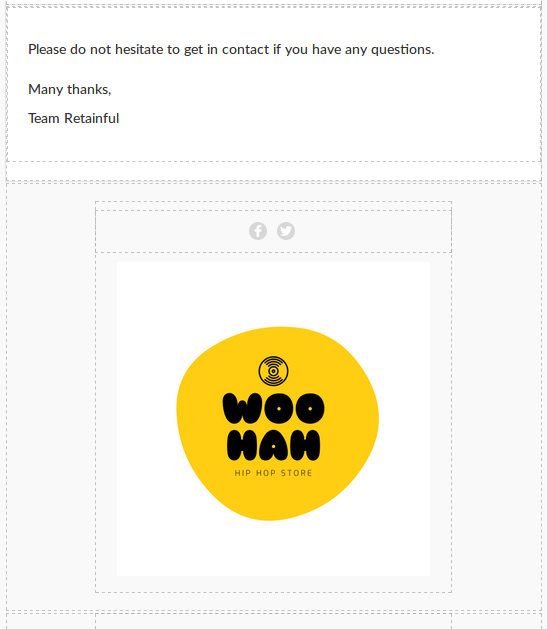
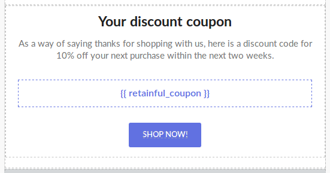
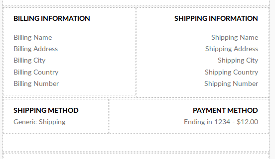
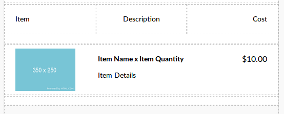
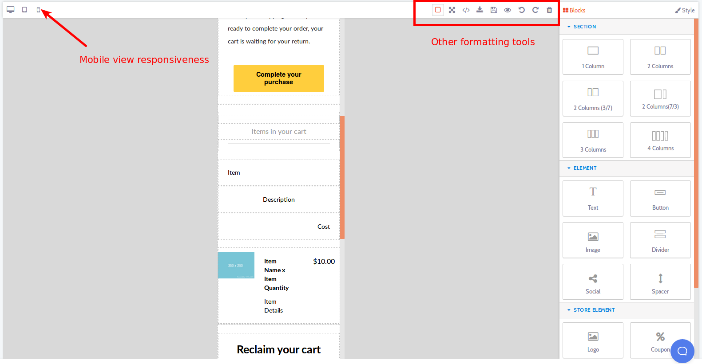

### Introduction

Retainful does offer attractive abandoned cart email templates. However, if you wish to design your own Abandoned cart email templates, you can do that as well.
The following are the steps to customise the abandoned cart email templates to suit your requirements.

### Customising the abandoned cart email templates

1) Login to your <link-text url="https://app.retainful.com/" target="_blank" rel="noopener">Retainful dashboard.</link-text> Navigate to **Abandoned carts** section. Click on **Email templates**.

2) As mentioned above, you could either edit the existing templates or create a new one. Let us create a new one  by clicking on the **Add email** button.

#### 3) **Adding new blocks to the email template**
  At the email template layout, you could see a pre-defined template. The tools for customisation are available at the far right corner of the Retainful  dashboard as follows:

  **Section tab**- In this part, you can find tools that allow you to add segments to your email template, for example, if you wish to divide the template layout into 2 or 3 columns, you could drag and drop blocks from this section.
  

 This is how the template layout can be segmented with the use of tools in the section tab:

**Element tab** - This section helps you add new text blocks, buttons, images, divider and so on.

 For example, if you drag and drop a button block into the template layout area, this is how the button would appear:

**Store tab**- To add logos, or coupons and fetch and display other store data, you could make use of the tools found here.

The store element section offers options to enter dynamic data from the store. So, the parameters require bit more explanation. Following are the options available at the store element area:

 **Logo block** -The logo block would fetch and display the store logo set on the Settings tab of the Retainful dashboard.

**Coupon block**- Using this block at the email template would generate dynamic coupons while sending the abandoned cart emails. You could also control the type of coupons you send and customise the value according to your needs.

**NOTE: The coupon block could be used only once in a given email template.**

If you wish to add Retainful coupons to the email template, you could do that by dragging and dropping the Coupon block from the above section and the result would be like this:

**Customising the coupon block**
1. Once you add the coupon block to the email template, click on it, a blue rectangle would appear around it indicating that it is customisable.
2. The settings for the coupon block would appear at the far right corner, once you select it.
3. You could enter the type of coupon, value, expiry (in terms of days), minimum order total to be eligible for the coupon.

**Address block**- With this block, the billing and shipping address, billing method and shipping method of the order would be fetched and displayed:

**Totals block**- If you wish to display the order amount breakup, then you could do so by using this block. The order totals, shipping cost and so on would be displayed.

**Line item block** -The items of the users cart can be displayed on your abandoned cart emails using this block.

You could also customise and add styles to the individual sections of the email template. Let us learn more about this on the next section.

#### 4)Editing individual elements of the email

If you wish to apply styles like changing the color, font-size, dimensions of a particular section, that can be done by clicking on that particular segment.
   When you click on a particular segment, a blue rectangle appears around the element or block. And the options to customise the layout appear on the right corner.
     

**Settings block** -This part offers options corresponding to the block that has been chosen. For example, if you click on a button block, then in the settings tab, you can specify the URL to which the user should be redirected to while clicking on the button.

**Dimension block** -In this section, you can modify the height and padding of the selected  block.

**Typography block** -This segment has options that let you control the font style of the selected block.

**Decorations block** -This section would allow you to add other CSS styles to the selected element.

#### 5)Checking responsiveness across devices
You could check if the email templates are responsive by making use of the icons at the left corner of the email template layout:

#### 6) Mobile view responsiveness and other formatting tools

Mobile view responsiveness can also be checked by clicking on the icon at the far left corner of the layout.

<call-out> TIP: Around 60% of your users might be checking out your site on a mobile device. Users tend to move to competitor's websites due to poor mobile experience. It becomes essential to make sure that your site is responsive.</call-out>

#### 7) Other formatting tools

Viewing the template in full screen, downloading the template, adding styles via html code, undo and redo options can be found at the top right corner of the template layout.

You could add styles and make the layout of the abandoned cart email templates even more beautiful.
