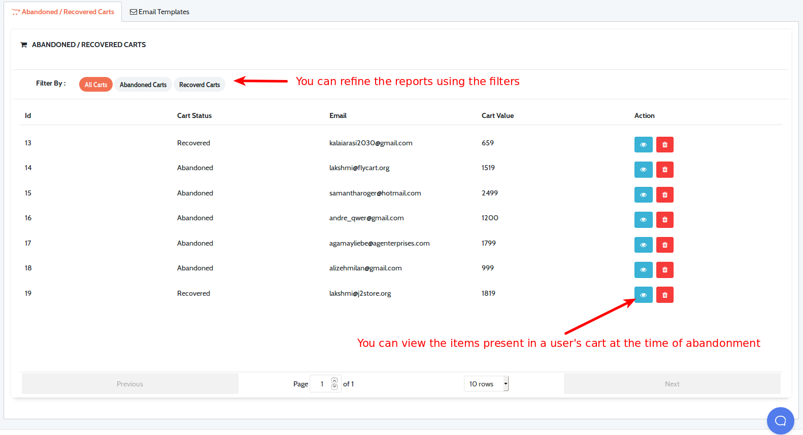
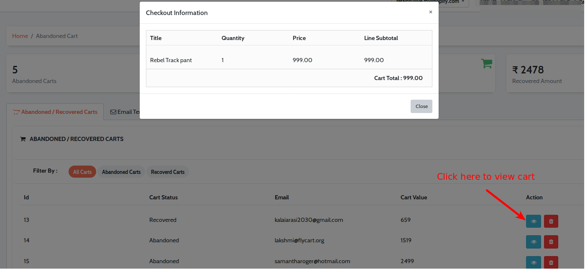

In this page, let us learn how to check the abandoned/ Live carts Reports.

### How to check abandoned carts and recovered carts

Retainful offers a real-time monitoring and complete analysis of abandoned carts and recovered carts. One can view these reports in the dashboard of his/her Retainful dashboard under the **Abandoned carts section**.

**An overview of abandonments and conversions**

You could find the following information here:

1) Number of abandoned carts
2) Amount abandoned
3) Number of carts recovered
4) Amount recovered

**More information on abandoned carts and conversions**

This section offers a bit more information about the abandonments and conversions. You could find the following information here:

1) Status of the carts
2) User information
3) Cart value
4) Items in the cart
5) Additional filters to sort and refine the data

While clicking on the view icon, the user's cart information pops up like this:

<call-out>**PRO TIP:** A good abandoned cart email strategy can help you could increase your cart recovery rate upto 36%</call-out>
Learn how to set up an abandoned cart email sequence using Retainful <link-text url="https://www.retainful.com/docs/shopify/setting-up-an-abandoned-cart-email-sequence" rel="noopener" target="_blank">here</link-text>