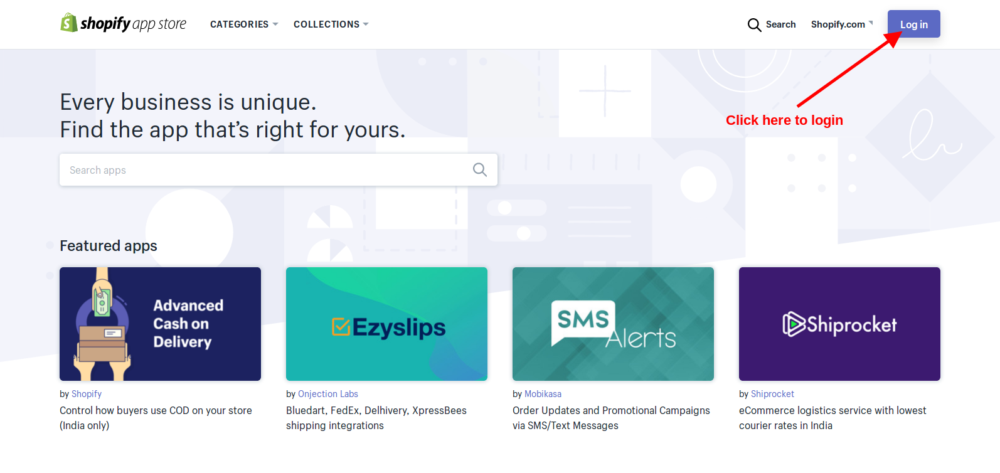
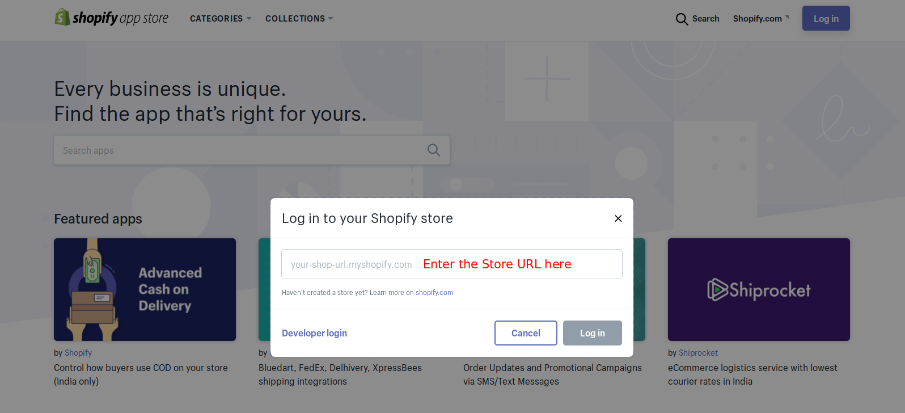
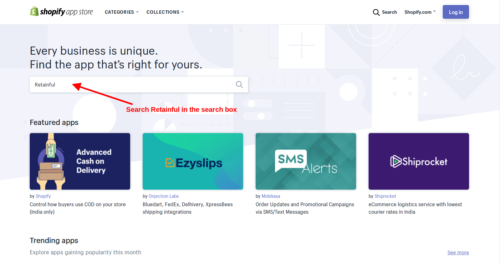
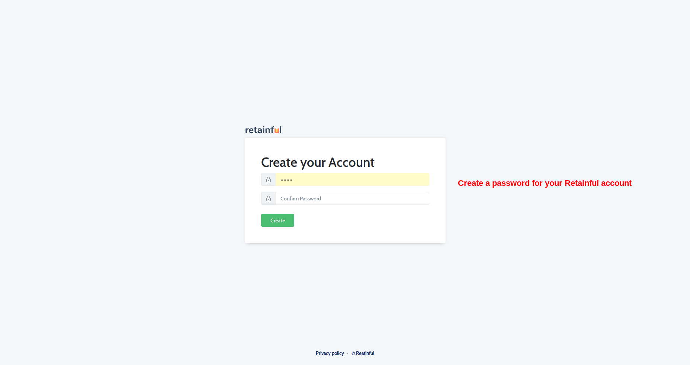
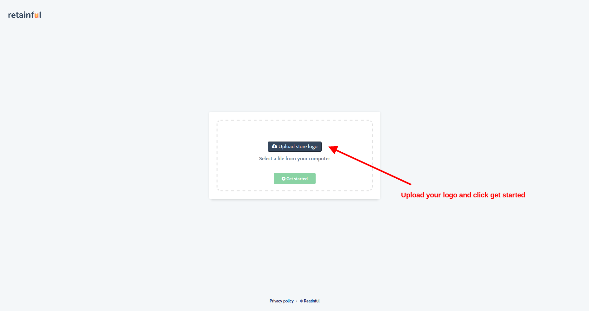
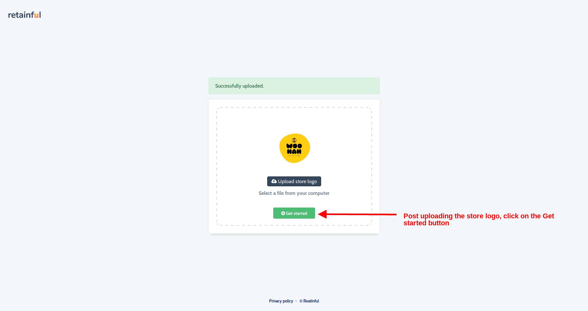
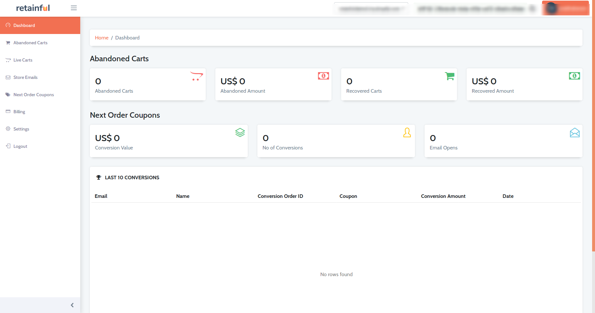

The following are the steps to be done to install Retainful on your store:

1) Visit the Shopify <link-text url="https://apps.shopify.com/" target="_blank" rel="noopener">Appstore</link-text>
2) You will have to login by clicking on the Login button at the top right corner of the page.

3) There would be a popup where you could enter the store URL.

4) Once you enter the store URL and click on Login, you can search the **Retainful** plugin on the search box.

5) Click on the retainful plugin from the results and click install. The landing page would list the parts of the store that retainful would have access to. You will have to **Install unlisted app** button.

6) Once you click on the Install button indicated above, you will be redirected to the Retainful page, where you will be asked to set up a password for your Retainful account. This would happen only on the first time. If you are a registered user, then you will be asked to login.

7) Post setting up a password for your account, or logging in(if you are an existing user), you will be asked to set up a store logo.
The logo that you upload here would be used as the store logo on the abandoned cart emails and next order coupon emails.
NOTE: If you wish to change this logo in future, you could do so by logging in to Retainful->Settings and change the store logo.

8) Click on the **Get started** button as indicated in the screenshot above. You will be redirected to Retainful dashboard.

Get, set, GO!

### Summary
Now that you have installed the Retainful app, let's <link-text url="https://www.retainful.com/docs/shopify/overview" target="_blank" rel="noopener">get started.</link-text>