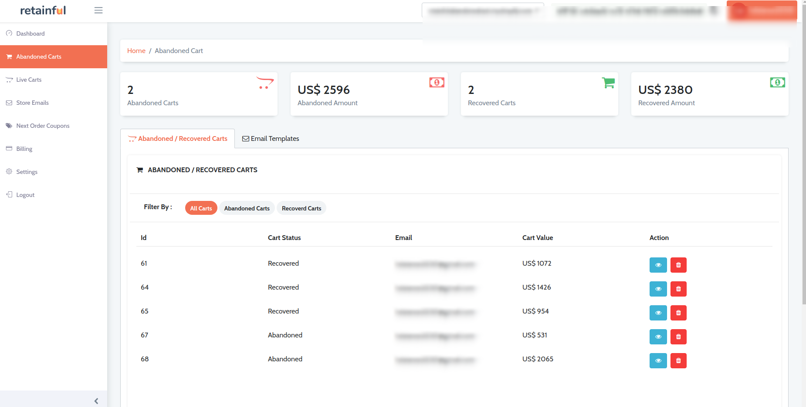
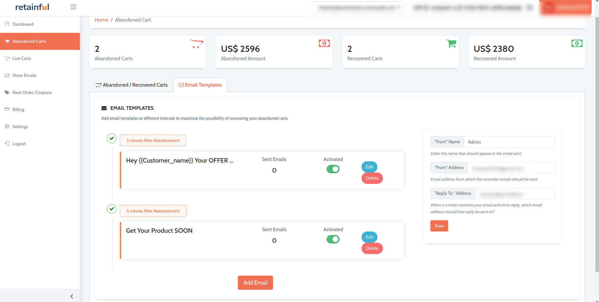
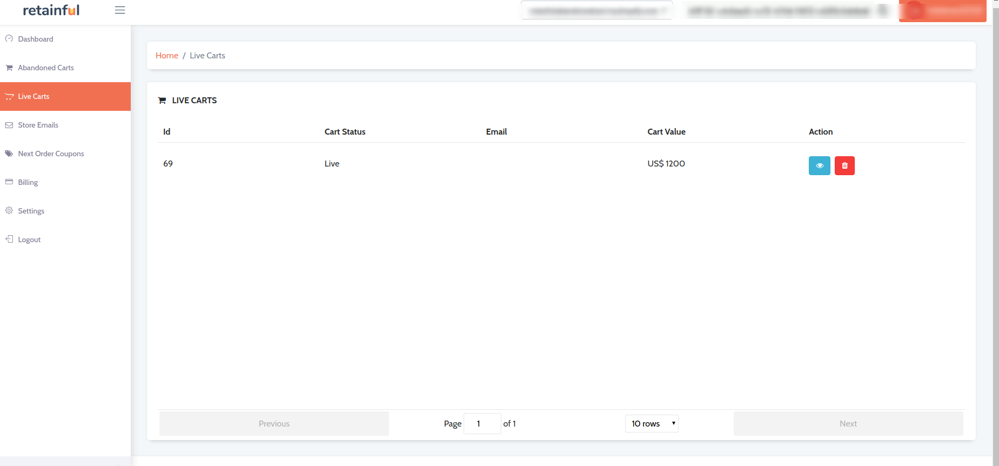
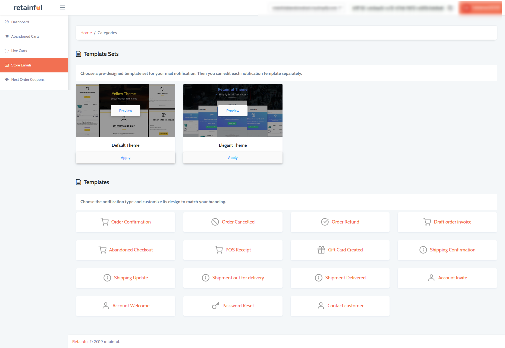
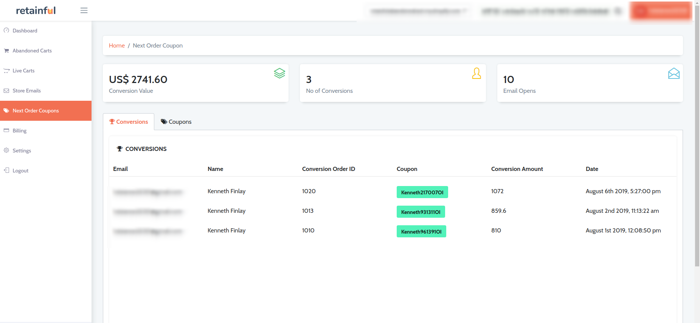
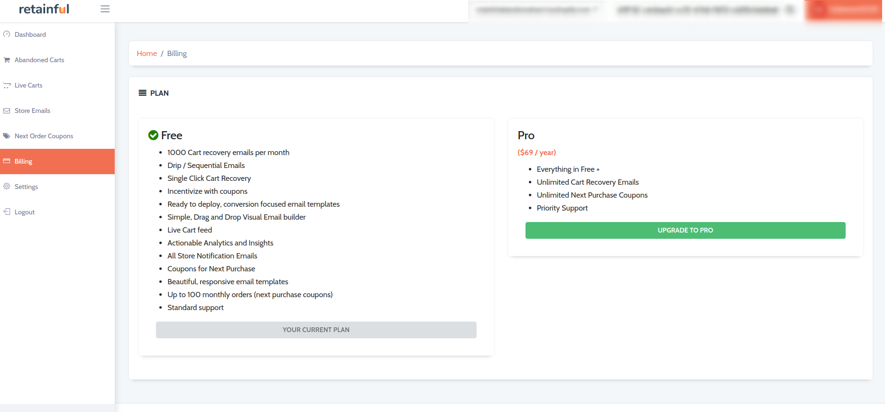
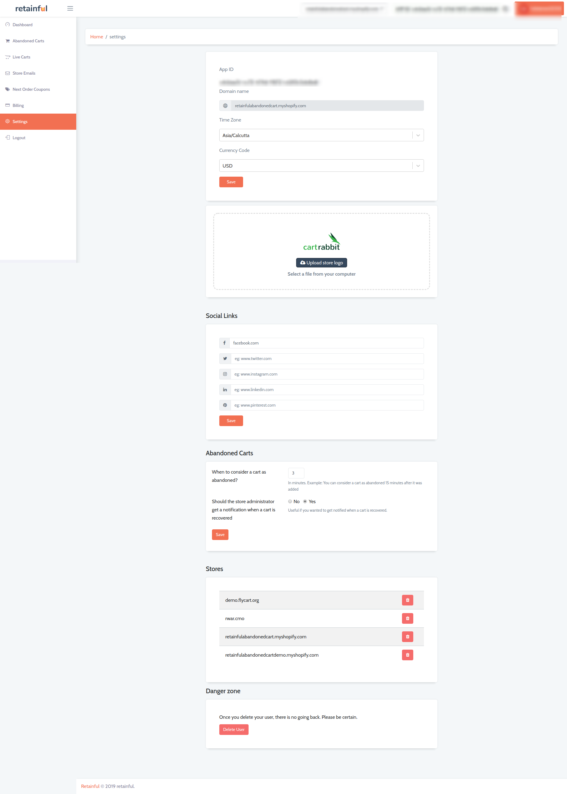

Retainful is a powerful Lead generation tool that allows store owners to recover and boost sales by setting up Abandoned cart emails and next order coupons.

The following overview would help you in getting started with Retainful.

### 1. Dashboard

Once you create an account with Retainful and login to the account, the first thing you see is the dashboard.
Want to bring your cart abandonment into control and wondering how to do it?
The intuitive dashboard has got your back. Here you could view a wide variety of insights on abandoned carts, coupons used by users and the conversions.

### 2. Abandoned carts

Send behavioral email messages based on real-time signals and user behavior to recover abandoned carts.
This individual section on Abandoned carts provides you with a 360° overview of the carts that have been abandoned and the users who have abandoned their carts.

<call-out>Tip: 12% of customers who recover their cart tend to add more products to their cart. Craft a strategy for your abandoned cart emails. Use winning subject lines.</call-out>

### 3. Live carts

Know what is in your customer's cart before they checkout. On the live carts section, you can get a list of the users that have initiated the checkout process but not completed it.

### 4. Store emails

Create and customise your store emails on-the-go with the pre-designed templates in this section.

### 5. Next order coupons

Know how your post purchase coupons have taken effect in this section. Here you can find the coupons that have been redeemed and the conversions that have occurred.

<call-out>Discounts encourage customers to buy more. Discounts offered at the correct time are more effective in driving new sales from inactive customers.</call-out>

### 6. Billing

Here you could view the plans and features that Retainful offers.

### 7. Settings

Here you could find the basic settings of your Retainful account.

Now that we know what is what, let us learn how to setup an <link-text url="https://www.retainful.com/docs/shopify/setting-up-an-abandoned-cart-email-sequence" targe="_blank" rel="noopener">Abandoned cart recovery email sequence.</link-text>