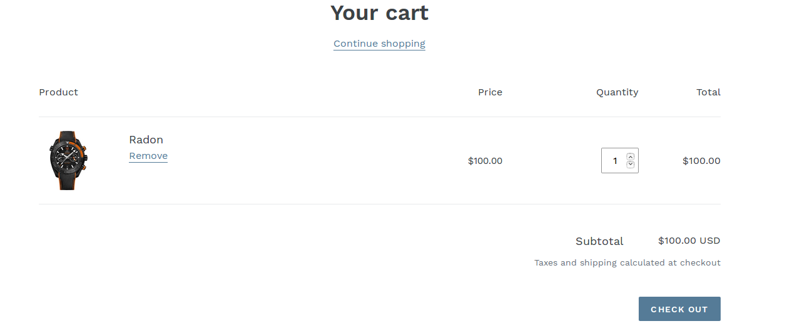
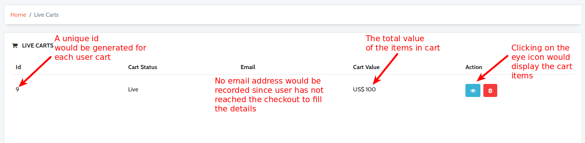
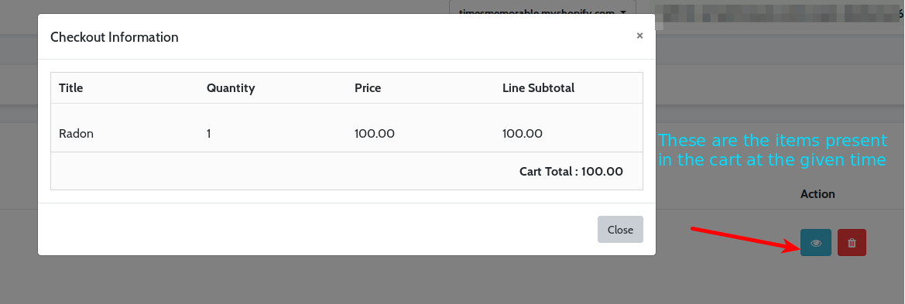
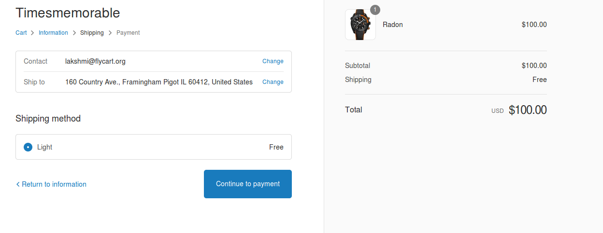
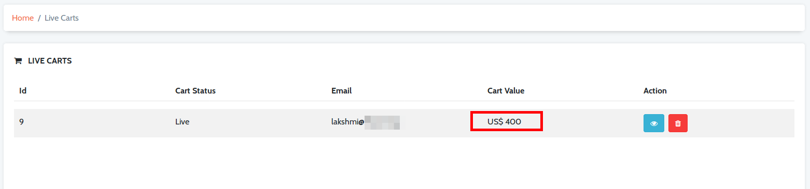
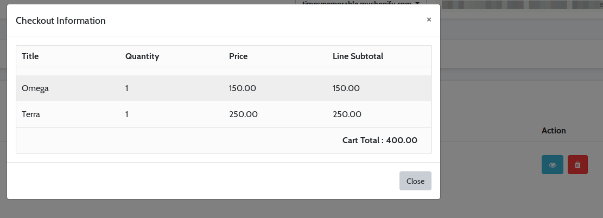
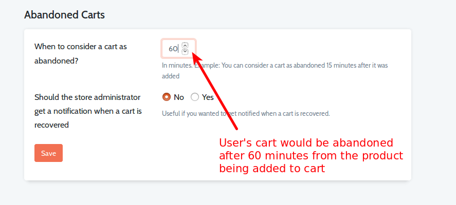

### Live carts

A user's cart becomes abandoned when he/she adds products to their cart, initiates the checkout process but doesn't complete the checkout process. To contact the customer that has abandoned the cart, you might want to grab their details while they are still active in your store. Retainful does that seamlessly.
All the user data would be collected in the **Live carts** section of the Retainful dashboard while the user initiates the checkout process. This data can be used to contact the user if the cart becomes abandoned.

In other words, a cart would be considered as Live when a product is added to cart until the cart is abandoned or a purchase is made.

Now, with Retainful on your store, you could monitor live user feed and get more knowledge of the user behaviour.

### How Retainful monitors live cart feed

Retainful offers a real-time monitoring of the carts on your store. This article assumes that you have connected your store with Retainful and set the time limit to consider a cart as abandoned. Let us walk through the process of how the live carts are monitored by Retainful.

**Case- 1**

User visits the storefront. Adds a product to the cart. Right now, user is at this stage of the checkout process:

NOTE: He/She has not yet navigated to the checkout page.

**The updates at the live cart section**

For the given scenario, at the Retainful dashboard, the **Live carts** section would now contain the following data:
1. **Id** - Once a user adds a particular product in cart, a unique id would be generated for that particular cart. This unique id would be displayed at the live carts section.
2. **Cart status** - The status of the carts would be marked as Live.
3. **Email address** - This field would be empty at the moment since the user has not yet reached the checkout page to fill in his/her details.
4.  **Cart value** -  The total value of the items present in the cart at the given time would be shown here. If the user makes any modifications like updating the quantity, adding few more products or deleting products from the cart, those changes would be reflected here as and when the changes are made.
5.  **Action** - The action tab has two icons: 
                                                                       -  View icon - To display the items in the cart at any given time.
                                                                       - Delete icon- To remove the given record from the live carts section.
                                                                       

The view icon when clicked, would display the cart items as follows:

**Case-2**

The user reaches the checkout section. User fills in all the necessary details like Name, Address and other contact information. Right now, the user is at this stage of the checkout process:

**The updates on the live cart section**

For the given scenario, the Live carts section of Retainful dashboard would be updated like this:

**Case- 3**
User changes his mind, returns to the cart page, deletes the existing product from the cart, adds another product to the cart. Navigates to the checkout session.

**The updates in the live carts section**

For the given case, the live carts section would be updated with all the changes that have been made by the user:

When you click on the view icon, the products that are added at the given time can be viewed:

So, Retainful captures user behaviour in real-time. The above scenarios depict a single user's behaviour. Retainful is capable of monitoring all the user's active carts, regardless of the store size and the user base it has.

### When will a cart be removed from Live carts section

Now that we know how Retainful monitors in-progress carts, you might wonder when a cart would be removed from the live carts section.

 **A user's in-progress cart would be removed from the live carts section when:**
1) The cart is considered as abandoned.
2) The user places an order with the products added to the cart.

##### The cart is considered as abandoned
Any user's cart would be treated as abandoned when it reaches the abandonment threshold.

The time when the user adds a product to cart would be taken into account. The cart would be present in the live carts section until the abandoned cart time limit is reached.

**Abandoned cart threshold settings**
Navigate to the Settings tab of the Retaiful dashboard-> Abandoned carts section->When to consider a cart as abandoned?

Once the cart is considered abandoned, the cart would be removed from the live carts section and moved to the abandoned carts section.

##### The user places an order with the products added to the cart

Sometimes, the user might be thinking over the purchase or comparing other products before completing the purchase or experiencing technical difficulties.
In such cases, they might continue the checkout process and complete the order successfully.
If an order has been placed, then the corresponding entry would be removed from the live carts section.

**Summary**

The Live carts feature is a simple yet powerful feature which you could use to your advantage. This feature allows you to get analysis of the user behaviour if you keep a close watch.