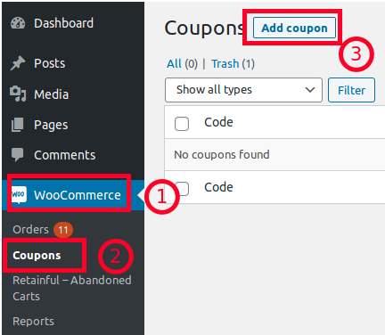
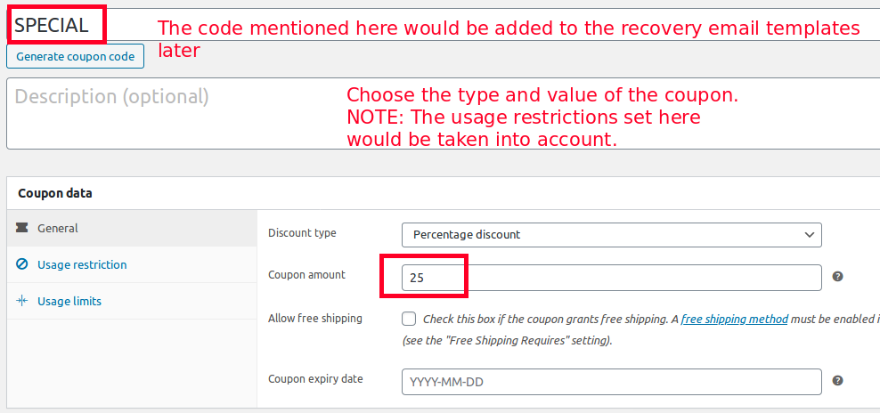
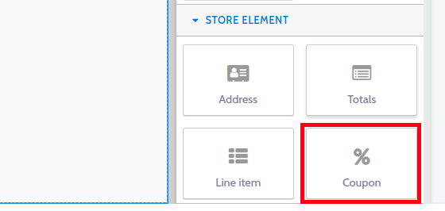
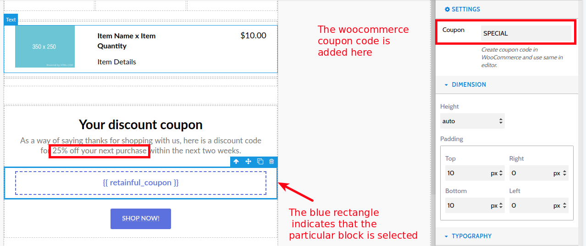

Coupon based discounts play a crucial role in driving sales on your store. You could encourage users to resume their abandoned purchase by offering them a discount.
Retainful allows you to add coupon blocks on your abandoned cart email templates easily using an intuitive drag and drop editor. 

This guide explains how you could add a coupon discount block on your cart recovery email templates.

> NOTE: This is a PREMIUM Feature. Make sure that you have activated the Premium add on of Retainful.

### Adding a coupon block on your email template using Retainful

For those who use Retainful plugin 2.x and have migrated to cloud, you could add a coupon discount to your recovery emails by following the process below.

#### Step-1: Create a coupon

1. You will have to create a coupon on your site. Navigate to **Woocommerce->Coupons**. Click **Add coupon**.

2. Set the value and other usage restrictions to your coupon.

3. Copy the coupon code.

#### Step-2: Adding the coupon code to your mail template on Retainful account

1. Login to the Retainful account that you have connected with your store.
2. Navigate to Emails->Your email template->Edit. Or you could create a new template as well. 
3. The coupon block can be found on the right hand side under the **Store elements** block.

4. Drag and drop the indicated block on your mail template's body.

5. Choose the coupon block to add the coupon code that we created on our Woocommerce store earlier at Step-1. Once the block is clicked, the settings would show up as follows:

> Note: Post adding the coupon code, edit the text block as per your discount conditions. In our example, we set up a flat 25% discount on our Woocommerce store. So let us not forget to modify the text accordingly.

6. Make sure that you **Activate the template** and **Save**.

Tada! We have now set up the coupon discount for the abandoned cart email template. Users can claim these coupon discounts by clicking on the **Shop Now** button found below the coupon code.

#### Video tutorial

Here is a video on how to add a coupon block to your abandoned cart recovery emails.

<iframe src="https://www.loom.com/embed/1e99048fceab4b27ab0b9941334f01b3" frameborder="0" webkitallowfullscreen mozallowfullscreen allowfullscreen style="position: absolute; top: 0; left: 0; width: 100%; height: 100%;"></iframe>

### Summary

In this article we saw how to:
1) Add coupon discounts to our Abandoned cart emails for version 1.x
2) Add coupon discounts to our Abandoned cart emails for version 2.x
