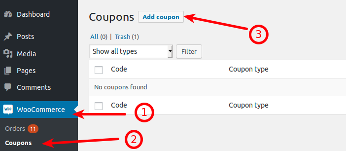
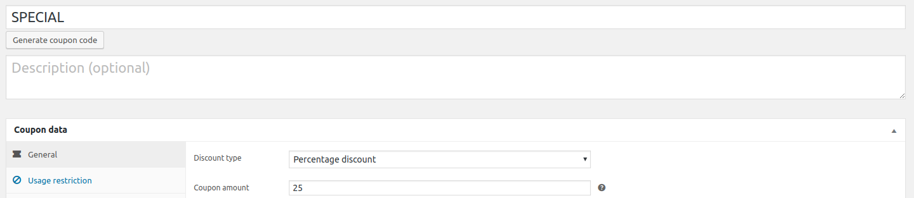
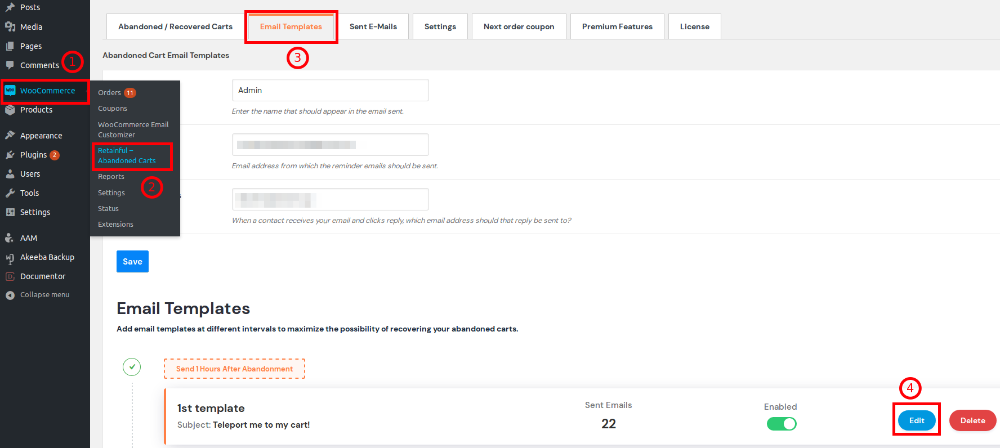
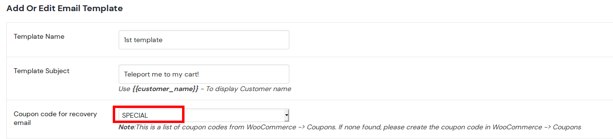
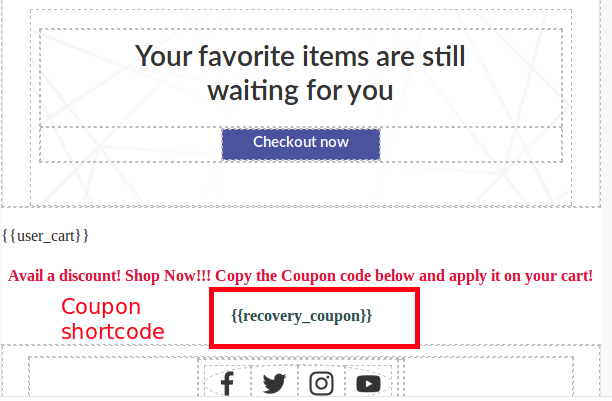
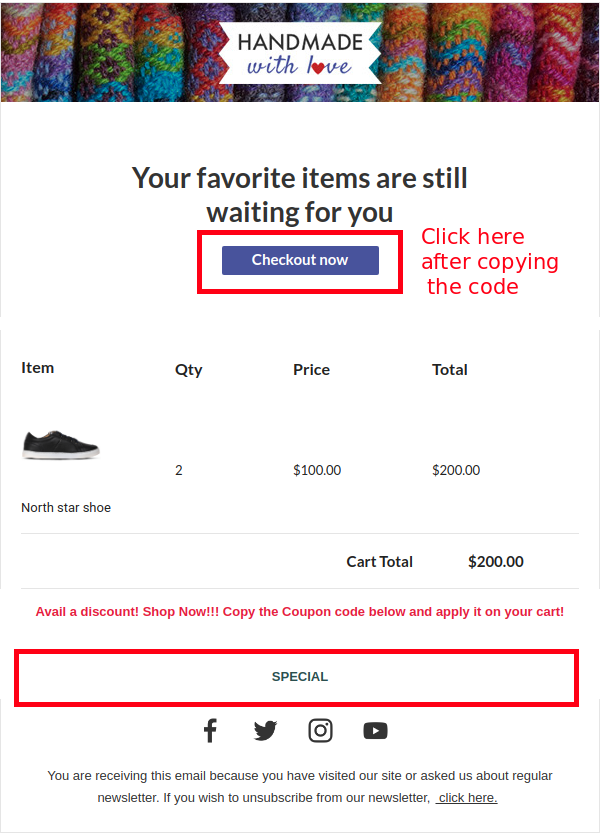
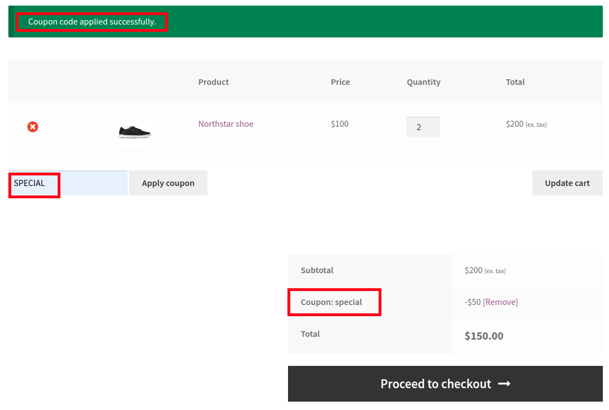
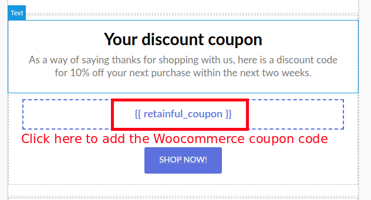
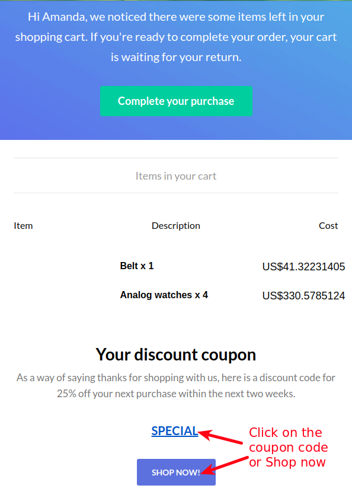
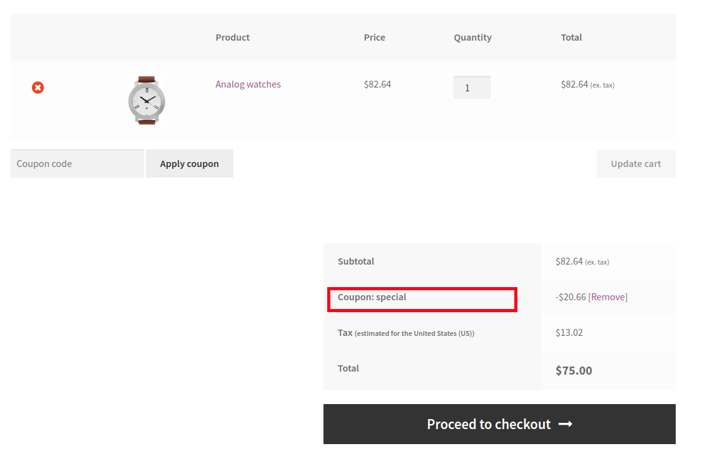

Coupon based discounts play a crucial role in driving sales on your store. You could encourage users to resume their abandoned purchase by offering them a discount.
Retainful allows you to add coupon blocks on your abandoned cart email templates easily using an intuitive drag and drop editor. 

This guide explains how you could add a coupon discount block on your cart recovery email templates.

> NOTE: This is a PREMIUM Feature. Make sure that you have activated the Premium add on of Retainful.

### For Legacy version 1.x:
For those who use the Retainful plugin with version 1.x, the following is the process of adding a coupon to your abandoned cart email templates.

 **Step-1: Create a coupon** 
 
 1. The first step is to create a coupon under Woocommerce->Coupons. 

> Note that the restrictions you set while creating the coupon will take effect while user tries to apply them while resuming their purchase.

2. I have created a flat 25% coupon code.

**Step-2: Adding the coupon to Email template**

1. Navigate to Retainful- Abandoned carts->Email templates->Your template->Edit.

2. Choose the coupon that you created in the option **Coupon code for recovery email** available as follows:

3. The next step is to mention the shortcode on the template body. The shortcode to be used is **{{recovery_coupon}}**:

4. Make sure that you **Activate the template** and **Save**.

Bingo! We have now set the coupon discount for our recovery emails.

**Step-3: How users see it and claim it**

1. Once a user abandons a cart, the email would be sent out. And the user would view the coupon code like this in the recovery email:

2. Users will have to copy the shortcode and click on the **Checkout now** button as shown in the above screenshot to apply the discount on the existing cart. Or you could use the coupon on a Fresh purchase as well.
3. Once they click on the Checkout now button, they would be redirected to the cart and the coupon code has to be pasted on the **Apply coupon** field available on the cart page. 

So, user has successfully claimed the discount!

**Video tutorial**

Here is a video tutorial that illustrates the process of adding a coupon block to your Abandoned cart emails:

<iframe src="https://www.loom.com/embed/279cc5aece7f46b9af2b93bd874c6023" frameborder="0" webkitallowfullscreen mozallowfullscreen allowfullscreen style="position: absolute; top: 0; left: 0; width: 100%; height: 100%;"></iframe>

### For version 2.x

For those who use Retainful plugin 2.x and have migrated to cloud, you could add a coupon discount to your recovery emails by following the process below.

**Step-1: Create a coupon** 

1. You will have to create a coupon on your site under Woocommerce->Coupons.
2. Copy the coupon code.

**Step-2: Adding the coupon code to your mail template on Retainful account**

1. Login to the Retainful account that you have connected with your store.
2. Navigate to Emails->Your email template->Edit. Or you could create a new template as well. Let us suppose that I am creating a new email template.
3. The coupon block can be found on the right hand side under the **Store elements** block.

4. Drag and drop the indicated block on your mail template's body. The coupon block would appear like this when you drag and drop the coupon block.

5. You will have to click on the indicated block to add the coupon code that we created on our Woocommerce store earlier at Step-1. Once the block is clicked, the settings would show up as follows:

> Note: Post adding the coupon code, edit the text block as per your discount conditions. In our example, we set up a flat 25% discount on our Woocommerce store. So let us not forget to modify the text accordingly.

6. Make sure that you **Activate the template** and **Save**.

Tada! We have now set up the coupon discount for the abandoned cart email template.

**Step-3: How users view and claim the coupon discount**

1. Once the cart is marked as abandoned, the email would be triggered to the user's email address. The email would look like this:

2. Users will have to click on the **Coupon code** or on the **Shop Now**button below the coupon code to avail the discount.

3. Once they click on the Shop now button, they would be redirected to the shop page where they would be able to initiate a purchase and the coupon would be applied.

The coupon code has been claimed by the user.

**Video tutorial**

Here is a video on how to add a coupon block to your abandoned cart recovery emails.

<iframe src="https://www.loom.com/embed/1e99048fceab4b27ab0b9941334f01b3" frameborder="0" webkitallowfullscreen mozallowfullscreen allowfullscreen style="position: absolute; top: 0; left: 0; width: 100%; height: 100%;"></iframe>

### Summary

In this article we saw how to:
1) Add coupon discounts to our Abandoned cart emails for version 1.x
2) Add coupon discounts to our Abandoned cart emails for version 2.x
