A store logo is the symbol of your brand. Make sure they get a place in your abandoned cart recovery templates. A logo on the emails is a gentle reminder of your brand.

With Retainful, you could add your Store's logo anywhere on the Abandoned cart emails that you send. This article walks you through the process of adding a logo on your Recovery mail templates.

### Adding a store logo on your email template using Retainful

Once you start using Retainful version 2.x, all the mail handling is done on your Retainful account that is connected to your store.
Here is how you could add a store logo to your mail templates while using version 2.x

**Method-1: Editing the existing logo**

1. Login to your Retainful account that is connected to your Woocommerce store.
2. Click on Emails ->Choose a template or add a new template.
3. There would be a logo on the template by default. This logo can be swapped with your store's logo. Double click on the default logo as indicated below:

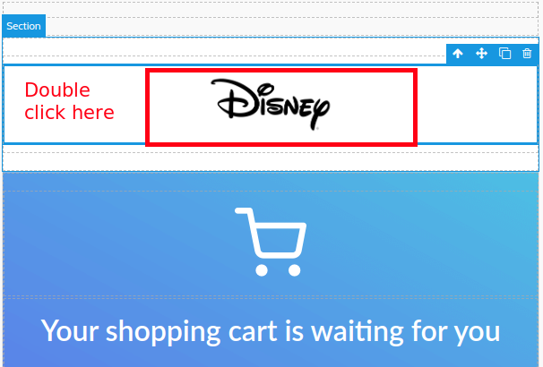

4. A popup would come up where you will have to mention the Image URL and click on **Add image** button.

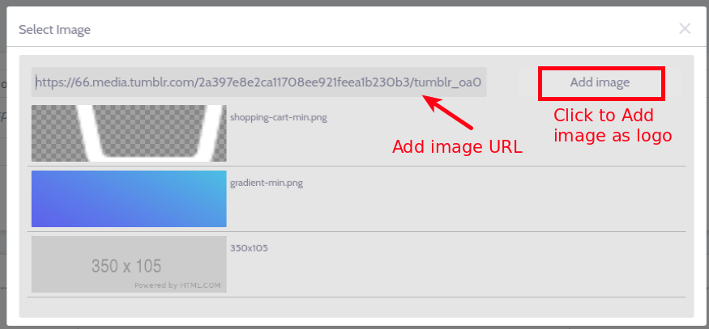

> NOTE: At the moment, there is an option to mention the image URL only. However, in the upcoming versions, an upload option would also be introduced.

5. Now the added image would show up as follows:

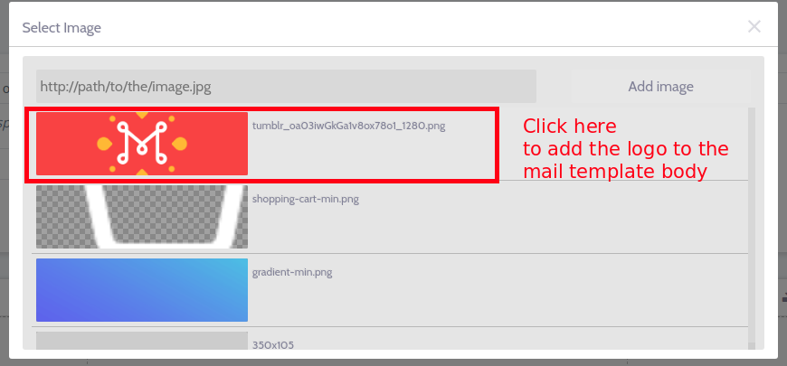

6. Once the image is clicked, it would be added to the mail template's body:
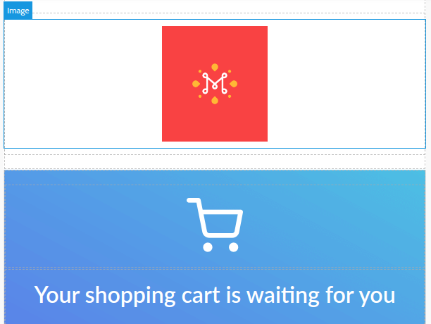

**Method-2: Adding a new image block**

You could add a new image block and then add a logo at your desired positions. 

1. Drag and drop the image block from the list of block elements on the desired position:

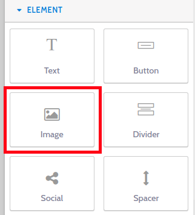
2. Once the image block is dragged and dropped, follow steps 3 to 6 from Method-1.

Now, we have uploaded the store logo in the image block position.

### Customizing the store logo

If you wish to customize the store logo, you could do so by following the below steps:

1. Select the image block where you have added the store logo. Settings would show up at the far right corner of the template body.

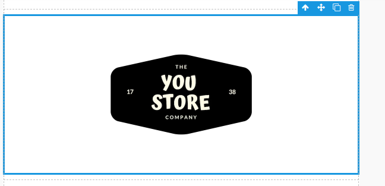

3. **Settings block** Here you can find options to link your store logo to a desired page. 

<call-out>It is recommended that you link the logo with your site's landing page.</call-out>

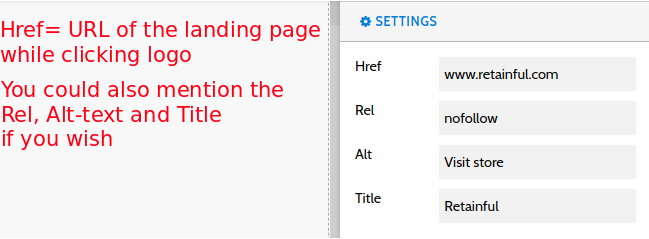

3. **Dimensions block** In this section, you could modify the logo's dimensions, set padding.

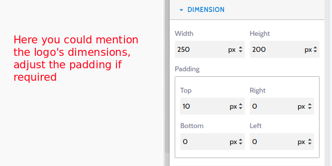

4. **Typography block** This segment lets you align your store logo. The default alignment is center.

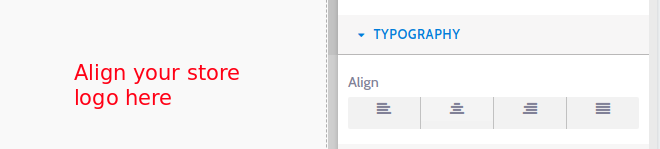

5. **Decorations block** Now its time to add a neat background to the logo block and shape the edges of the logo.

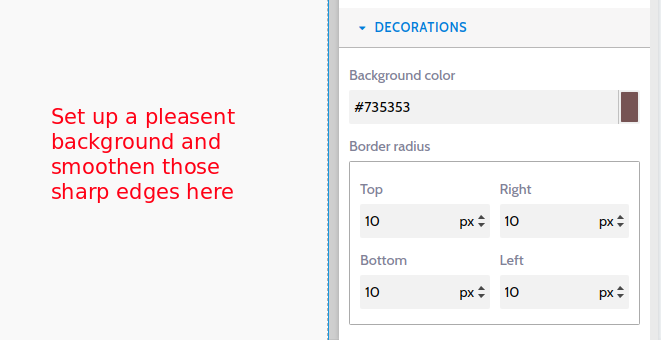

6. **End product** Now the customized logo is ready! 

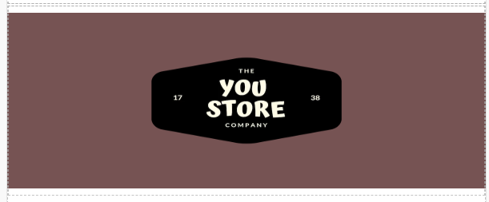

You could customize the logo as per your wish.

**Video tutorials**

Here is a video on how to add a store logo to your abandoned cart email templates:

<iframe src="https://www.loom.com/embed/80c0a13775044e10a6210925528891c9" frameborder="0" webkitallowfullscreen mozallowfullscreen allowfullscreen style="position: absolute; top: 0; left: 0; width: 100%; height: 100%;"></iframe>

Here is a video on how you could customize the store logo:

<iframe src="https://www.loom.com/embed/80b6969ded5f499abdc3d7f634d98aa1" frameborder="0" webkitallowfullscreen mozallowfullscreen allowfullscreen style="position: absolute; top: 0; left: 0; width: 100%; height: 100%;"></iframe>

### Summary

In this article, we saw how to:

1. Add a store logo to your abandoned cart emails.
2. Customize the logo.
