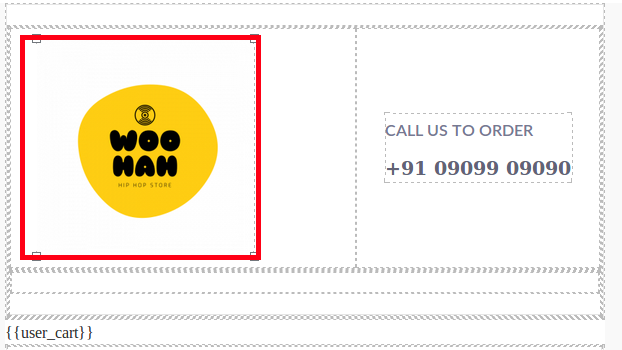
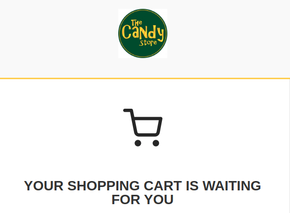

A store logo is the symbol of your brand. Make sure they get a place in your abandoned cart recovery templates. A logo on the emails is a gentle reminder of your brand.

With Retainful, you could add your Store's logo anywhere on the Abandoned cart emails that you send. This article walks you through the process of adding a logo on your Recovery mail templates.

### Adding a store logo on your email template using Retainful

Once you start using Retainful version 2.x, all the mail handling is done on your Retainful account that is connected to your store.
Here is how you could add a store logo to your mail templates while using version 2.x

**Method-1: Editing the existing logo**

1. <link-text url="https://app.retainful.com/" target="_blank" rel="noopener">Login</link-text> to your Retainful account ->Emails ->Choose a template or add a new template.
2. A default logo would be available on the chosen template. Click on the Default logo to upload your brand logo.
3. Once you click, a panel with the change option would show up on the right corner.

5. A popup would appear where you could either upload your brand's logo or choose an already available logo.

6. The chosen logo would replace the default logo. Save the mail template once.

Alternatively, you can also drag and drop the image block from the list of block elements on the desired position and upload a brand logo.

### Customizing the store logo

Retainful lets you customize the store logo as per your requirements. To customize:

1. Select the image block where you have added the store logo. Settings would show up at the far right corner of the template body.
2. **Settings block** -Here you can find options to link your store logo to a desired page. 
3. **Dimensions block** -In this section, you could modify the logo's dimensions, set padding.
4. **Typography block** -This segment lets you align your store logo. The default alignment is center.
5. **Decorations block** -Now its time to add a neat background to the logo block and shape the edges of the logo.

You could style the logo as per your requirements.

**Video tutorial**

Here is a video on how to add a store logo to your abandoned cart email templates:

<iframe src="https://www.loom.com/embed/8cdf2c94a3134721b91905811a852304" frameborder="0" webkitallowfullscreen mozallowfullscreen allowfullscreen style="position: absolute; top: 0; left: 0; width: 100%; height: 100%;"></iframe>

