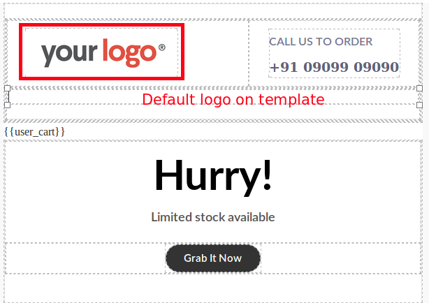
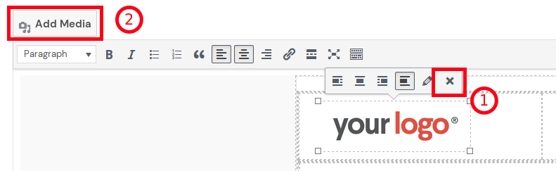
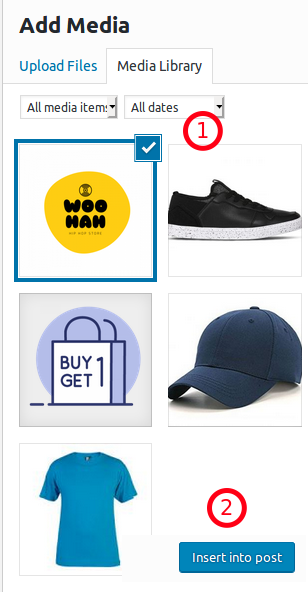

A store logo is the symbol of your brand. Make sure they get a place in your abandoned cart recovery templates. A logo on the emails is a gentle reminder of your brand.

With Retainful, you could add your Store's logo anywhere on the Abandoned cart emails that you send. This article walks you through the process of adding a logo on your Recovery mail templates.

### For legacy version- 1.x:

Users who have Retainful version 1.x on their site can follow the below process to add a store logo to your Abandoned cart mails.

1. Navigate to Woocommerce->Retainful-Abandoned carts -> Email templates-> Choose a template or create one ->Insert a template.

2. Now, this is a static logo which can be swapped with your store's logo.
3. To remove this logo, place the cursor on the logo element and you would see a list of options popup. Click on the X mark to remove the existing default logo.

4. Post removing the logo, click on the **Add media** button above the Mail body editor as indicated in the above screenshot.
5. Once you click on the Add media button, a popup would come up where you could upload an image or use an existing one. Select one and click one on the **Insert into post**.

6. Now the logo that was chosen would come up on the email template.

We have now added a Store logo to our recovery emails.

**Video tutorial**

Here is a short video that explains how you could add a store logo to your abandoned cart recovery emails.

<iframe src="https://www.loom.com/embed/3a43fb2073e6468cac6934247ca9d90f" frameborder="0" webkitallowfullscreen mozallowfullscreen allowfullscreen style="position: absolute; top: 0; left: 0; width: 100%; height: 100%;"></iframe>

### For version 2.x:

Once you start using Retainful version 2.x, all the mail handling is done on your Retainful account that is connected to your store.
Here is how you could add a store logo to your mail templates while using version 2.x

1. Login to your Retainful account that is connected to your Woocommerce store.
2. Click on Emails ->Choose a template or add a new template.
3. Double click on the header image available by default on the template.

4. A popup would come up where you will have to mention the Image URL and click on **Add image** button.

> NOTE: At the moment, there is an option to mention the image URL only. However, in the upcoming versions, an upload option would also be introduced.

5. Now the added image would show up as follows:

6. Once the image is clicked, it would be added to the mail template's body:

We have now added our store's logo to the abandoned cart mail template.

**Video tutorial**
Here is a video on how to add a store logo to your abandoned cart email templates.

<iframe src="https://www.loom.com/embed/80c0a13775044e10a6210925528891c9" frameborder="0" webkitallowfullscreen mozallowfullscreen allowfullscreen style="position: absolute; top: 0; left: 0; width: 100%; height: 100%;"></iframe>

### Summary

In this article, we saw how to:

Add a store logo for versions 1.x (Legacy) and 2.x.

