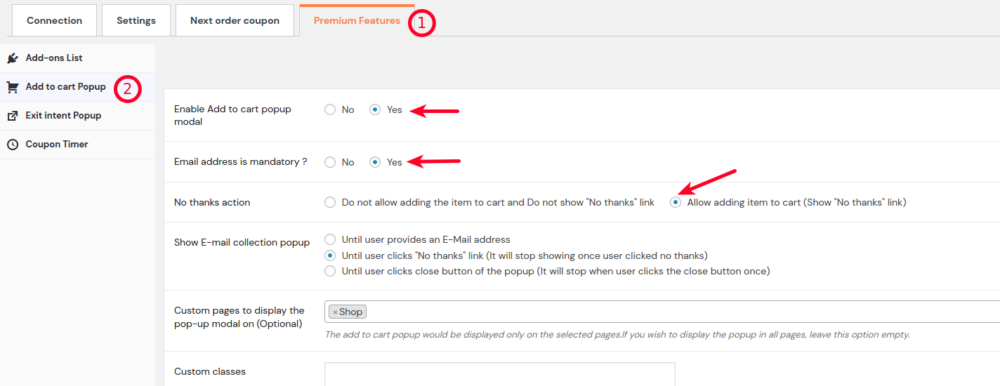
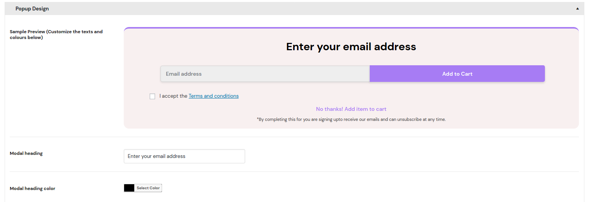
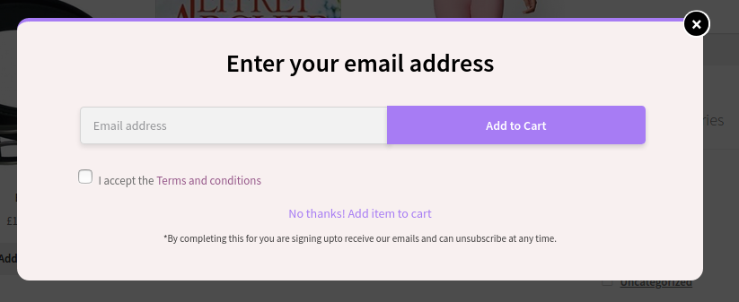
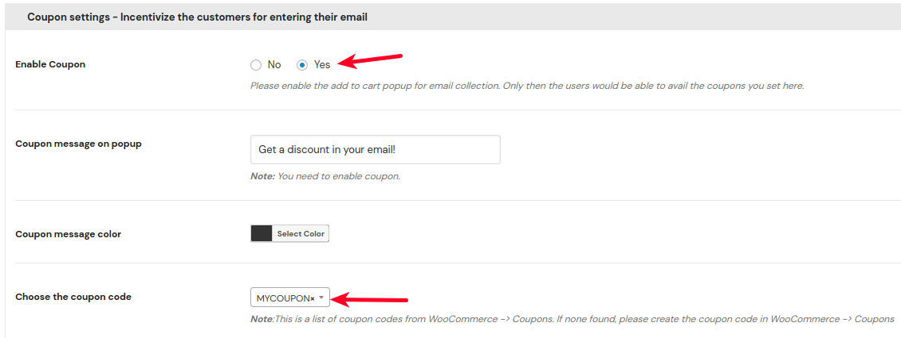
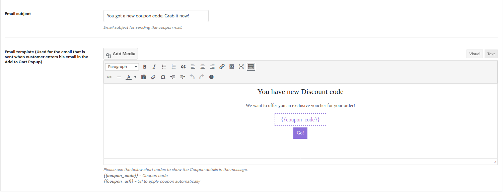
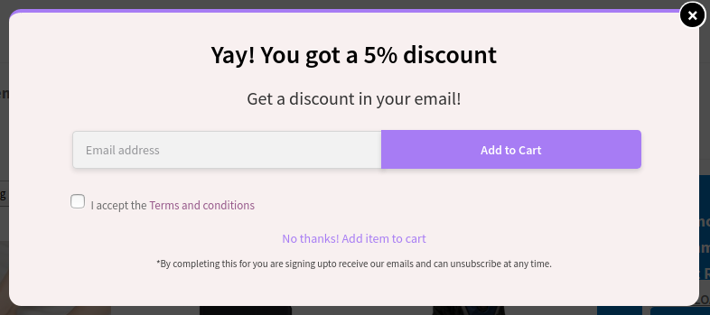

 An important requirement to recover abandoned cart is the email address of the prospective customer.

As you have noticed, someone might add an item to cart. But if they leave  your site without purchasing the item, then you left with no way of reaching him or her.

> Collecting email address at the time of adding a product to cart is a best solution. This would help you reach out to the customer even if he abandons the cart and then recover it.

This guide walks you through the steps to Collect Email Address using the Retainful Abandoned Cart recovery plugin for WooCommerce.

### Requirements
Before we begin, the guide assumes the following:

- You have installed and activated the [Retainful plugin for WooCommerce](https://www.retainful.com/features/woocommerce)
- [Connected to your Retainful Account](https://www.retainful.com/docs/woocommerce/connecting-the-store-with-retainful-account) 

The **Add to cart popup** premium add-on offers 2 awesome features

- An Email Collection popup (triggered at the time of adding an item to cart)
- Coupon code to incentivize the customer to give their email address

<iframe src="https://www.loom.com/embed/7a064bb6865942fb943a991709162e2e" frameborder="0" webkitallowfullscreen mozallowfullscreen allowfullscreen style="position: absolute; top: 0; left: 0; width: 100%; height: 100%;"></iframe>

## The Add-to-Cart Email Collection Popup

### 1. Setting up Email Collection

Please go to your WordPress Dashboard -> WooCommerce -> Retainful -> Premium -> Add to cart popup.

**Enable Add to Cart Popup modal:** Set this field to YES to activate the popup for Email Collection

**Email Address Mandatory:** You can set this to YES to force customers to enter their email address before adding to cart. You can also have this set to NO if you do not want to force

**No Thanks action:** By default, Retainful will show a No Thanks link to close the popup and proceed to cart. This to ensure that the customer get a choice. Recommended setting is _Allow adding to cart_

**Show E-mail collection popup** You can determine until when the add to cart pop up should show up on the site. Recommended setting is _Until user clicks "No thanks link(It will stop showing once user clicked no thanks)"._
While choosing the recommended setting, the popup would not appear for that particular user session once he clicks on the No thanks link. If you wish to force users to enter their email address, you can set it to _Until user provides email address_

**Custom pages to display the pop-up modal on (optional)** You can choose the pages where the add to cart popup should appear on the site. If left empty, the add to cart popup would appear on all pages where there are products.

**Custom classes** This option helps when you have a custom add to cart button for your products and wish to display email collection popup while users click on those buttons as well. This being the case, you will have to mention the class used for that custom created button. For example:  _.custom_add_to_cart_

### 2. Customizing the Email Collection Popup

Retainful allows you to customize the popup design. You can change the default text, button text, no thanks action link text and more.
Scroll down to the heading _popup design_ to customize the email collection popup.

It also lets you provide a <link-text url="https://www.retainful.com/docs/woocommerce/gdpr-compliance/#enabling-gdpr-for-add-to-cart-popup" target="_blank" rel="noopener"> GDPR compliance message</link-text> since you were collecting the email address. 

### 3. Save and Go Live!
Save and start recovering more abandoned carts effectively!

### 4. How does it look in the storefront?

Here is a screenshot of how it gets triggered while adding a product to cart.

> The following steps are optional. 

## Motivating customers with an offer in Email Collection popup

Let's face the fact. Very few people would want to give their email address at the time of adding to cart. Especially, when you plainly ask "Enter your email to add this item to cart"! Would you provide yours? No.

So how do we collect the customer's email at the time of adding a product to cart?

> Incentivize. Who would resist if a popup says "You got a 5% discount! Email me the coupon" 

Now, anyone would be willing to give their email address to you. So how are we going to achieve that with Retainful? 

### Step 1: Create a coupon code

We need a coupon code to send it to the customer. So navigate to **WooCommerce -> Coupons.**
Click "**Add Coupon**" button to create a coupon.

You can create a simple percentage based coupon. That should be sufficient or you can also go for a fixed amount discount as well. Choice is yours :-)

In the Usage limits tab, make sure you set the "Usage limit per user" to 1 (as you do not want the same customer to use the coupon multiple times)

### Step 2: Enable Coupon for Email Collection

Navigate to WooCommerce -> Retainful -> Premium -> Add to cart popup configuration
Scroll down to find the **Coupon settings - Incentivize the customer for entering his email**

As shown in the above screenshot,
- Set the **Enable coupon** to Yes
- Choose the coupon code you created in the previous section

#### Instantly display the coupon code

Instead of making your users wait for the email with the coupon code, now you could just display the coupon code on a pop up once they enter their email addresses.

You could use the following shortcodes on the popup template to display the coupon code:
**{{coupon_code}}** - To display the coupon code
**{{coupon_url}}** - Using the shortcode will automatically apply the coupon when clicked. 

Similarly the email that is sent can also be customized.

### Step 6: Save your configuration

Now you have successfully set up Retainful to incentivize your customers to provide their email.

Here is a screenshot of how the email collection popup would look at the store front:

That's a great motivation for the customer to complete his purchase. Even if he abandons the cart after getting the coupon, you can still have the chance to [recover it by following up with email reminders](https://www.retainful.com/docs/woocommerce/retainful-abandoned-cart-recovery)

### Pro Tip!
If you plainly say "Enter your email", most customers would hesitate to provide it.
So word the popup header differently!. Here are some creative headings for you!

- Get special offers emailed to you!
- Become our VIP customer. Get personalized offers delivered to your email!
- Get notified early for the next sale!

### What's Next?

- [Create your first abandoned cart recovery email](https://www.retainful.com/docs/woocommerce/creating-an-abandoned-cart-email-sequence)
