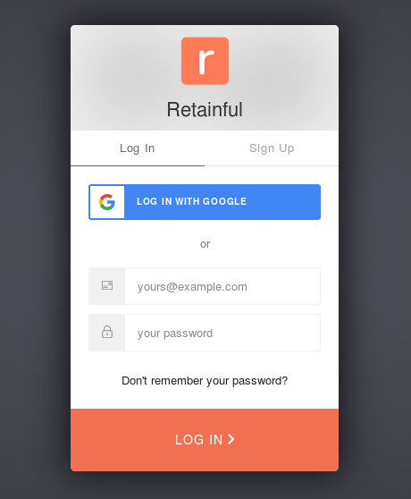
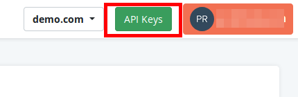
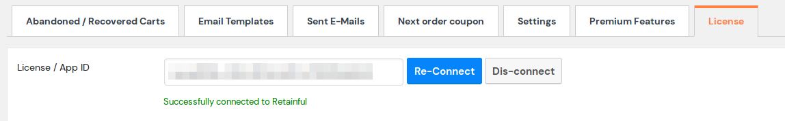
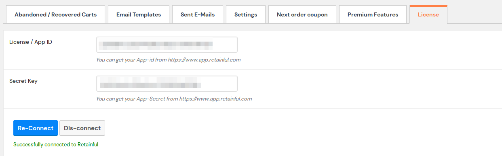

Post installing the Retainful plugin on your site, the next step is to get your store connected to your Retainful account.

This article walks you through the process of connecting your Woocommerce store with your Retainful account. 

### Connecting the store with Retainful

#### For version 1.x
For those, who use Retainful plugin with version 1.x, please follow the below steps to connect the store with your Retainful account:

1. **Fetching the keys:** Login to your Retainful dashboard by clicking <link-text url="https://app.retainful.com" target="_blank" rel="noopener">here<link-text>
If you are a new user, you could sign up as well.

  
2. Once you are logged in, you could find a button called **API keys** at the top right corner, next to your Avatar. 

    
3. Click on the button to view the APP ID. The resulting page will have your App ID and Secret key.

4. **Adding the keys to store and validating them:** As far as Version 1.x is concerned, you would need only the APP ID and not the secret key. So copy the App ID alone.

5. On your store's dashboard, click on Woocommerce ->Retainful-Abandoned carts -> License and add the App ID, click the connect button.

    
6. A success message would appear indicating that you have been connected to Retainful as indicated in the above screenshot.

 7. Alternatively, you could click on the **dashboard** button on the License tab which would take you to the Retainful dashboard from where you could fetch your API keys as well.

#### For version 2.x

For users who use Retainful plugin with version 2.x:

1. Follow the steps 1 to 3 as per the version 1.x.
2. For 2.x, you will need both the** App ID** and the **Secret key** to be entered in order to connect the store with Retainful.
3. So, you will have to copy both and paste them in your license tab to get connected to Retainful as follows:

4. A success message would appear indicating that you have been connected to Retainful account.

Now that we have connected the store to Retainful, you would be able to  access the benefits mentioned above. 

#### Video tutorial
    
Here is a video on how to connect your Woocommerce store with your Retainful account.
    
<iframe src="https://www.loom.com/embed/a372e56018f14cbb82a32701fff5f65f" frameborder="0" webkitallowfullscreen mozallowfullscreen allowfullscreen style="position: absolute; top: 0; left: 0; width: 100%; height: 100%;"></iframe>

#### Summary
    
In this article, we saw how to:

1. Fetch keys from Retainful account
2. Add the keys to the store and validate the keys
    		