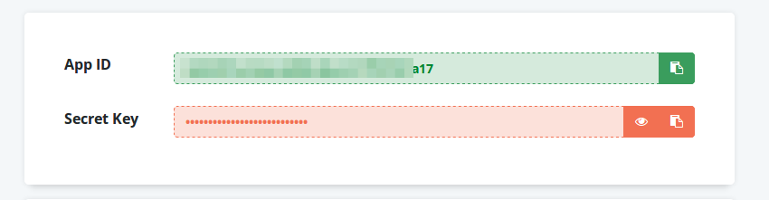

It is quite easy to connect your WooCommerce store with your Retainful account. You can do it 3 simple steps.

### Step 1 : Collect API Keys from your Retainful account

- Login to your [Retainful Dashboard](https://app.retainful.com/?utm_source=connecting_your_woocommerce-store-with-retainful&utm_medium=retainful_dashboard&utm_campaign=docs)  (If you do not have an account, [Signup for Free](https://app.retainful.com/?utm_source=connecting_your_woocommerce-store-with-retainful&utm_medium=signup_for_free&utm_campaign=docs))
- Go to the Settings page
- Copy your App ID and Secret Key

### Step 2: Enter the keys in the plugin.

- Go to your WordPress Dashboard -> WooCommerce -> Retainful
- Under the Connection tab, enter the keys in the respective field

Press "Connect" button

> Note: If you are an existing user, you may have already connected, just press the "Re-connect" button.

### What's Next ?

[Creating an Abandoned Cart Email Template](https://www.retainful.com/docs/woocommerce/customizing-the-email-templates-using-drag-and-drop-editor)