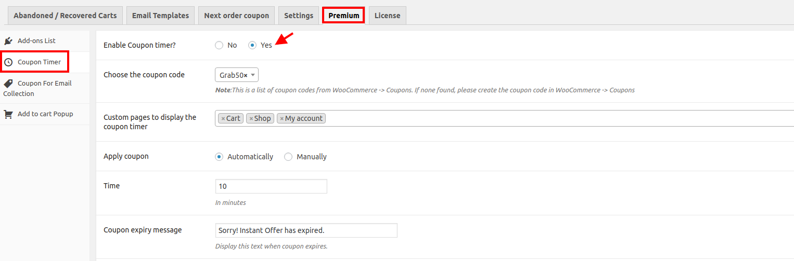
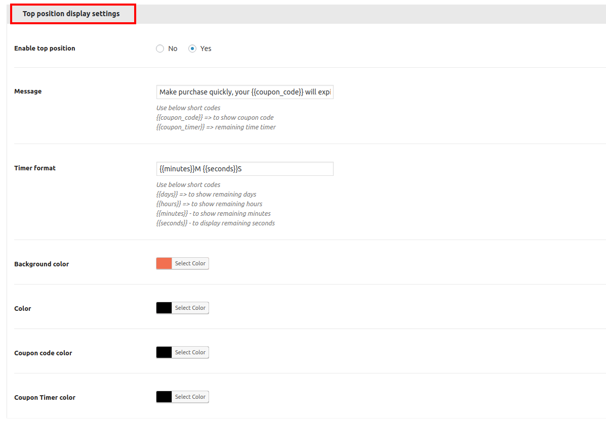
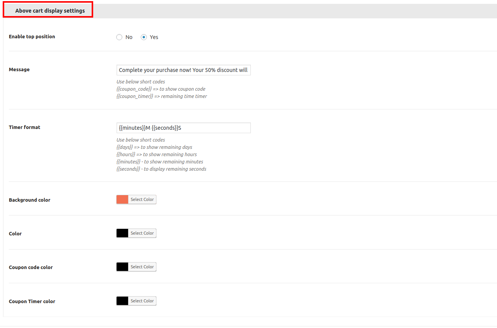
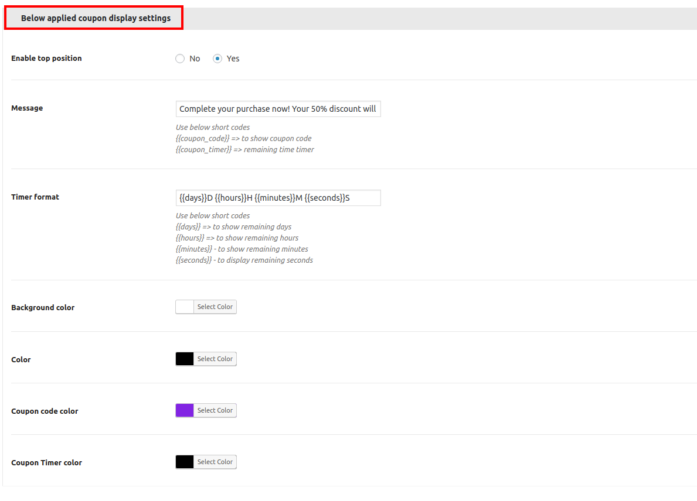
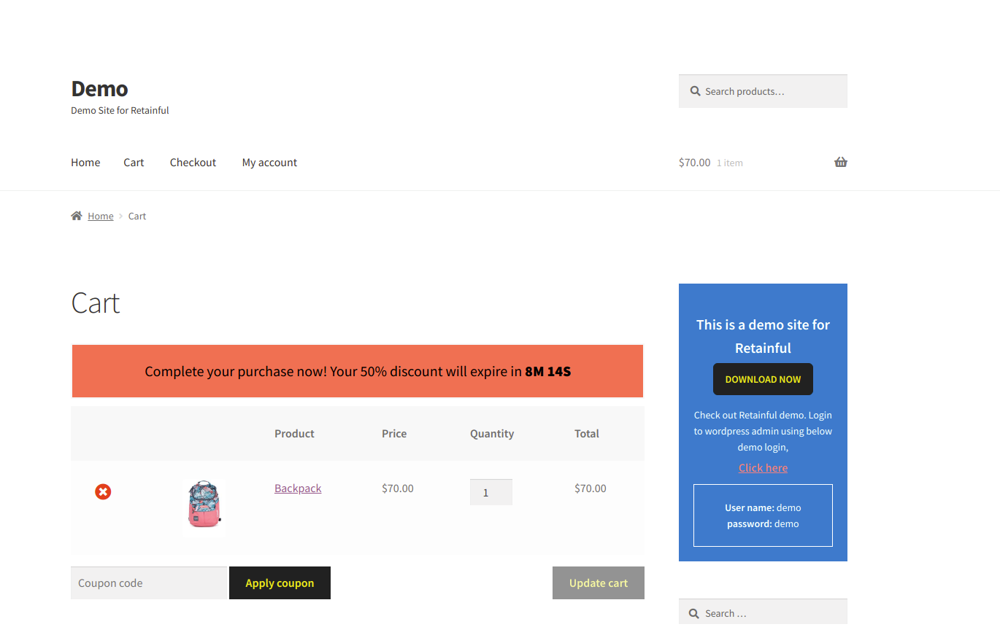
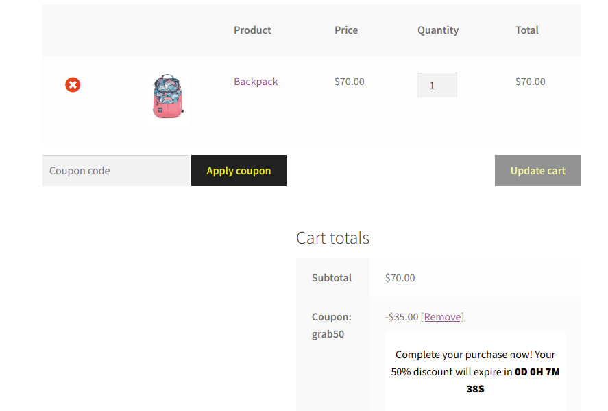
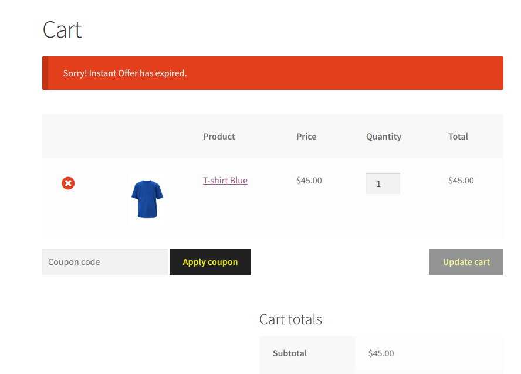

Countdown timer can be added to any message, popup or banner.       
This guide walks you through the steps to show a countdown timer using the Reatinful Abandoned Cart Recovery plugin for Woocommerce.

**Pre - requisite**

-   Install and activate Retainful - <link-text url="https://www.retainful.com/features/woocommerce" target="_blank" rel="noopener">Abandoned Cart recovery email plugin for Woocommerce</link-text>.
-   Activate Retainful Premium (Coupon Timer is part of the Peminum features of Retainful)

<link-text url="https://app.retainful.com/?utm_source=coupon_timer&utm_medium=upgrade_to_premium&utm_campaign=docs" target="_blank" rel="noopener">Upgrade to Premium</link-text> (if you have not done it yet)  
  

## The coupon timer premium add on offers the following features
- A timer that can be displayed in your website pages (pages of your choice)  
- Customise the display settings of the timer.

### 1. Setting up Coupon Timer   
Navigate to Woocommerce --> Retainful --> Premium → Coupon Timer. Here you can enable and set the following :

**Enable Coupon Timer** : Set to Yes.  
**Choose the coupon code** : Choose the coupon from dropdown list. Coupons created via Woocommerce will be listed here.  
**Custom Pages to display the coupon timer** : Select pages in which the timer should be displayed.  
**Apply coupon** : Choose if the coupon should be automatically added to cart or manually added by the customer.  
**Time** : Enter the time to display the timer. Time entered here is considered in minutes.  
**Coupon expiry message** : Enter text to display. This message will be displayed when you are trying to enter the coupon code after the coupon has expired.

### 2. Customising display Settings

Countdown timer can be displayed in three ways

* Top position of page
* Above cart display settings
* Display settings after applying the coupon

The settings are same for all the three options. You can either choose to display the same display settings or provide different display messages and color settings.  
  
#### Top position of page 
Set the option to “Yes” and choose the color easily via color picker.  

#### Above cart display settings        
Set the same way as chosen for “Top position of page”.

  
  

#### Display settings after applying coupon  
This message will be displayed after applying the coupon in cart.  

### 3. Save and Set Live !!  
Start increasing sales by activating the count down timer and increase sales.  
  

### 4. How does it look in Store front ?  
This is how it looks in cart page :

**Screenshot of cart page after applying coupon in cart.**

**Screenshot of cart page when you are trying to apply coupon after the coupon is expired**

