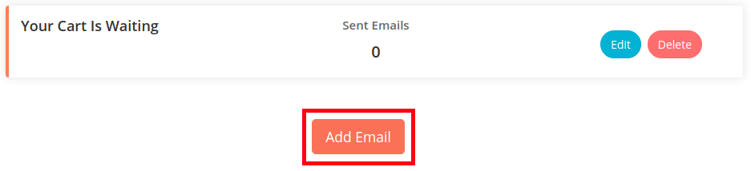
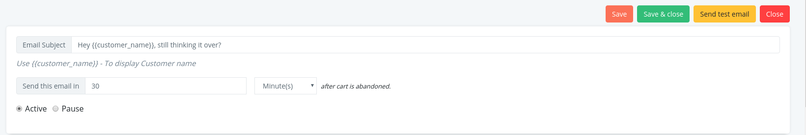
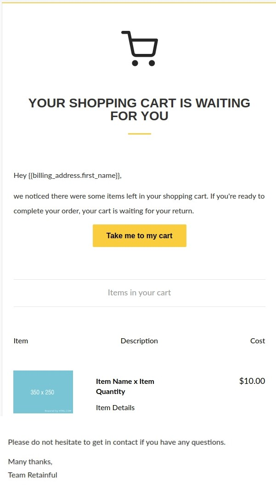
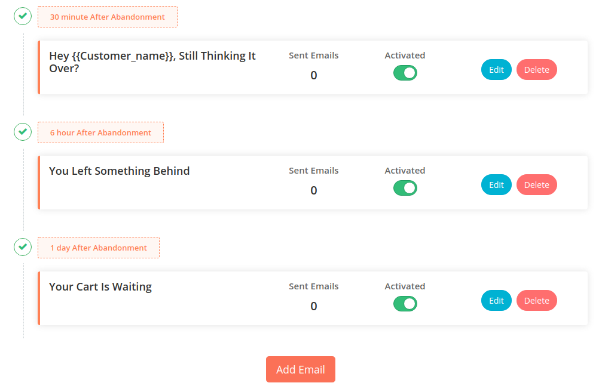

After migrating to cloud, the next step is to set up your very first abandoned cart mail series using Retainful.  Retainful lets you set up a cart recovery mail series in minimal steps.

This guide applies to users who use Retainful 2.x.
Lets get started!

### Recommended Sequence

An ideal abandoned cart email sequence consists of 3 emails. Here is an example sequence:

- **First email**-Send after email 30 minutes
- **Second email**-Send after 6 hours
- **Third email** -Send after 1 day

### Creating the first email

1) <link-text url="https://app.retainful.com/" target="_blank" rel="noopener">Login to or Sign up with Retainful.</link-text>

2) When you first login to your account, you would see the **Create** button. Click on the Create button to get started. 

3) If you are logging in for the second time or later, go to Emails->Email templates-> click on the **Add email** button to get started.

4) In the resulting page, mention the email subject.
For example: **Teleport me to my cart!**
Set the time limit for the mail template to be triggered.

5) Next comes the mail body. Retainful offers default templates which you could use on your templates. You could choose from the two available templates. Following is how the body section of the email after a template is chosen:

6) Click **Save and set live** for the email template to be activated.

7) This is the very first mail template of the series which would be triggered after 30 minutes of abandonment. You could check the look and layout by sending a test mail.

8) Similarly set up the other two mail templates as mentioned in our scenario. The resultant sequence would look like this:

We have now created our very first abandoned cart mail series. 

Once this sequence is created, Retainful will automatically execute this sequence when a customer abandons the cart. Whenever the cart is recovered, the sequence will automatically stop for that particular customer. 

You can also pause, edit or delete any email template whenever you wish.

### Shortcodes that can be used 

You could use shortcodes on your email templates to display dynamic data like user's name and so on. Here is a list of the most prominent shortcodes that can be used.

**{{customer_name}}** - To display user's name.

**{{billing\_address.first\_name}}** - To display the first name user enters on the billing address section of the checkout.

**{{abandoned\_checkout\_url}}** - To redirect user to the cart page along with the products they had in their cart.

**{{retainful_coupon}}** - Displays the coupon code of the Woocommerce coupon. Note that a coupon block has to be added to the email template for this shortcode to display the Woocommerce coupon code.

**{{abandoned\_checkout\_url\_with\_coupon\_code}}** - Redirects users to the shop page with the coupon auto-applied. A coupon code has to be added to the email template to use this shortcode.

**{{shop.address}}** - Displays the shop’s address mentioned in your Woocommerce store settings.

**{{shop.email}}** - Shows the shop’s email address specified in your Woocommerce store settings.

More such shortcodes can be found <link-text url="https://www.retainful.com/docs/woocommerce/shortcodes-for-reference#other-allowed-shortcodes" target="_blank" rel="noopener">here</link-text>

### What's next

1. <link-text url="https://www.retainful.com/docs/woocommerce/customizing-the-email-templates-using-drag-and-drop-editor" target="_blank" rel="noopener">Customize the email template using Drag and drop editor</link-text>

2. <link-text url="https://www.retainful.com/docs/woocommerce/shortcodes-for-reference">Use shortcodes to personalize the mail templates</link-text>

3. <link-text url="https://www.retainful.com/docs/woocommerce/adding-a-store-logo-on-your-email-template" target="_blank" rel="noopener">Add a store logo to your mail template</link-text>