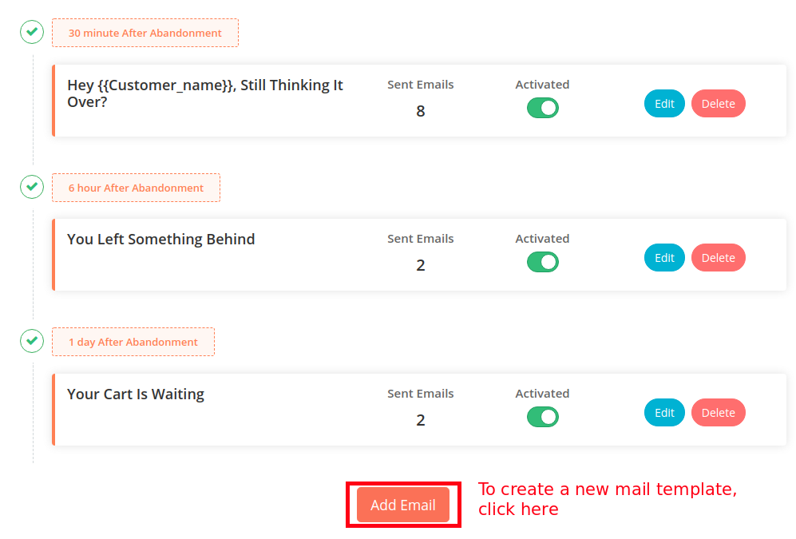

After migrating to cloud, the next step is to set up your very first abandoned cart mail series using Retainful.  Retainful lets you set up a cart recovery mail series in minimal steps.

> NOTE: The following guide is for users who are using Retainful version 2.x and have migrated their data to cloud. If you are still using Retainful legacy version 1.x, you could click <link-text url="https://www.retainful.com/docs/woocommerce/retainful-abandoned-cart-recovery" target="_blank" rel="noopener">here </link-text>for more information.

This guide explains how you could create your first abandoned cart recovery series.

### Recommended Scenario

An ideal abandoned cart email sequence consists of 3 emails timed at regular intervals. Let us consider the following sequence:

- Send an email 30 minutes after customer abandons the cart
- Do another email follow-up 6 hours after the cart is abandoned
- Still not recovered, remind the customer again 1 day after the abandonment

>NOTE: You can set up the interval and customize the sequence in anyway you wanted. There are no limits on the number of email templates that can be created.

### Creating the sequence

1) Login to or Sign up with Retainful. 
2) When you first login to your account, you would see the **Create** button. Click on the Create button to get started. 

3) In the resulting page, mention the email subject.
For example: Teleport me to my cart!
Set the time limit for the mail template to be triggered.

4) Next comes the mail body. Retainful offers default templates which you could use on your templates. You could choose from the two available templates.

5) Save and set the status to **Active**. 
6) This is the very first mail template of the series which would be triggered after 30 minutes of abandonment. You could check the look and layout by sending a test mail.
7) Similarly set up the other two mail templates as mentioned in our scenario. 

8) If you wish to add more templates to the series, you could do so by clicking on the **Add email** button available. 

>NOTE: On the emails page, the activation toggle would appear only if you have edited that particular email template atleast once.

We have now created our very first abandoned cart mail series. 

Once this sequence is created, Retainful will automatically execute this sequence when a customer abandons the cart. Whenever the cart is recovered, the sequence will automatically stop for that particular customer. 

You can also pause, edit or delete any email template whenever you wish.

### What's next

1. <link-text url="https://www.retainful.com/docs/woocommerce/customizing-the-email-templates-using-drag-and-drop-editor" target="_blank" rel="noopener">Customize the email template using Drag and drop editor</link-text>
2. <link-text url="https://www.retainful.com/docs/woocommerce/shortcodes-for-reference">Use shortcodes to personalize the mail templates</link-text>
3. <link-text url="https://www.retainful.com/docs/woocommerce/adding-a-store-logo-on-your-email-template" target="_blank" rel="noopener">Add a store logo to your mail template</link-text>
