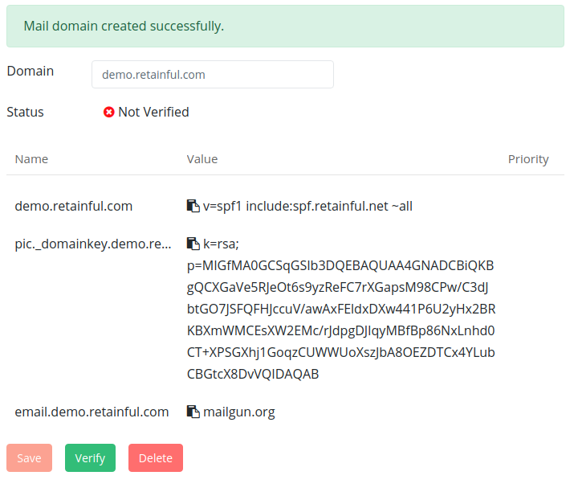

You can now send your cart recovery emails from your store's own domain.

In order to send emails from your shop's domain, you will need to add few DNS records wherever your domain is hosted(GoDaddy, HostGator, SiteGround and so on). This topic is a bit technical but the process is rather simple.

In this article, let us see how to add a custom domain from which the abandoned cart emails are to be sent.

### Why should you use your domain to send emails

Customers expect your business to have a domain name and a website.

Free email services, such as Gmail and Yahoo, are great for personal use, but when you use a free email account for business purposes, people will start to doubt your professionalism and credibility.

Setting up a custom email domain in Retainful ensures that all email is delivered from your domain, which removes the "via retainful.net" from the emails and uses "yourdomain.com" on the recovery email notifications.

This has the added benefit of preventing your store's emails being marked as spam by an email authentication measure called *DMARC *(Domain-based Message Authentication, Reporting & Conformance). DMARC is an email-validation system that determines whether or not an email comes from an authentic source.

Sending emails from your shop's domain not only looks more professional but it also helps build trust and improve your email deliverability.

Creating consistent branding across each of your customer touch points helps promote trust among your shoppers. When your in-store displays, online store, invoices and emails carry your branding and have a consistent look and feel, you can turn your one-time shoppers into repeat customers.

> NOTE: Setting up a custom domain is not mandatory. If you are fine with default mail settings, you can still use that itself.

### Setting up a custom domain

To set up a custom domain, follow the below process:

#### Generating the DNS records

The first step is to add the shop's domain on the Retainful account and generate the DNS records. To do this:

1. Login to Retainful dashboard. Click on **Settings** tab.
2. Scroll to the **Advanced settings** tab.
3. In the **Custom Email domain** section, mention the shop's domain on the **Domain** field and click Save.

4. Once you click on save, a success message appears with the DNS records like this:

5. Three records would be generated- **1 of the type CNAME and 2 of the type TXT**. These records have to be added to the hosting account's DNS records page.

#### Adding the DNS records to Domain host

Below are general instructions for adding/editing DNS records with that will work for most domain hosts. We would be coming up with a more detailed documentation on how to add those records on specific hosts. Following are the steps:

1. Login to your hosting provider account.
2. Go to your domain's DNS records page, often called as **DNS Management**, **Name Server Management**.
3. Select the option to **add a new record**.
4. **Adding the TXT records** -Select **TXT** for record type.
5. In the **Host**/**Alias**/**Name** field, paste the **Host/Name** entry copied from the Retainful settings page. The name entry to be copied is indicated in the below screenshot:

6. In the **Value**/**Answer**/**Destination** field, paste the **Value/Alias To** copied from Retainful settings page. The value to be copied is indicated in red in the below screenshot:

7. Save the record.
8.  Repeat the same process(steps 3 through 7 for the second TXT record as well).
9. **Adding the CNAME record**- Select the option **add a new record**. Select **CNAME** for the record type.
10. In the **Host**/**Alias**/**Name** field, paste the **Host/Name** entry copied from the Retainful settings page. The name entry to be copied is indicated in the below screenshot:

11. In the **Value**/**Answer**/**Destination** field, paste the **Value/Alias To** copied from Retainful settings page and save the record. The value to be copied is indicated in red in the below screenshot:

### Verifying the records

Post adding the DNS records, you will have to verify to ensure that the records are added properly. Verification has to be done at the Retainful **Custom Email Domain** settings section.

>Note: DNS can take upto 48  hours  max to update. You might want to wait sometime before clicking on the Verify button at the Retainful settings page.

### Got questions?

Please feel free to reach us through the chat system available on the Retainful site. We would be happy to help you :-)
