Customizing your abandoned cart email templates has never been so easy. With Retainful, you could easily drag and drop the desired elements onto the template body of your mails.

This article illustrates how you could customize email templates using Retainful.

### Customizing email templates

Login to your Retainful account. Click on **Emails->Email templates->Choose a template or create a new one**.

#### Adding a new block

At the email template layout, you could see a pre-defined template. The tools for customisation are available at the far right corner of the Retainful dashboard as follows:

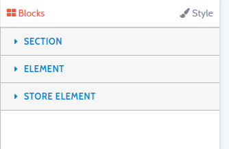

1. **Section tab**\- In this part, you can find tools that allow you to add segments to your email template, for example, if you wish to divide the template layout into 2 or 3 columns, you could drag and drop blocks from this section.

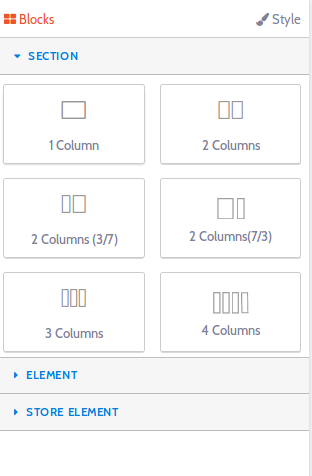
This is how the template layout can be segmented with the use of tools in the section tab:

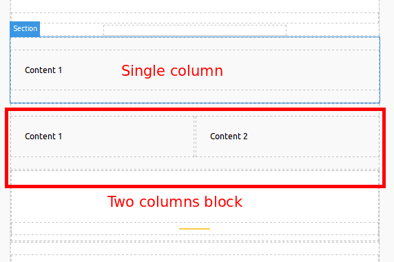

2. **Element tab**- This section helps you add new text blocks, buttons, images, divider and so on.

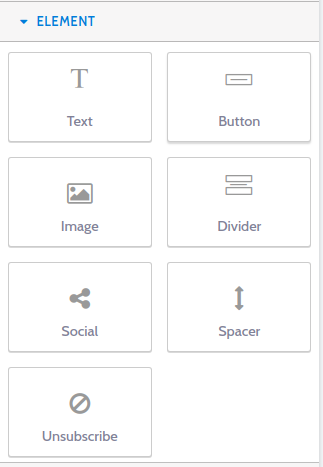

3. **Store block**- To add logos, or coupons and fetch and display other store data, you could make use of the tools found here.

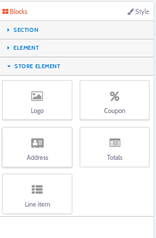
The store element section offers options to enter dynamic data from the store. So, the parameters require bit more explanation. Following are the options available at the store element area:

- **Logo block** -  To know how to add a store logo to your emails and customize the logo, click <link-text url="https://www.retainful.com/docs/woocommerce/customizing-the-email-templates-using-drag-and-drop-editor" target="_blank" rel="noopener">here</link-text>

- **Coupon block** - To know how to add a coupon block to your recovery emails, click <link-text url="https://www.retainful.com/docs/woocommerce/adding-a-coupon-block-on-your-email-template">here</link-text>

- **Address block** - With this block, the billing and shipping address, billing method and shipping method of the order would be fetched and displayed:

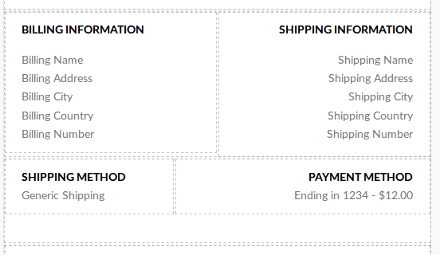
- **Totals block**- If you wish to display the order amount breakup, then you could do so by using this block. The order totals, shipping cost and so on would be displayed.

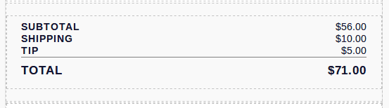

- **Line item block** -The items of the users cart can be displayed on your abandoned cart emails using this block.

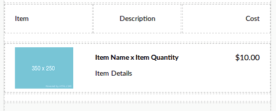

You could also customise and add styles to the individual sections of the email template. Let us learn more about this on the next section.

#### Editing individual elements of the email 

If you wish to apply styles like changing the color, font-size, dimensions of a particular section, that can be done by clicking on that particular segment. 
When you click on a particular segment, a blue rectangle appears around the element or block. 
And the options to customise the layout appear on the right corner.

1. Choose the block of the element you wish to customize further. A blue rectangle would appear.

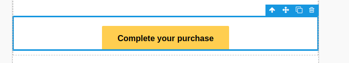

2. **Settings block** -This part offers options corresponding to the block that has been chosen. For example, if you click on a button block, then in the settings tab, you can specify the URL to which the user should be redirected to while clicking on the button. 

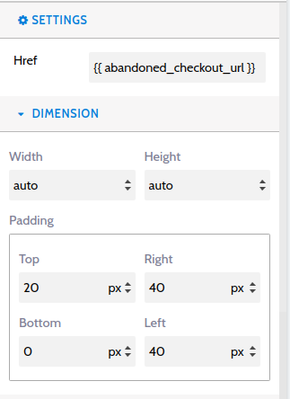

4. **Dimension block** -In this section, you can modify the width, height and padding of the selected block.

5. **Typography block** -This segment has options that let you control the font style of the selected block.

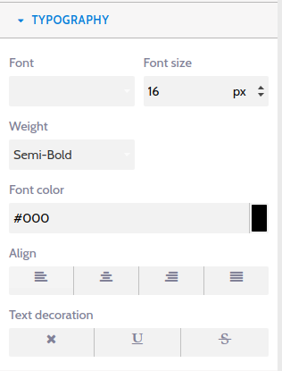

6. **Decorations block**-This section would allow you to add other CSS styles to the selected element.

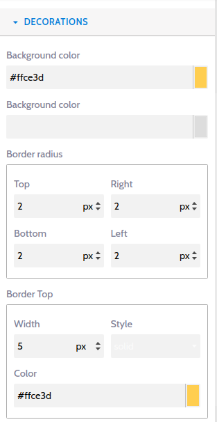

You could style each and every element as per your requirements. 

#### Checking responsiveness across devices

<call-out>Around 61% percent of your stores users are checking your emails and accessing your site on mobile phones. Responsive design eases the checkout process and improves user experience.</call-out>

You could check if the email templates are responsive by making use of the icons at the left corner of the email template layout:

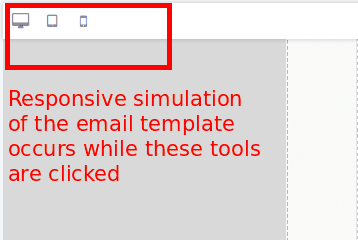

#### Other formatting tools 

Viewing the template in full screen, downloading the template, adding styles via html code, undo and redo options can be found at the top right corner of the template layout.

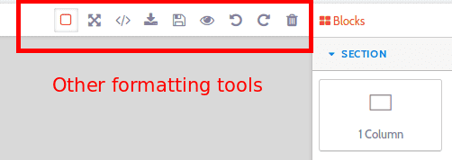

You could add styles and make the layout of the abandoned cart email templates even more beautiful.
