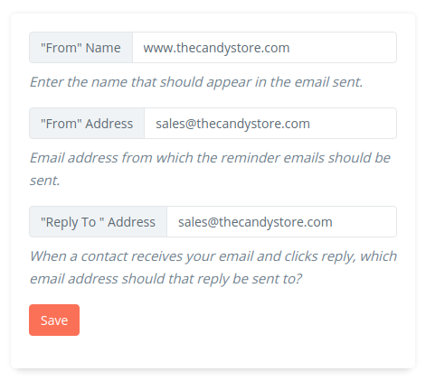
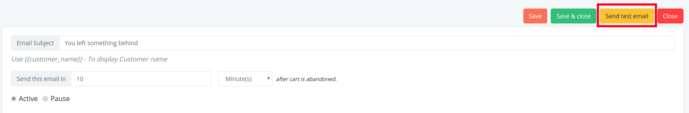

### 1. Where can I view my sent emails?

Retainful maintaines a list of emails that have been sent to users. 
You can find the detailed report of sent emails on your Retainful account under **Emails->Sent Emails** tab.

### 2. How do I change the From address in emails?

An option to change the "From" address can be found in the Email templates tab of your Retainful account.
If you have not mentioned any From address, the From address would be the email  address that you registered with Retainful.
However if you wish to add/ edit the From address, you could do so here:

### 3. How to test abandoned cart emails with Retainful?

Once you set up an abandoned cart email sequence on your Retainful account, you can check the layout of the email by clicking on the **Send test email** button on the appropriate email template:

A popup would show up where you could enter the email address to which the email is to be sent.

> NOTE: Test emails use dummy data that allow you to get an idea on the look and feel of your recovery emails. The links and buttons on the Test emails are not linked to any real-time carts. So the elements on the Test email would not work.

**Alternative approach**

If you wish to check if the elements of your abandoned cart emails are working fine, then you might want to abandon a cart on your store front and wait for your abandoned cart email to be triggered.

As a time-saver, you could set the time limit to consider the cart as abandoned to the minimum available time(15 minutes). Also, you could reduce the time limit of the abandoned cart mail sequence in terms of minutes.

This is **only for testing purposes**. You might want to change the time intervals to the desired limits post testing the workflow.

### 4. What are the ways to collect user's email address before they checkout using Retainful?

Retainful gives you two more options / features to collect customer's email:

1. **Exit Intent popup** - You can trigger a popup when customer tries to leave your site when having items in cart. The popup can have an email collection form or a coupon or both Click <link-text url="https://www.retainful.com/docs/woocommerce/exit-intent-popup" target="_blank" rel="noopener">Here</link-text> to view the guide.
 
2.  **Add to cart popup** - You can trigger an email collection popup when customer clicks add to cart.  Click <link-text url="https://www.retainful.com/docs/woocommerce/collect-email-address-before-adding-to-cart-in-woocommerce" target="_blank" rel="noopener">Here</link-text> to view the guide.

Retainful supports all these in WooCommerce Stores.
Just <link-text url="https://app.retainful.com/" rel="noopener" target="_blank">sign up for a free account</link-text> and you can start a 14-day free trial.

Exit Popup and Add to cart popup are premium add-ons. You can download the Retainful Premium Add-ons plugin from our billing section and try it for 14 days
Click <link-text url="https://www.retainful.com/docs/woocommerce/retainful-upgrading-to-premium#installing-the-premium-plugin-on-your-store">here</link-text> to  download the premium plugin.

### 5. Unable to disable the plugins on Wordpress dashboard

Sometimes, you might receive an error while trying to disable plugins on your site's backend that says **"The link you are following is expired"**.

**Points to check**
1. Are you using Retainful version 2.x?
2. Is the Retainful Premium plugin enabled?

If your answer to the above questions is Yes, then:

**Solution:** In the latest Retainful version, we have merged the Premium plugin into the Retainful core plugin. 
De-activate the Retainful Premium plugin and this issue will be sorted out.

### 6. Can I remove or exclude certain contacts from Retainful account?

There are no options to remove or exclude certain contacts(probably your test contacts) from your Retainful account.
Every unique email address you collect using Retainful account would be treated as a unique contact.

### 7. What happens after I reach the contact limit allowed for my plan?

For example, If you are using the FREE plan. With the Free plan you are allowed a contact limit of 300 contacts.
Once you reach the 300 contact limit, cart recovery emails would be stopped.

You will still be able to track the carts on your Retainful account. 
However, to continue sending recovery emails, you will have to upgrade to other paid plans.

Click <link-text url="https://www.retainful.com/pricing" target="_blank" rel="nofollow">here</link-text> to know the plans and features that Retainful offers.

### The add to cart button functions very slow

This may be because of the Cart tracking engine that you are using. Navigate to**Woocommerce->Retainful- Abandoned carts->Settings**.
Set the cart tracking engine to **Javascript engine**.

The PHP tracking engine gets processed at the server end, while javascript uses the browser for interacting with the API. So, the Javascript engine tracks carts and also processes all the requests at a better speed.
