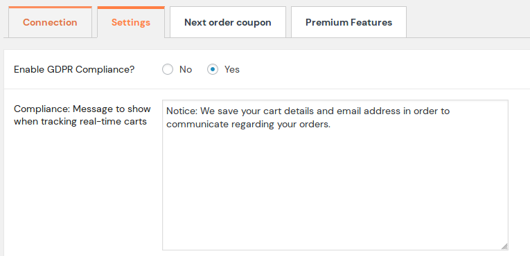
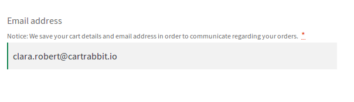
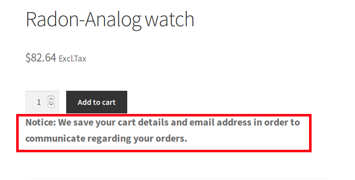
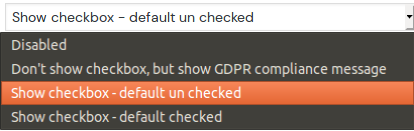
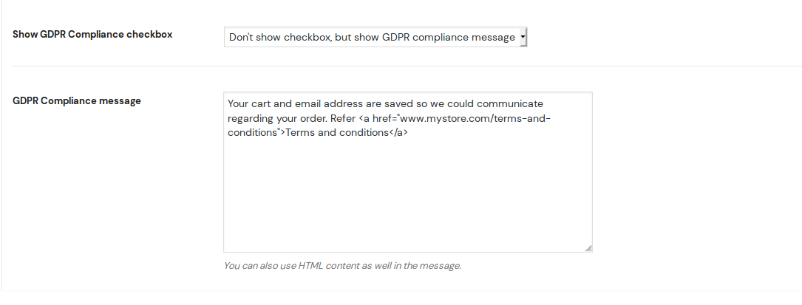
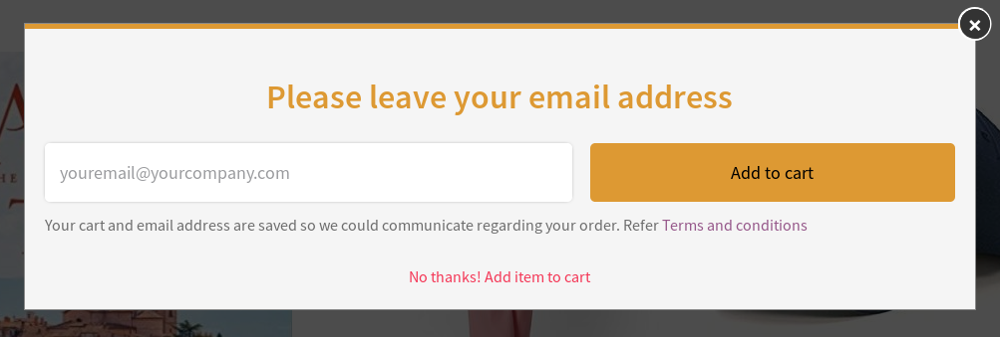
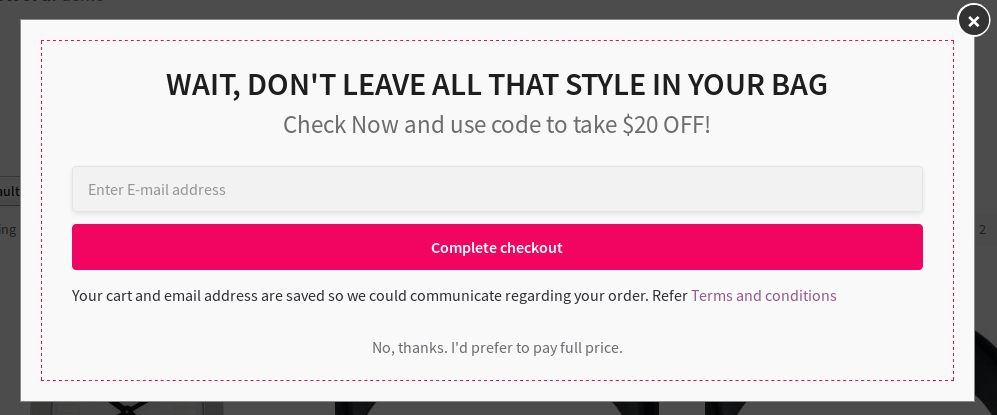

As  part of the GDPR compliance, it becomes essential that you display a notice informing users that you would be saving their emails and cart information.

Retainful lets you comply with GDPR by providing an option to display a GDPR notice on your storefront at the checkout, Add to cart popup form and Exit intent popup.

### Enabling GDPR notice

To enable GDPR notice on the checkout page, follow the below steps:

1. Login to your site. Go to **Woocommerce->Retainful- Abandoned carts ->Settings**.
2. Set **Enable GDPR compliance?** to Yes. Mention the compliance message that you wish to display on the checkout page:

3. Save the settings.

4. **Frontend view**- Here is how users view the notice at the checkout page:

Additionally, the notice would appear on pages where products are listed like this:

### Enabling GDPR for add to cart popup

To enable GDPR notice on the add to cart pop up:

1. Go to Woocommerce->Retainful-Abandoned carts -> Premium features ->Add to cart email collection popup.
2. Click Go to configuration -> GDPR compliance for collecting email.
3. **Show GDPR compliance checkbox**- This option has the following values from which you could choose one:

 
4. **GDPR Compliance message** - Mention the compliance message here. You could also publish a Privacy policy page on your site and add the link to the page here:

5. Save the settings.
6. **Frontend view** - Post enabling the GDPR notice, users would view the add to cart popup with the GDPR notice like this:

If they click on the No Thanks option, the product would be added to cart without the email address.

### Enabling GDPR for Exit intent popup

You could add a GDPR notice on the Exit intent popup as well. Here is how you could enable GDPR notice for exit intent popups:

1. Navigate to Woocommerce->Retainful-Abandoned carts->Premium features->Exit intent popup. 
2. Follow steps 2 through 6 as mentioned on add to cart popup section above.
3. **Frontend view** - After setting up the notice, the Exit intent popup would show the notice like this:

If they don't wish to leave the email address, they could click on the No thanks link and continue with their intended action.