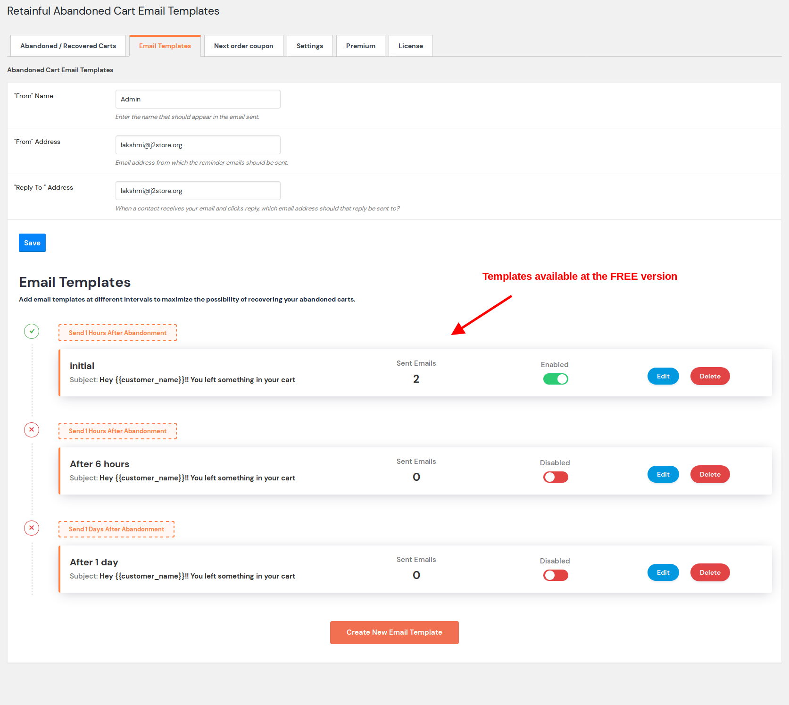
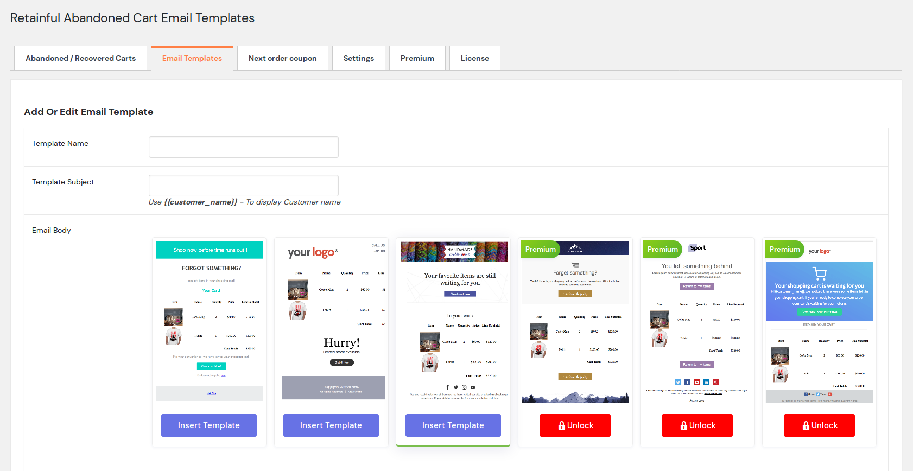
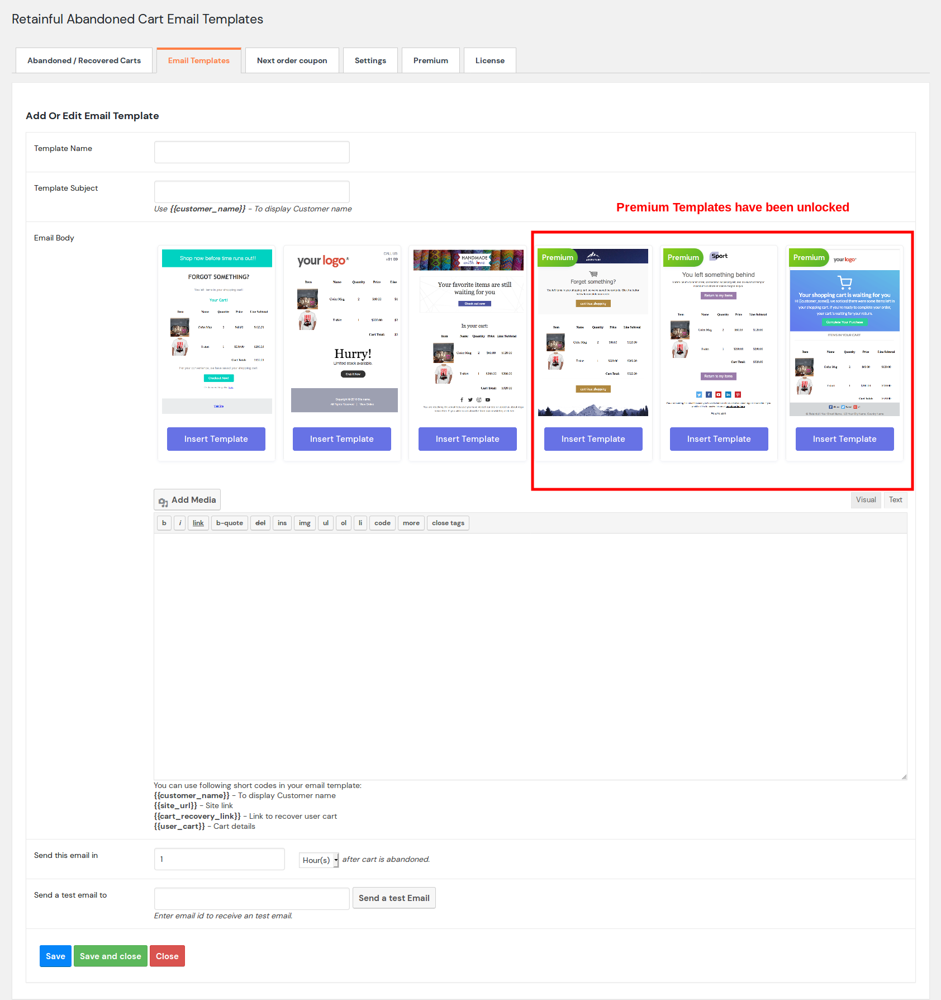
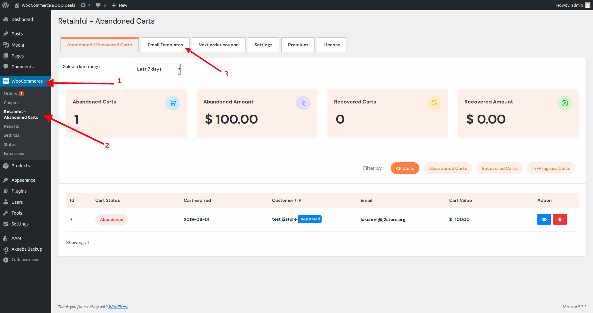
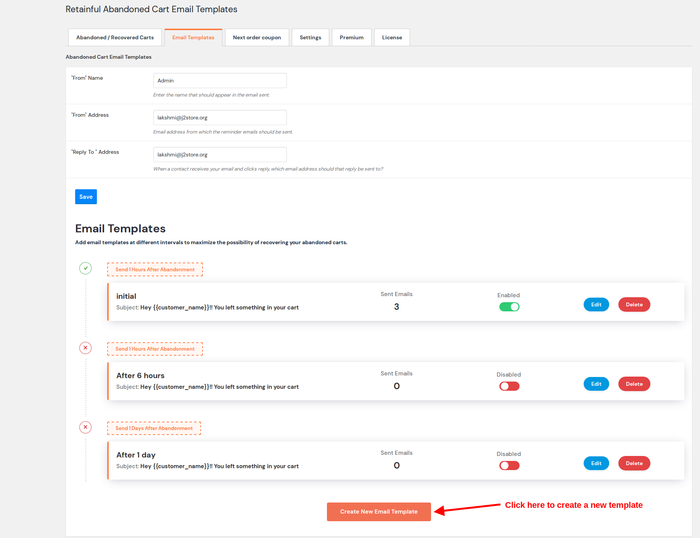
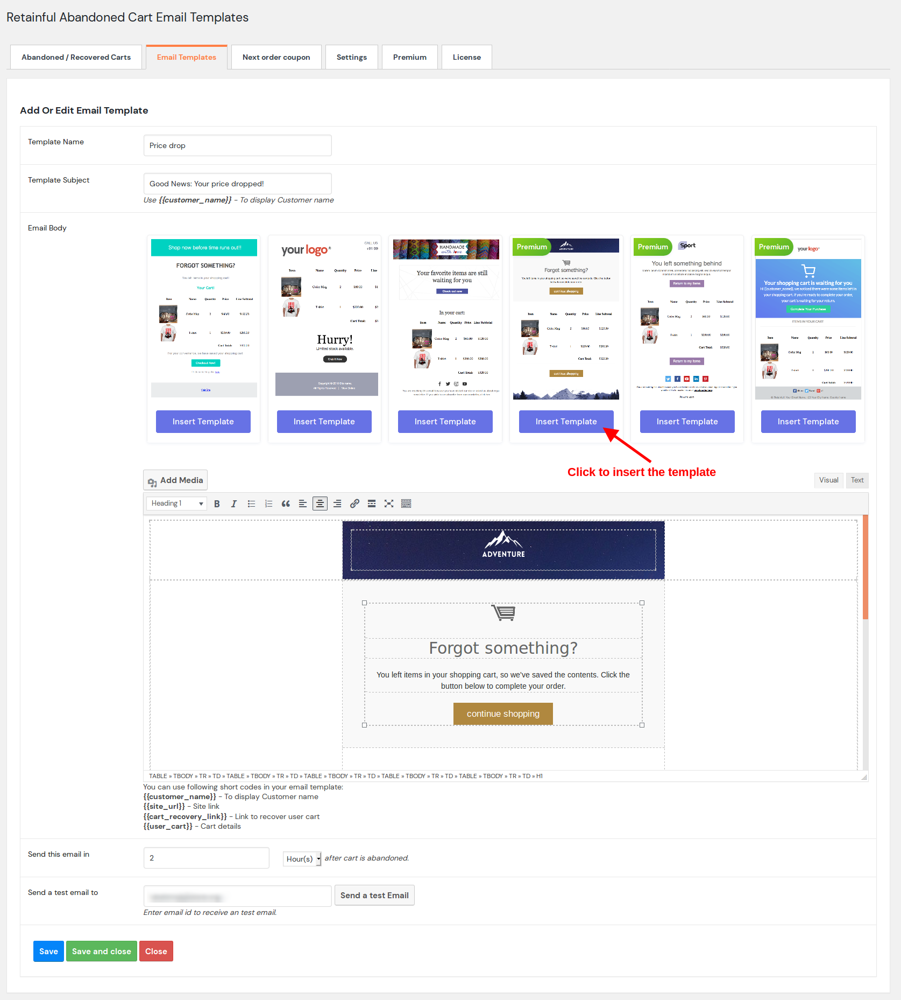
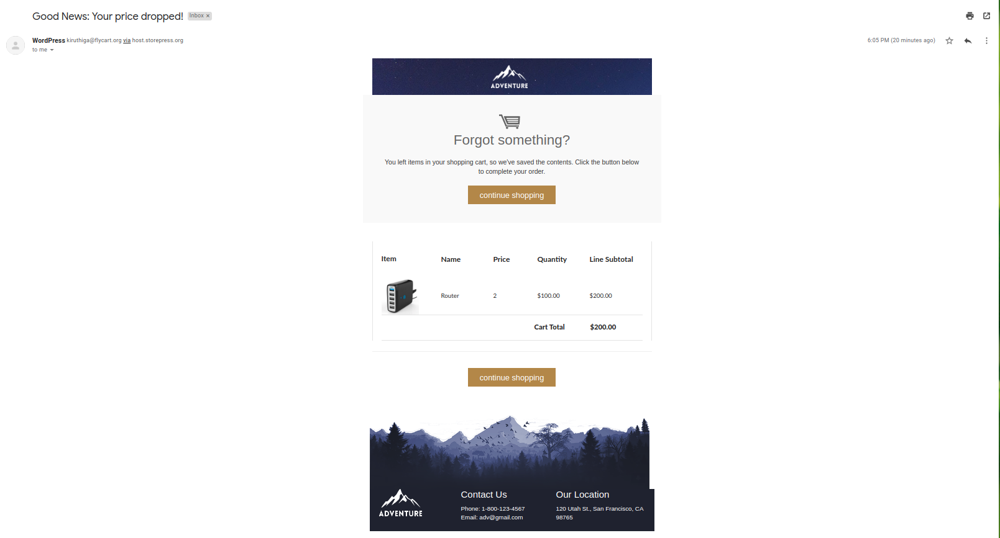

Abandoned cart recovery emails are a great way of recovering lost sales. With that said, it becomes quite harder to stand out in the user's inbox.

What if you could customise your abandoned cart emails on-the-go with the help of templates?
Sounds great, isn't it? 

We all like extra choices, don't we?
With the premium plan of Retainful you could get access to more abandoned cart email templates.

**What the free plan offers?**

With the Free plan of Retainful,  you will have access to 3 email templates as follows:

You could unlock other templates by subscribing to the Premium plans.

Though the Free plan provides the facility to use templates, it feels good to choose from few more options. You can get this added advantage in the Premium plans.

**Getting premium abandoned cart email templates**

To get access to the premium abandoned cart email templates, the following steps are to be done:

1) <link-text url="https://www.retainful.com/docs/woocommerce/retainful-abandoned-cart-recovery" target="_blank" rel="noopener">Upgrade to the Premium plan and validate your license key.</link-text>
2) Navigate to Plugins->Installed Plugins->Enable the plugin Retainful- Premium addons.

3) Once you activate the premium addon plugin, navigate to **Abandoned carts section** on the **Retainful- Abandoned cart recovery Emails and Next order coupons** plugin. Click on the **Email templates** section.
4) Click on the **Create New Email template** section.
5) You can see that all the email templates are now unlocked.

Now that we have access to extra templates, let us create an example abandoned cart recovery email template.

### Creating an example abandoned cart email template

Let us start create an abandoned cart email informing user of a Price drop on your store.

1) Navigate to Woocommerce->Retainful-Abandoned carts->click on Email templates.

2) You would see the list of 3 default templates. To create a new template, click on the Create a new email template button.

3) Let us fill out the essential details and choose the template by clicking on the Insert template button below the desired template and click on Save.

You are now good to go! Here is how your abandoned cart email would look like:

Now, you will be able to send abandoned cart recovery emails on-the-go!
