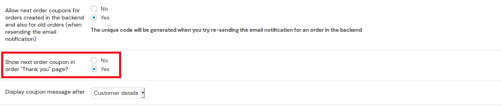

### Drive repeat sales using next order coupons on Thank you page

As a way of encouraging your loyal customers, you could display a coupon code on the thank you page of your site, for every order the user places using the Next order coupon feature available in Retainful.

Lets get started.

### Enabling next order coupons in thank you page

To enable the next order coupon on the thank you page, follow the below steps:

1. Navigate to **Woocommerce->Retainful - Abandoned carts->Next order coupon** and enable next order coupon.
2. Mention a value in the **coupon value** option.
3. Set the option **Show next order coupon in order "Thank you" page?** to Yes.

1. You could set up user-role based, order status based restrictions for the display of the next order coupon as well. To know more, click <link-text url="https://www.retainful.com/docs/woocommerce/next-order-coupon" target="_blank" rel="noopener">here</link-text>

### How users view it on the thank you page

Post enabling the next order coupon on the thank you page, you could view the next order coupon being displayed on the thank you page.

Just place a test order on the storefront to see the coupon being displayed at the end of order completion.

Additionally, the coupon code would also be attached to the order notification email as well.

**Video Tutorial**

Here is a video on displaying a coupon code at the thank you page:

<iframe src="https://www.loom.com/embed/0dfc02fed74a474fb4f9404f6a4e737c" frameborder="0" webkitallowfullscreen mozallowfullscreen allowfullscreen style="position: absolute; top: 0; left: 0; width: 100%; height: 100%;"></iframe>

