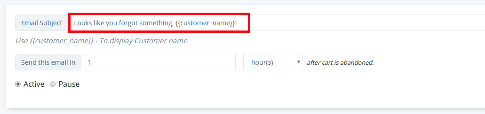
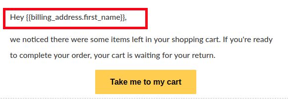

Sending personalized emails are a way to make your user feel important and special. Personalized emails have a higher conversion rate.

Retainful offers you many possibilities to send personalized emails using shortcodes.

This guide helps you understand how you could make your cart recovery emails more personal.

### Step 1-Personalized subject line

The very first and foremost step is to add a personalized subject line because subject lines are the first thing a user notices before opening an email.

To add a personalized subject line, you can make use of the user's name in it. Follow the below steps on how to add a user's name on the subject line using Retainful:

1. Login to Retainful account. Go to **Emails**-> Email templates ->Edit your email template. 
2. To display the user's name on the Subject line, you could use the shortcode **{{customer_name}}** on the subject line of your recovery email template like this:

> NOTE: You could find more examples of personalized subject lines <link-text url="https://www.retainful.com/blog/13-best-subject-lines-for-abandoned-cart-email-campaigns/#personalized-subject-lines" target="_blank" rel="noopener">here.</link-text>

Using the shortcode mentioned above would return the user's name they used on the checkout process.

### Step 2- Personalized email body

You can use **customer's firstname** in the mail body to make the email more relevant. Try using the user's first name above a Call-To-Action button for optimal personalization:

1. In the template body, make use of the shortcode **{{billing_address.first_name}}** like this:

Though these are the most prominent personalization strategies, you could use other shortcodes as well to make the emails more personal. Here is a <link-text url="https://www.retainful.com/docs/woocommerce/shortcodes-for-reference" target="_blank" rel="noopener">list of shortcodes.</link-text>

