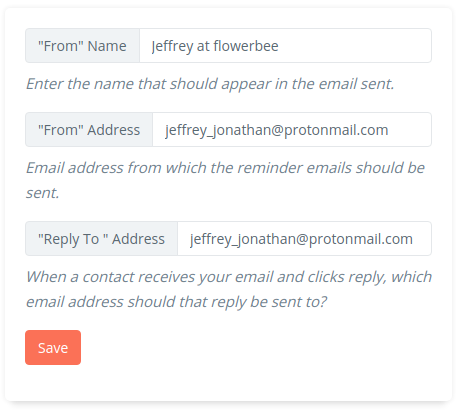
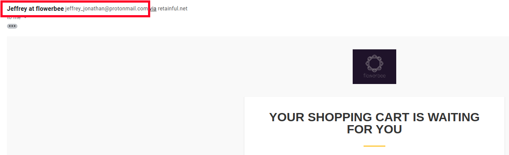
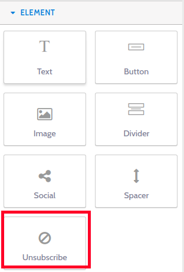

Are your emails reaching their destination?
While sending out abandoned cart recovery emails, it becomes important to ensure that all your emails are being delivered to the user's inbox.
How can you ensure that all your cart recovery emails are being delivered to the user's inbox?

Here is a list of actions that can improve email deliverability.

### From name and from address

When a recipient sees your email in their inbox, they should be able to see your brand name. Not only does it help get the attention of recipients but it can reduce spam complaints.

With Retainful, you could set up a from name and from address that would appear on all your recovery emails.

#### Setting up a from name and from address

To add a more personal touch, you can also send the emails from an individual’s email address in your company. After the individual’s name, you can also add your brand name.

1. On your Retainful dashboard, click on **Emails tab-> Email templates.**
2. You can mention the From name, From address, reply to address on the right corner of the email templates page.

3. Here is how it appears on your cart recovery emails

### Sending emails from your custom domain

You could also avoid confusion regarding the origin of the emails by sending emails from your brand's domain.
This also enhances trust among users while also improving email deliverability rates.

Retainful lets you add a custom domain name from which all the recovery emails would be sent instead of the retainful domain.

Click <link-text url="https://www.retainful.com/docs/woocommerce/custom-email-domain" target="_blank" rel="noopener">here </link-text> to know how to add a custom domain for your cart recovery emails.

### Allow users to opt out easily

As per GDPR regulations, it is not only necessary to obtain consent from your users to send them emails but also provide them with an opt-out option so that they can stop receiving your emails if they wish.

This can be done by adding an **unsubscribe option** on all your cart recovery emails. 

#### Adding an unsubscribe link to your emails

The default email templates of Retainful do have an unsubscribe link at the bottom.

However, if you create a new template, you can still add the unsubscribe link by dragging and dropping the **Unsubscribe block** from the **Element section** on the right side of the mail template.

### Craft your subject lines

The subject line is the first thing a user has eyes on before opening an email. An catchy subject line can not only gain user's attention but also improves deliverability.

   1. Avoid spam trigger words in the subject line such as “free”, “risk free”, “special offer”, etc.
    2. <link-text url="https://www.retainful.com/docs/woocommerce/creating-an-abandoned-cart-email-sequence" target="_blank" rel="noopener" >Personalize your emails</link-text> by using **user's name on the subject line**. 	
    
You could find other interesting subject lines <link-text url="https://www.retainful.com/blog/13-best-subject-lines-for-abandoned-cart-email-campaigns" target="_blank" rel="noopener">here.</link-text>

### Maintain a consistent schedule

When sending automated abandoned cart emails, the consistency is the key. You might want to draft a consistent series.

An ideal recovery email sequence comprises of 3 emails set up on timed intervals. You could still have additional emails added to your email sequence.
However, you might want to find the correct balance between bombarding users with too many emails and contacting them infrequently.

### Whats next?

While designing your next abandoned cart emails, make sure that you have the above points on your mind.
Click <link-text url="https://www.retainful.com/docs/woocommerce/creating-an-abandoned-cart-email-sequence" target="_blank" rel="noopener">here</link-text> to create your abandoned cart recovery emails.