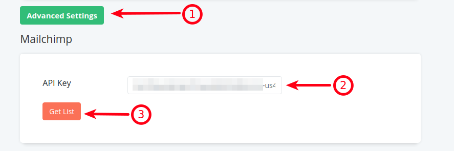
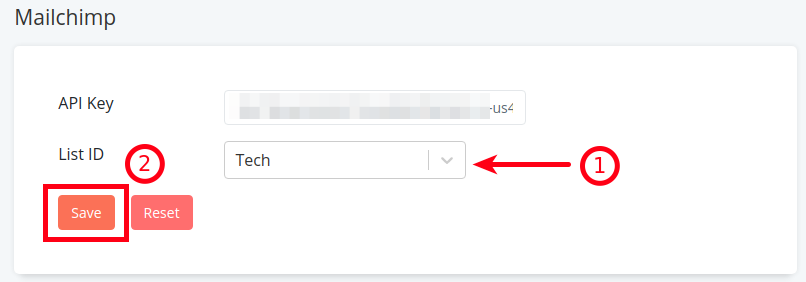

Retainful collects your store users's email addresses and lets you get in touch with users via Abandoned cart emails, next order coupons and increase your revenue.
Is that it?
What else can you do with all that user data that you collected via Retainful?
Looks like you can add your Retainful users' email addresses to your Mailchimp mailing lists and send them newsletters, inform them of your latest offers and other promotion emails, just by connecting your store with Mailchimp.
This article explains the process of connecting your store with Mailchimp.

>Note: Option available only for users who have migrated to cloud.

### Pre-requisites
1) A mailchimp account
2) Atleast one mailing list in Mailchimp

### Integrating with Mailchimp

**Step-1: Retrieving the API key from Mailchimp**

Here is how you could retrieve your keys from Mailchimp:
Click <link-text url="https://mailchimp.com/help/about-api-keys/" target="_blank" rel="noopener">here</link-text> to know how you could retrieve your Mailchimp API keys.

**Step-2: Adding API keys on Retainful account**

 1. Login to your Retainful account. Click on **Settings** tab->**Advanced settings**.
 2. Paste the retrieved key on the **API key** field under **Mailchimp** heading.

3. Click on the **Get list** button. A dropdown of the mailchimp lists would show up if the credentials are correct.
4. Choose the desired list and **Save**.

Now we have connected the Retainful account with Mailchimp mailing list.
The upcoming user emails would be added to the chosen mailchimp mailing list.

> NOTE: If users unsubscribe from the mails that are sent via mailchimp, that would unsubscribe them from the Mailchimp mailing list as well.

5. If you wish to stop syncing the user's emails from Retainful with Mailchimp list, you could do so by clicking on the Reset button.

### Summary
In this article we saw how to:

1) Retrieve API keys from Mailchimp
2) Connect the Retainful account with a Mailchimp mailing list.