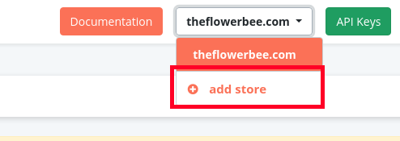
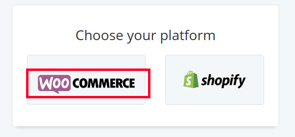
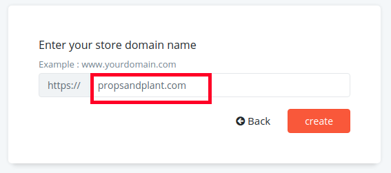

You might be having multiple e-commerce stores and might want to reduce abandoned carts on all of your stores. 
You might be wondering if you have to create multiple accounts to manage all your carts effectively.
Retainful allows you to add and manage as many stores as you wish on your Retainful account itself.

All you have to do is <link-text url="http://app.retainful.com/" target="_blank" rel="noopener">create a single account with Retainful</link-text>. The stores would be managed independently within the Retainful account.

### Adding a store in Retainful

You could start managing all your stores at one place with Retainful. Adding your stores to Retainful is just few clicks away.

#### Add store
On the top right corner of your Retainful account, you would find the store to which Retainful is connected to. Click on **Add store** button.

####  Choose your store's platform
Retainful supports Woocommerce and Shopify. Choose Woocommerce to add your WP online store.

#### Enter your store's domain
Add the store's domain on the domain name field and click **Create**

Hurray! We have now added our store to the Retainful account.
Now, you can try all the features of the Retainful Premium during the trial period free of cost.
Each store added to the Retainful account has independent contact limit according to the plan you have chosen for that particular store.

>NOTE: 
>1. Each store has a separate billing. 
>2. You could create separate campaigns for each store. 
>3. The carts and contacts would be managed separately for each store.

### What's next?

1. <link-text url="https://www.retainful.com/docs/woocommerce/connecting-the-store-with-retainful-account" target="_blank" rel="noopener">Connect the store with Retainful</link-text>
2. <link-text url="https://www.retainful.com/docs/woocommerce/creating-an-abandoned-cart-email-sequence" target="_blank" rel="noopener">Set up your first abandoned cart recovery campaign</link-text>

