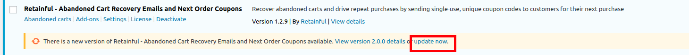
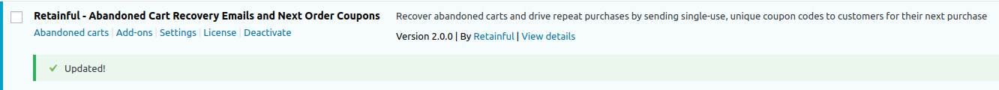
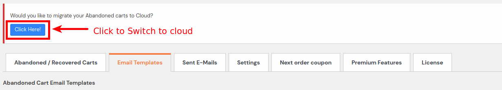

### Why should I upgrade ?

Retainful 1.x heavily depends on the WP Cron for managing abandoned carts, scheduling and sending emails. However, the WP Cron is quite unreliable and performance intensive too. Read what  <link-text url="https://www.retainful.com/docs/woocommerce/migrating-from-plugin-to-cloud">WP Expert Chris Lema has to say about WP Cron</link-text>.

Besides, managing tons of abandoned carts and constant checks for scheduling adds additional loads to your database and server. 

So we have introduced the abandoned cart management, email creation, scheduling and sending of emails in the Retainful app itself. All these run on Retainful servers. No extra loads to your shop.

If you would like to learn more about the benefits, <link-text url="https://www.retainful.com/blog/abandoned-cart-solutions-cloud-based-solutions-vs-self-hosted-plugin-based-solutions">check this detailed blog post</link-text>.

### Pre-requisites

Make sure you have installed the Retainful 2.0 plugin.

>NOTE: The migration option is available for existing users of Retainful 1.x
> For users who use Retainful 2.x by default, the abandoned cart management would be done via Retainful App by default. No further steps are needed.

### Migration from version 1.x to 2.x

#### Step-1: Upgrading from version 1.x to 2.x

Install or update to the Retainful 2.0 plugin.

1. Navigate to your Plugin manager (Woocommerce->Plugins->Installed plugins). You would find an update button below Retainful- Abandoned carts as shown below:
 
    
3. Click on the Update button to Update the plugin to version 2.0. A success message appears post update like this:

    
> NOTE: Are you a new user? These steps are not relevant for you! Please skipe the entire guide.

#### Step-2: Switching to cloud       
    
1. Now that you have updated to 2.x, a button would appear at the Retainful page on your site.

      

2. Press that button. Before pressing the button, make sure that you have <link-text url="https://www.retainful.com/docs/woocommerce/connecting-the-store-with-retainful-account" target="_blank" rel="noopener">connected the store with your Retainful account.</link-text>

3. Go to your Retainful Dashboard -> Emails -> Email Templates. Create an abandoned cart email template with our brand new drag and drop editor. 

#### Step-3: Post migration

An ideal abandoned cart recovery campaign comprises at least 3 emails. So go ahead and create the required emails for your sequence and set them active once you are done.

**Switching back to plugin:**  

If you change your mind after migrating to cloud, you still have the option to switch back to plugin.

### Summary
In this article, we saw how to:
1.  Update the Retainful plugin
2.  Migrate the entries to cloud
3.  Switch back to plugin
