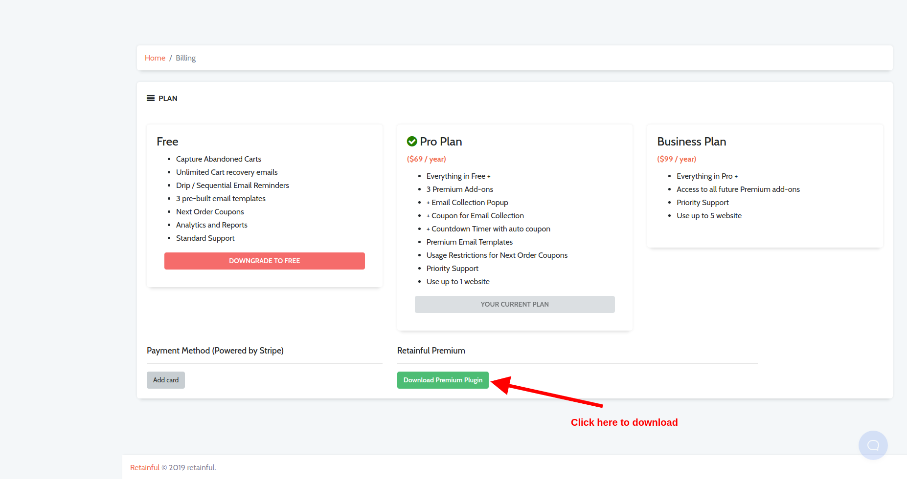
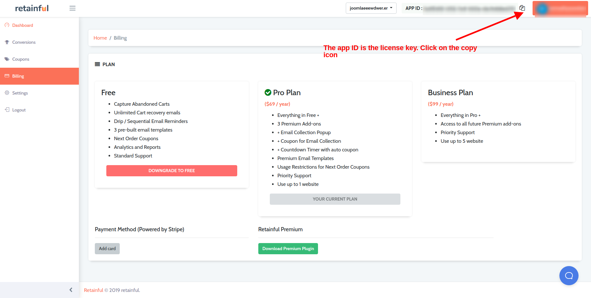
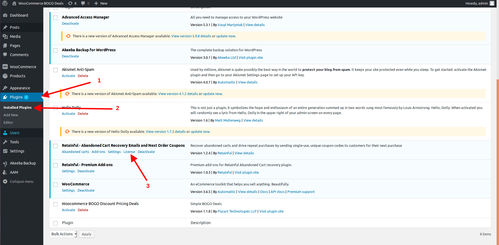
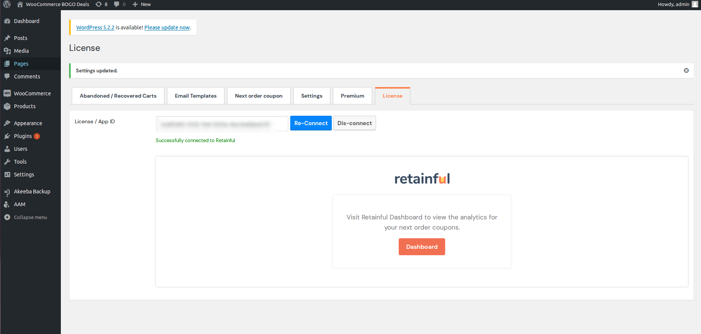
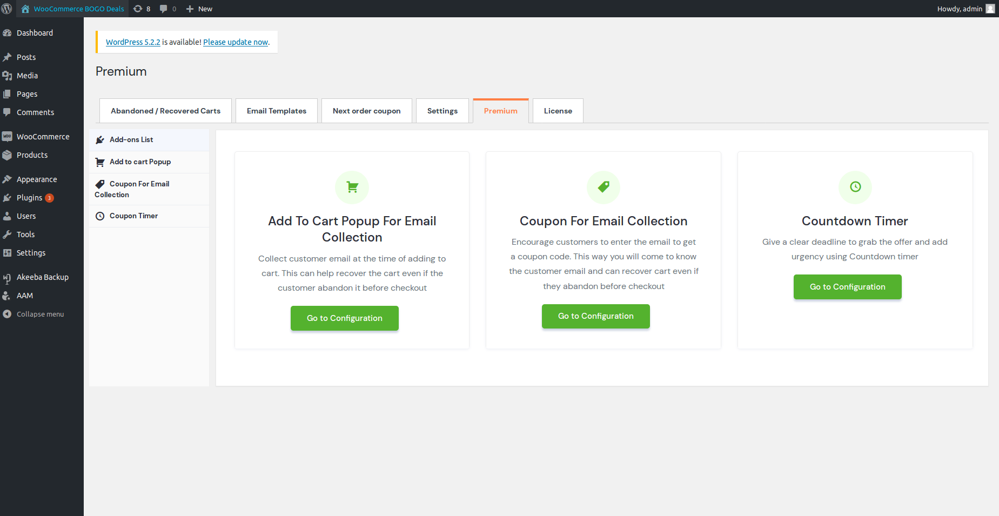

To enjoy added benefits, retainful offers Premium plans as well:
* PRO plan 
* Business plan

### Upgrading to premium

If you are looking to upgrade to a Premium plan of Retainful, following are the steps to be followed:

* On your wordpress site's backend, navigate to Woocommerce section on the left pane. 
* Click on Retainful- Abandoned carts submenu and a window would open as shown below:

* Once you click on the **Upgrade to premium** option as indicated in the above screenshot, you would be redirected to the retainful dashboard.
* A login window would come up. Login using the retainful account details.
* Once you login to the dashboard, click on the Billing section to view the list of plans available:

* Click on the **Upgrade** option below the desired plan.
* You would be redirected to a payment window. Fill in your card details to complete the transaction.

Once the transaction is complete, you could enjoy all the Premium features of Retainful.

### Installing the premium plugin on your store

* Post purchasing the premium plugin, you could download the plugin from the retainful dashboard:

* Navigate to your site, Click on Plugins->Add New->Browse and upload the copy of the downloaded premium plugin and click Install.

* Once you upload and install, an activate button would come up. Click on the activate button to enable the plugin.

### Adding the license key and connecting to Retainful

After installing the premium plugin, the next step would be to adding the License key to the store. To do this, the below steps have to be followed:

* The license key can be fetched from the <link-text url="retainful.com" target="_blank" rel="noopener">retainful dashboard</link-text> in the top right corner as indicated below:

* Navigate to your site's plugin manager->Click on the **License** option below the Retainful -Abandoned cart Recovery emails and next order coupons plugin.

* Now, add the copied license key in the resulting window in the field **License/App ID** and a success message should come up

* We have now successfully connected the store with the retainful dashboard. Want to see the premium features?
You could view them in the Premium tab on the Retainful plugin:

Happy Selling!
