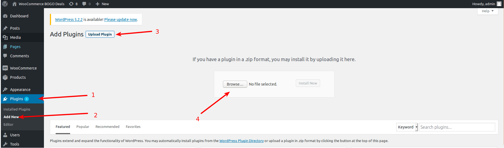
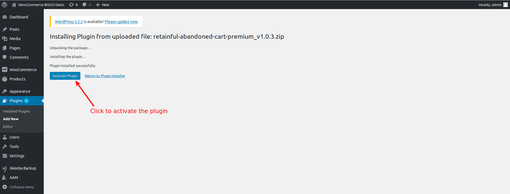

Retainful offers the following Premium Add-ons to convert your visitors into customers more effectively in your WooCommerce store.

* Exit Intent Popup
* Add to cart Popup for Email Collection
* Countdown Timer with Auto Apply Coupon

### Adding Premium Features to your WooCommerce store

If you do not have an account already, sign up for a [Retainful Account free](https://app.retainful.com/?utm_source=enabling_premium_add_ons&utm_medium=retainful_account_free&utm_campaign=docs) and get started with a 14-day free trial. 

You can try all the features of the Retainful Premium Add-ons during the free trial period.

> NOTE: If your trial has expired, please upgrade to a paid plan in order to continue to use the premium add-ons.

#### Step 1: Download the Premium Add-ons Plugin

Go to your Retainful Dashboard -> Billing to download the plugin

#### Step 2: Install and Activate the Premium Add-ons

- Go to your WordPress Dashboard -> Plugins -> Add New 
- Choose the zip file that you have just downloaded.

- Once installed, activate the plugin.

#### Step 3: Configure the Premium Add-ons

Access the Premium Add-ons by going to your WordPress Dashboard -> WooCommerce -> Retainful -> Premium Features tab

### What's Next ?

- Learn how to add an [Exit Intent Popup](https://www.retainful.com/docs/woocommerce/exit-intent-popup)
- Learn how to add an [Email Collection Popup at the time of adding to cart Add to Cart](https://www.retainful.com/docs/woocommerce/collect-email-address-before-adding-to-cart-in-woocommerce)
- Learn how to add a sense of urgency with a [Countdown Timer](https://www.retainful.com/docs/woocommerce/coupon-timer)

