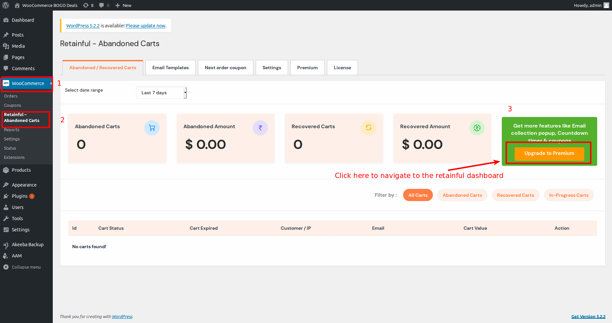
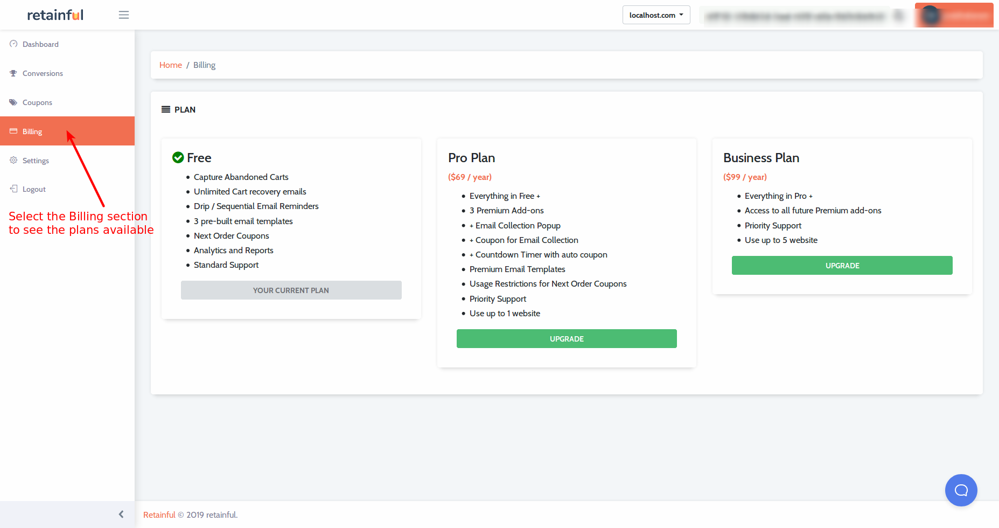
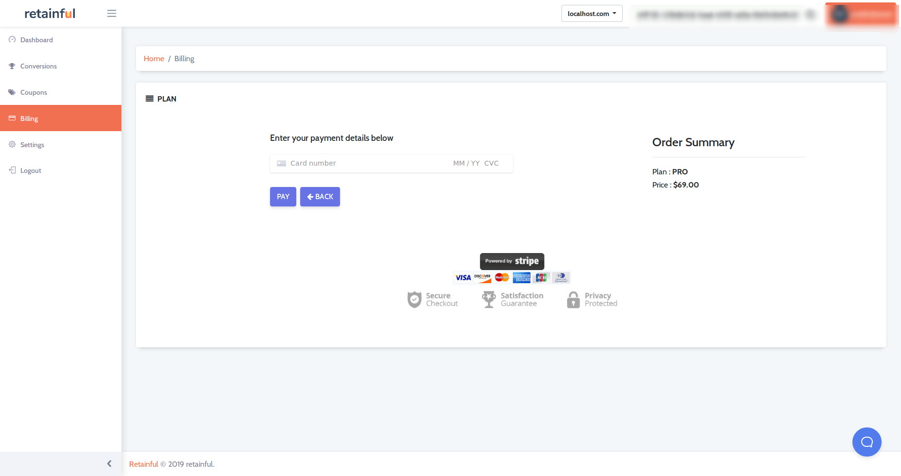
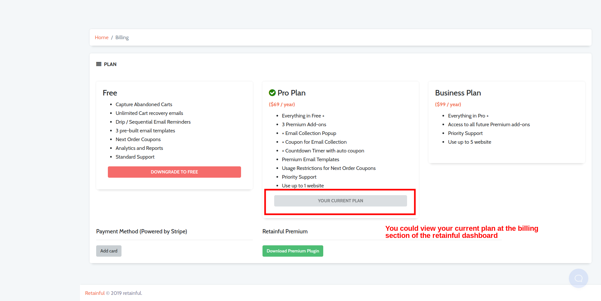

To enjoy added benefits, retainful offers Premium plans as well:
* PRO plan 
* Business plan

If you are looking to upgrade to a Premium plan of Retainful, following are the steps to be followed:

* On your wordpress site's backend, navigate to Woocommerce section on the left pane. 
* Click on Retainful- Abandoned carts submenu and a window would open as shown below:

* Once you click on the **Upgrade to premium** option as indicated in the above screenshot, you would be redirected to the retainful dashboard.
* A login window would come up. Login using the retainful account details.
* Once you login to the dashboard, click on the Billing section to view the list of plans available:

* Click on the **Upgrade** option below the desired plan.
* You would be redirected to a payment window. Fill in your card details to complete the transaction.

Once the transaction is complete, you could enjoy all the Premium features of Retainful.

Happy Selling!

