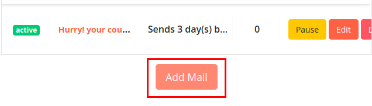
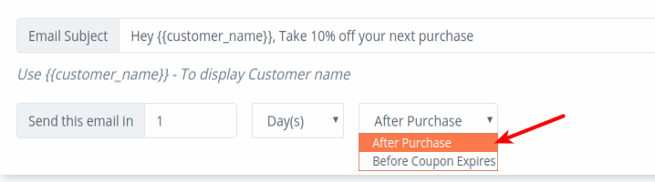
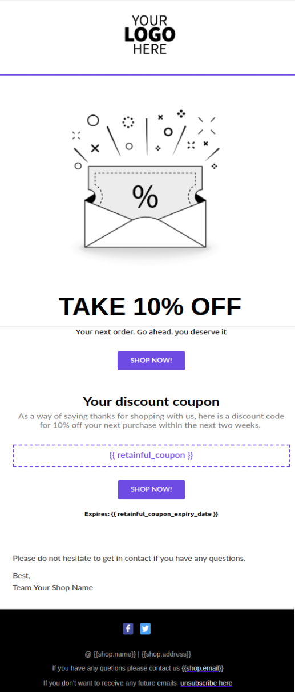
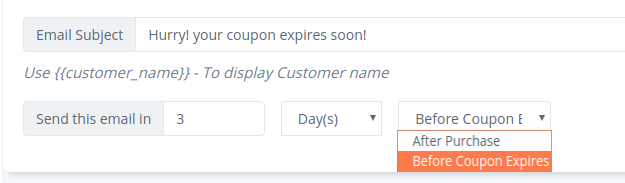
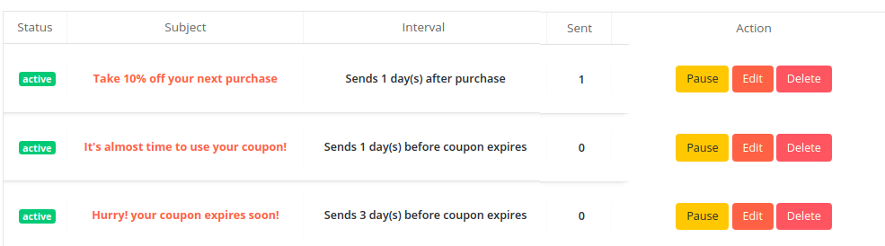

Like the cart recovery emails, Retainful helps you drive repeat purchases by sending next order coupon reminders.

In this article, we are going to learn how to set up next order coupon reminder emails.

#### Pre-requisites

1. Next order coupons should be enabled on your wordpress dashboard.
2. Coupon value and coupon expiration date should be set up.

NOTE: Next order coupon reminder emails are a Premium feature. If you are on your Free trial, you should be able to access this feature free of cost until your Trial expires. If not, you might want to upgrade your plan.

### Recommended Sequence

An ideal email reminder sequence consists of at least 3 email templates at regular intervals. Here is a recommended sequence:

First reminder- 1 day after purchase.
Second reminder- 3 days before coupon expires.
An optional Third reminder- 1 day before the coupon expires.

You could add additional reminder email templates by clicking on the Add mail button under Emails->Next order coupons on your Retainful dashboard.

#### Creating the first reminder: After 1 day of purchase

1. On your Retainful account, navigate to **Emails->Next order coupons**.
2. Click on the **Add mail** button to get started.
3. Three email templates are available from which you could choose the desired template.

4. The subject line can be customized as required. You could set up reminders to be triggered based on the time of purchase or the coupon expiration.

5. You could also customize the email body. You might want to update your store logo instead of the default logo and the Coupon text as per your configuration. Once the configuration has been done, the email template would look like this:

#### Shortcodes for next order coupon reminders

You can also personalize the reminder emails with any of the following shortcodes:
**{{customer_name}}**- Returns the customer's name. You can use this on the subject line to make the email more personal.
**{{retainful_coupon}}**- Displays the coupon code of the next order coupon generated.
**{{retainful\_shop\_url}}**- Redirects user to the shop page. Using this shortcode on the Shop now button preceeded by the coupon code would encourage users to purchase more.
**{{retainful\_shop\_url\_with\_coupon\_code}}** - Redirects the user to the shop page with the coupon auto-applied. This shortcode can also be used on the Shop now button below the coupon code.
**{{retainful\_coupon\_expiry\_date}}** - Displays the expiry date of the next order coupon.

Other shortcodes can be used to display information like Shop email, shop address and shop name at the footer section of the email.

6. Click on the **Save and set live** button to activate the mail template. You can also pause, edit and delete the email templates as and when required. You could test the look and feel of the mails by sending a test email.

#### Second email template:  3 days before the coupon expires

Post setting up the first coupon, you can click on the Add mail button to set the next reminder mail.

Mention the subject line and set the **Send email in** option as **3 days before the coupon expires.**

You can customize the mail body as required and once you are ready, click on the Save and set live option to activate the email template.

Similarly, the third email template can also be set as per your store's requirement. As per our recommended sequence, we would have three templates like this once we complete creating all the three email templates:

Once the email sequence is set live, users who are eligible for the next order coupons would receive these emails until they redeem the coupon.