Sometimes, you might wish to reward users with Next order coupons. So, it becomes necessary to know how the coupons work. 
Let's do some testing to understand the workflow.

### Receiving next order coupons:

Next order coupons can be received in two methods:
1) Placing a test order from the storefront
2) From the store's admin panel:
         -  **Sending an order notification from the existing orders**
         -  **Creating new orders from the backend**
        

### Placing a test order from the storefront

1) You could set up a next order coupon on your store by following the guide <link-text url="https://www.retainful.com/docs/woocommerce/next-order-coupon" target="_blank" rel="noopener">here</link-text>
2) Once you have set up a next order coupon, navigate to the shop page of your site, add an item to the cart.
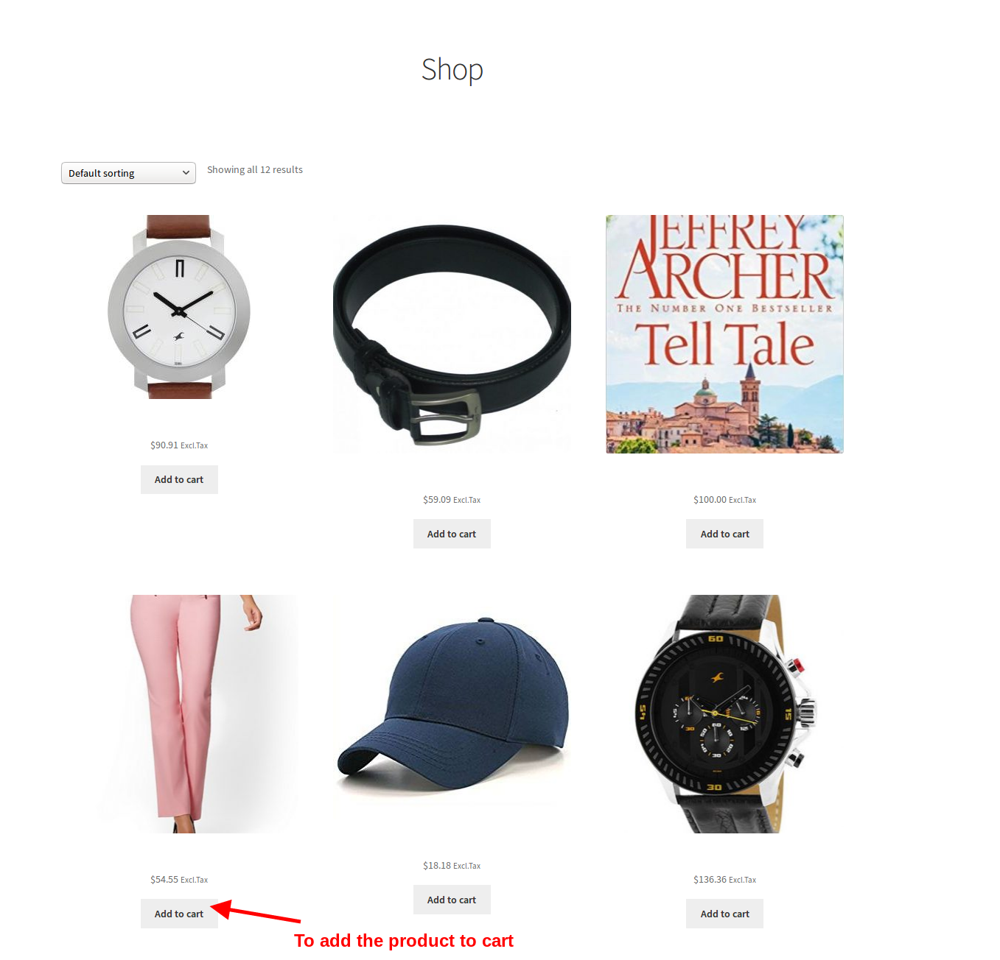
3) Navigate to the cart page by clicking on the **view cart** button.
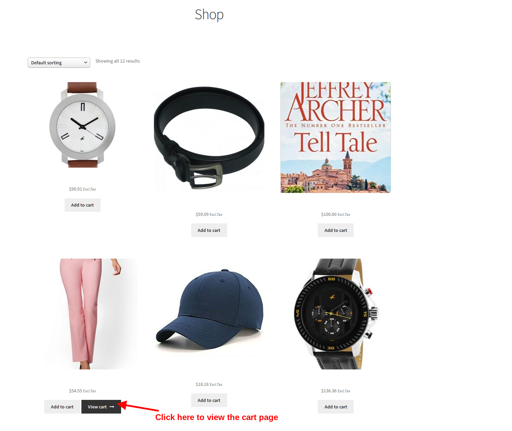
4) In the cart page, click on the proceed to checkout button to move to the checkout page.
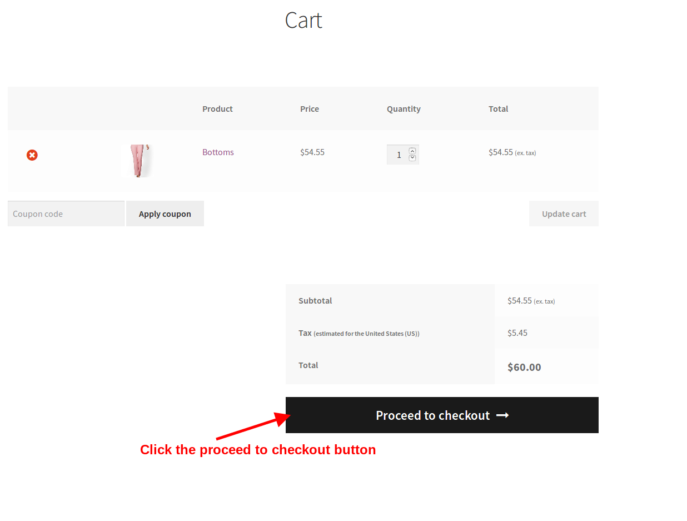
5) Fill in the details at the checkout page, choose the desired payment method and click on the **Place order** button.
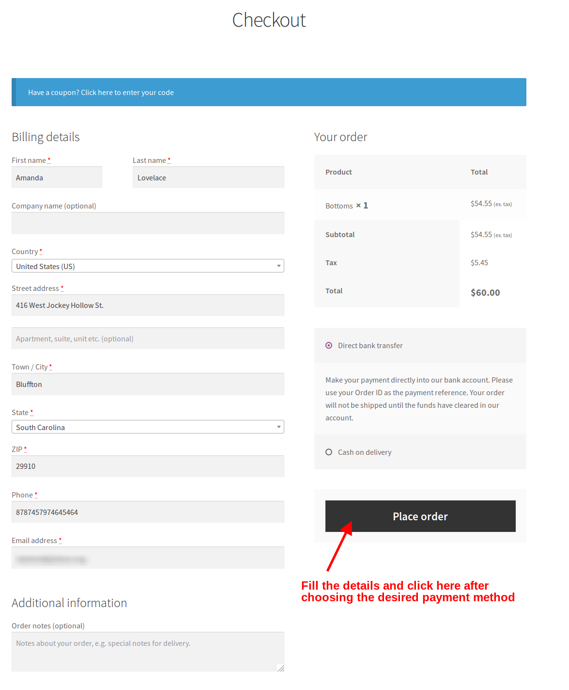
6) You would be redirected to the order confirmation page where a success message would appear as follows:
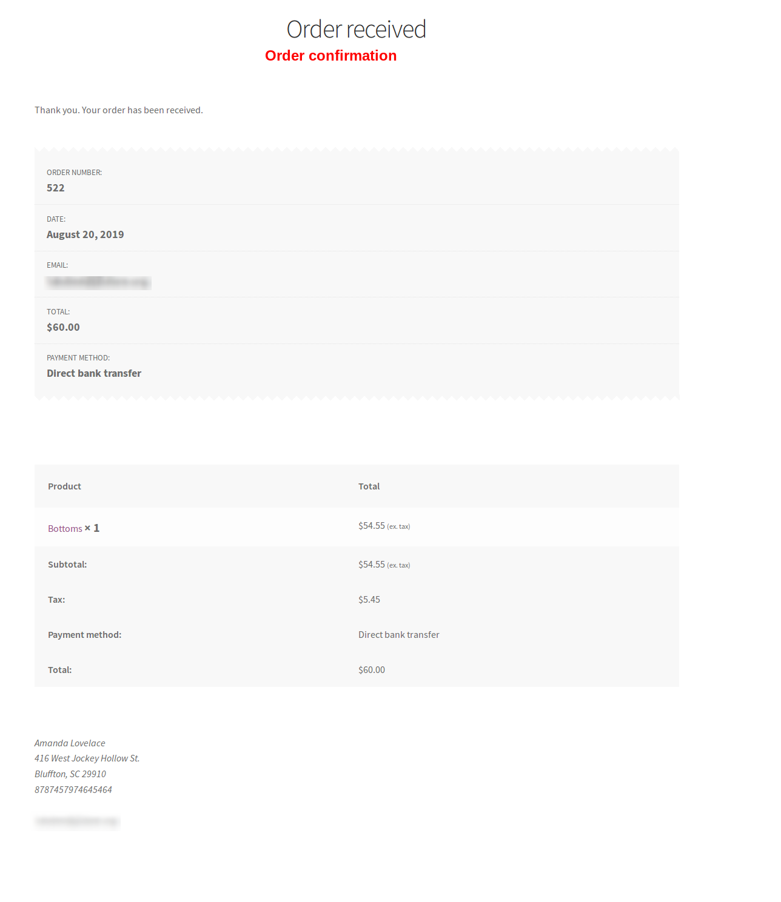
7) An order confirmation email is sent to the email address associated with the order.

### From store admin's backend

There is another provision to receive the next order coupons by creating new orders from the backend or by sending email notifications from existing orders. 

### Settings

1) Login to your store's admin panel. Click on  Woocommerce->Retainful-Abandoned carts->Next order coupons tab.

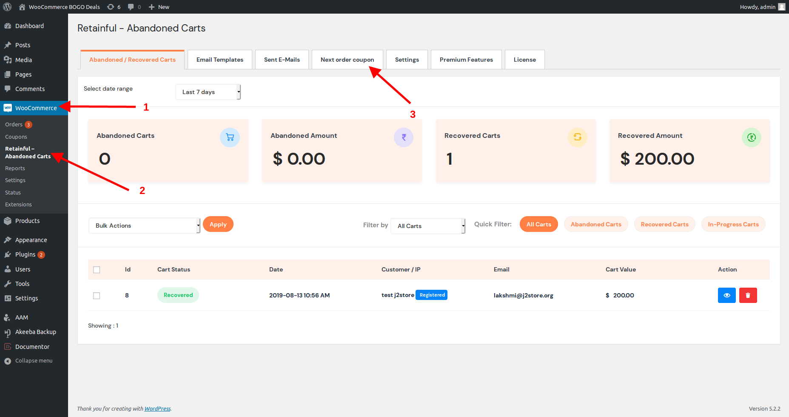

2) Set the option  **Allow next order coupons for orders created in the backend and also for old orders (when resending the email notification** to Yes.

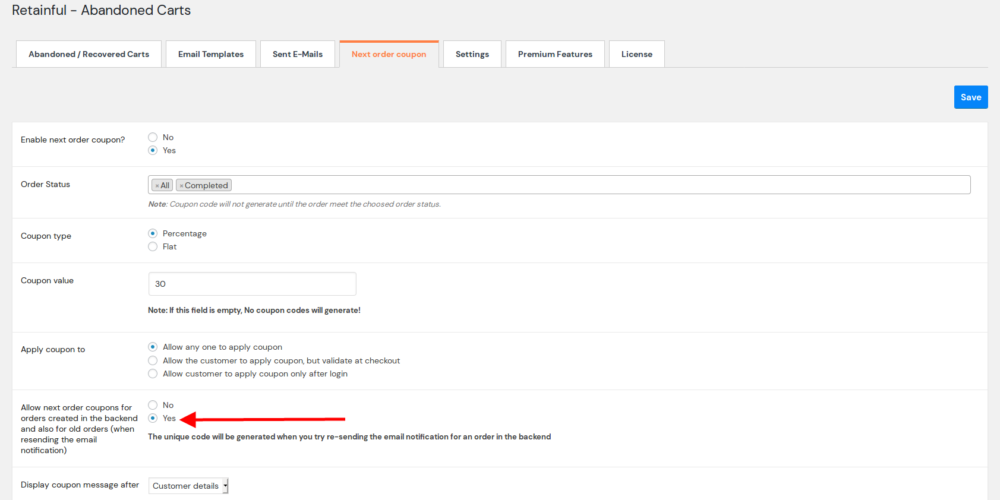

Setting this option to Yes would allow you to resend next order coupons from your admin panel for orders that have been created already or orders that are created from the backend.
The emails would be sent to the email associated with the particular order.

### Creating an order from admin panel

1) Login to your site's admin panel. Navigate to Woocommerce->Orders->Add new.
2) Fill the details, choose the payment method, add product(s).

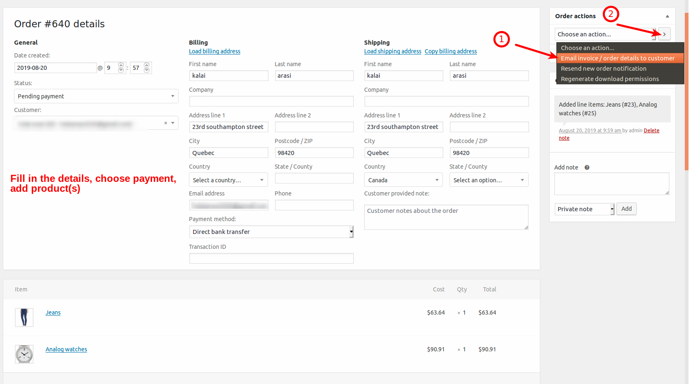

3) At the far right corner, in the order actions field, choose the option **Email invoice/order details to customer** option.
4) Once the option is chosen, click on the arrow button next to the choose action dropdown box as shown in the above screenshot.
5) An email would be sent to the email associated with this order with the next order coupon details.

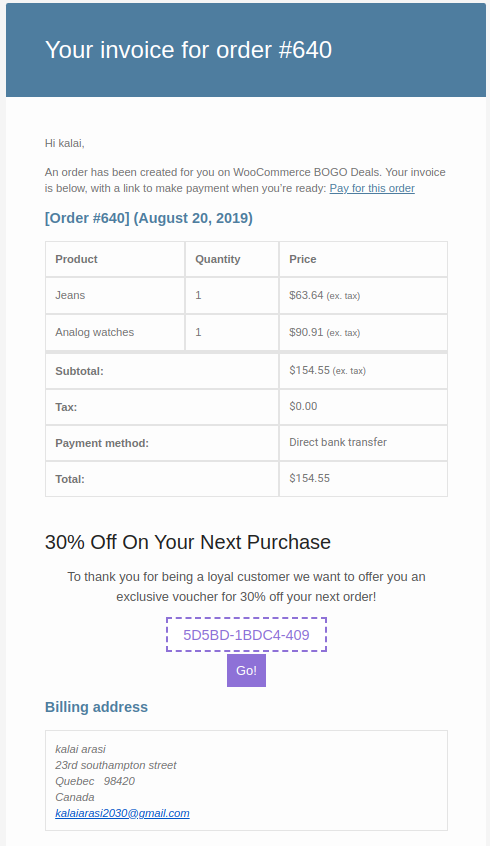

### Sending next order coupons for existing orders
1) Login to your store's admin panel. Click on Woocommerce->Orders->Choose an existing order.

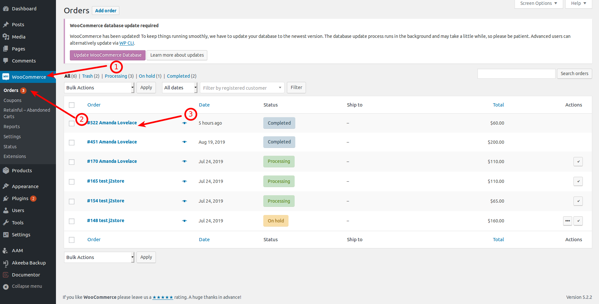

2) At the far right corner of the order view page, click on the option **Email invoice/order details to customer** option.

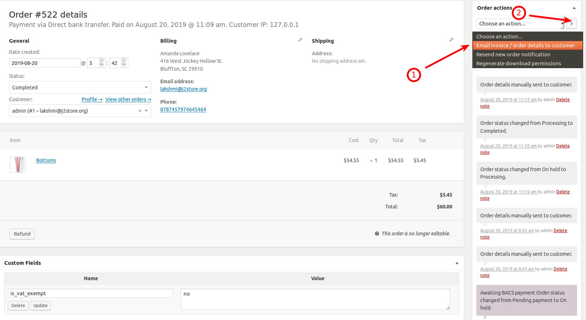

3) Once the option is chosen, click on the arrow button next to the choose action dropdown box as shown in the above screenshot.
4) An email would be sent to the email associated with this order with the next order coupon details.

#### Testing next order coupons

1. Now that you have received the order notification email, for example, let us consider the following email:

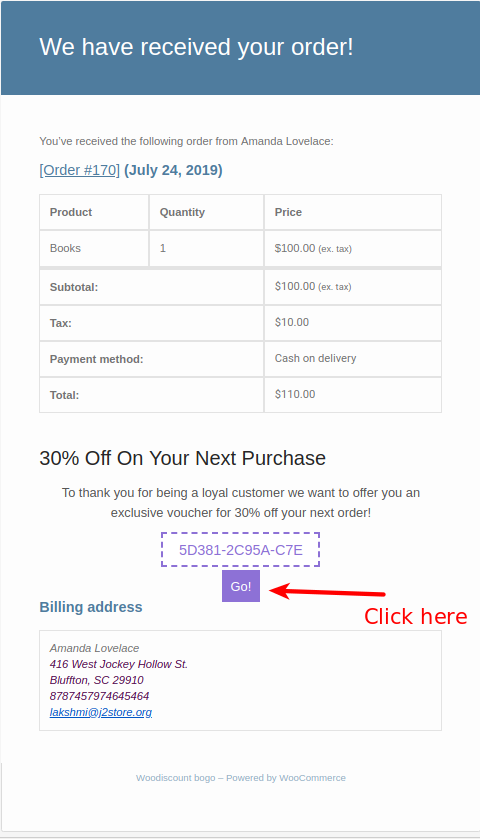
2. Click on the **GO** button on that email.

3. Add a product to the cart and click on the view cart button.

4. Once you visit the cart page, the coupon would be applied based on the restrictions and configuration set at the Retainful plugin.

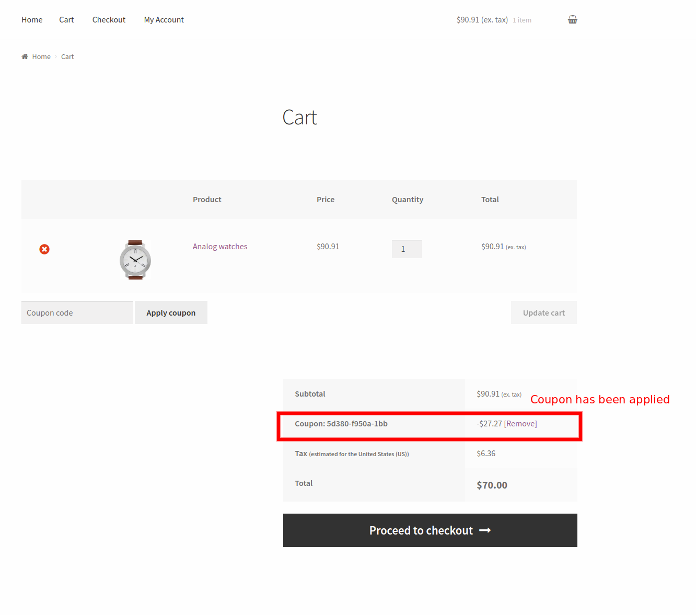
Tada! The coupon has been applied.