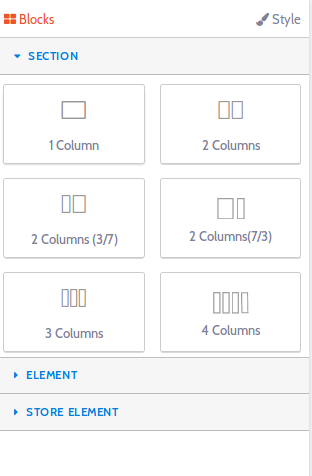
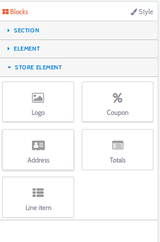
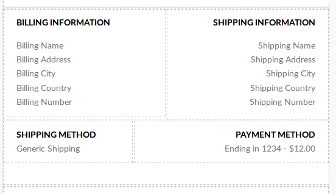
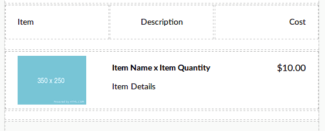
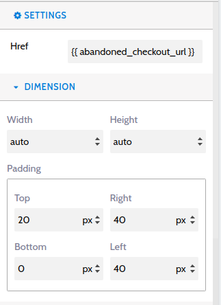
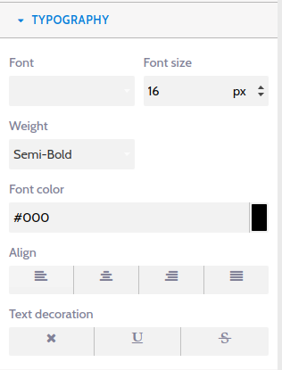
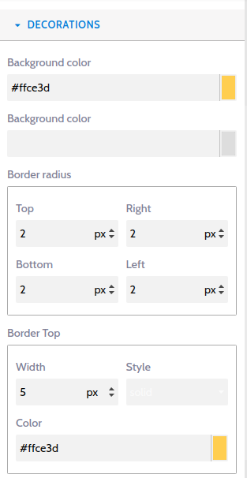
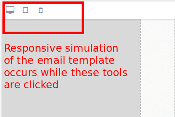
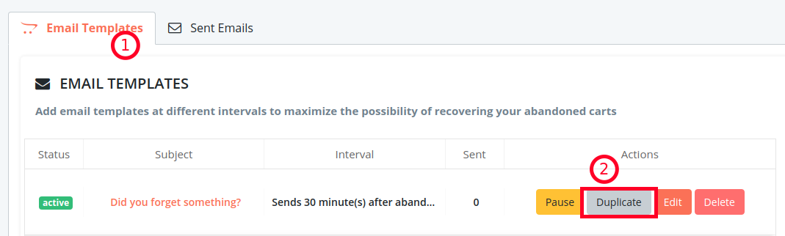

Customizing your abandoned cart email templates has never been so easy. With Retainful, you could easily drag and drop the desired elements onto the template body of your mails.

This article illustrates how you could customize email templates using Retainful.

### Customizing email templates

Login to your Retainful account. Click on **Emails->Email templates->Choose a template or create a new one**.

#### Adding a new block

At the email template layout, you could see a pre-defined template. The tools for customisation are available at the far right corner of the Retainful dashboard as follows:

1. **Section tab** - Divide and Conquer!
Divide the email into neat columns.
In this part, you can find tools that allow you to add segments to your email template, for example, if you wish to divide the template layout into 2 or 3 columns, you could drag and drop blocks from this section.

This is how the template layout can be segmented with the use of tools in the section tab:

2. **Element tab**- This section helps you add new text blocks, buttons, images, divider and so on.

<call-out>

1. A clear CTA encourages users to complete the abandoned purchase. If you are looking to add <highlight>call-to-action buttons</highlight> on your recovery emails, you could do so by using the button block.

2.  Avoid customer frustruation. Send GDPR-compliant abandoned cart emails. This can be done with the Unsubscribe button element. The other store emails would still be delivered.

3.  Some users might have abandoned their cart because they had questions and didn't know where to get them answered. Why not make use of the recovery mails to do that? Use the Text block to answer FAQs.

</call-out>

3. **Store block**- Every abandoned cart email should have certain elements like:
- The brand's logo
- The cart items
- The price of the order
- A discount coupon(at the right time)
Here is how you could add these elements on your recovery emails.

The store element section offers options to enter dynamic data from the store. So, the parameters require bit more explanation. Following are the options available at the store element area:

- **Logo block** -  To know how to add a store logo to your emails and customize the logo, click <link-text url="https://www.retainful.com/docs/woocommerce/adding-a-store-logo-on-your-email-template" target="_blank" rel="noopener">here</link-text>

- **Coupon block** - To know how to add a coupon block to your recovery emails, click <link-text url="https://www.retainful.com/docs/woocommerce/adding-a-coupon-block-on-your-email-template">here</link-text>

- **Address block** - With this block, the billing and shipping address, billing method and shipping method of the order would be fetched and displayed:

- **Totals block**- If you wish to display the order amount breakup, then you could do so by using this block. The order totals, shipping cost and so on would be displayed.

- **Line item block** -The items of the users cart can be displayed on your abandoned cart emails using this block.

You could also customise and add styles to the individual sections of the email template. Let us learn more about this on the next section.

#### Editing individual elements of the email 

If you wish to apply styles like changing the color, font-size, dimensions of a particular section, that can be done by clicking on that particular segment. 
When you click on a particular segment, a blue rectangle appears around the element or block. 
And the options to customise the layout appear on the right corner.

1. Choose the block of the element you wish to customize further. A blue rectangle would appear.

2. **Settings block** -This part offers options corresponding to the block that has been chosen. For example, if you click on a button block, then in the settings tab, you can specify the URL to which the user should be redirected to while clicking on the button. 

4. **Dimension block** -In this section, you can modify the width, height and padding of the selected block.

5. **Typography block** -  Make your emails look attractive and captivating by using the right font, size and alignment. This segment has options that let you control the font style and alignment of the selected block.

6. **Decorations block**- Keep your product in mind while designing your emails. Highlight when necessary using the ideal background color.
This section would allow you to add other CSS styles to the selected element.

You could style each and every element as per your requirements. 

#### Checking responsiveness across devices

Around 61% percent of your stores users are checking your emails on mobile devices.  This becomes all the more reason to optimize your emails for mobile devices.

<call-out>

1. Avoid large images
2. Keep your emails brief

</call-out>

You could check if the email templates are responsive by making use of the icons at the left corner of the email template layout:

#### Duplicating an email template

While creating mail templates to recover abandoned carts, you can save time by duplicating email templates that have been created already. Creating copies of email templates is so painless.

1. Go to **Emails->Email templates** tab on your Retainful account.
2. Click on the **Duplicate button** on the right corner of your desired email template.

3. A copy of the above template would be created. 

>Note: The duplicated template would be in Paused state. Click the Go live button to enable the template.

#### Other formatting tools 

Viewing the template in full screen, downloading the template, adding styles via html code, undo, redo, preview options can be found at the top right corner of the template layout.

You could add styles and make the layout of the abandoned cart email templates even more beautiful.

**Video tutorial**

Here is a video of how to customize the abandoned cart emails. In this video you will see how to:
1. Insert a new section to your email template
2. Add text element, unsubscribe block
3. Customize a selected block
4. Ensure responsiveness

<iframe src="https://www.loom.com/embed/120d0455822c4821b1698ddd350c4259" frameborder="0" webkitallowfullscreen mozallowfullscreen allowfullscreen style="position: absolute; top: 0; left: 0; width: 100%; height: 100%;"></iframe>

#### Summary

In this article we saw how to:
1. Divide your mail templates into columns or add new sections
2. Add new elements and text blocks
3. Customize the individual elements
4. Ensure responsiveness