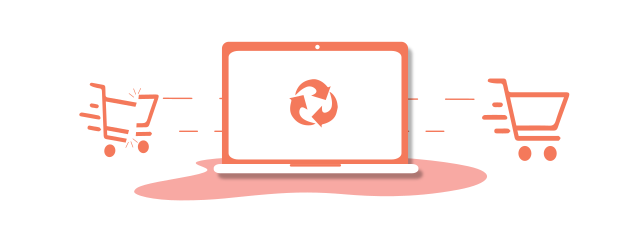
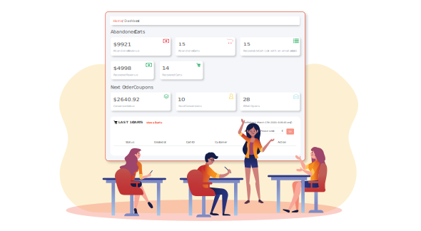

<container>

<headercontent>

# Recover Abandoned Carts. Stop losing sales

Reduce cart abandonment and grow your revenue effortlessly. Automatically send cart recovery emails, capture emails with popups and never let visitors abandon their carts again.

<cta url="https://app.retainful.com/?utm_source=landing_page&utm_medium=abandoned_cart_recovery&utm_campaign=recover_your_cart&utm_term=cta" target="_blank" rel="noopener">GET STARTED</cta>

</headercontent>

</container>

<container>

## Start Recovering Abandoned Carts in 3 Simple Steps

<featurecontent featurebodysizeleft="6" featurebodysizerigth="6">

#### Track Abandoned Carts 

Retainful tracks every single cart in your store without adding any additional overheads to your resources. Its powerful Javascript tracker can track carts and capture the email in real-time and report in your dashboard. 

#### Automatically Trigger Cart Recovery Emails

Remind your customers automatically on what they left in the cart with perfectly-timed abandoned cart emails.  Use the automated workflow to win back your lost sales and make it more appealing with a coupon.

#### Let customers recover the cart with a single click

Retainful generates and sends a unique link to each customer to recover their cart with a single click. And it can even automatically apply a coupon. The link directly takes the customer to the checkout and lets him complete the purchase.

</featurecontent>

</container>

<container>

## Features to Prevent Cart Abandonment and Recover Abandoned Carts  

<featurecontent featurebodysizeleft="6" featurebodysizerigth="6">

### Stop Visitors from Abandoning Their Carts

 

Prevent visitors from abandoning their shopping carts in the first place. Retainful comes with power-packed features that help prevent cart abandonments from happening and also to capture them later.

 

-   Capture the email before checkout using a popup
    
-   Use countdown timers to create FOMO and motivate customers to complete their purchase.
    
-   Catch the visitor when he tries to exit with the Exit Intent Popup and stop them from abandoning their shopping carts.
    
-   When cart abandonment happens, track them and send personalized cart recovery emails.

</featurecontent>

<featurecontent featurebodysizeleft="6" featurebodysizerigth="6" orderleft="order-two" orderright="order-one">

### Track Abandoned Carts

 

To capture abandoned carts, you need to be able to track them first. And Retainful helps you do just that. Know what's happening with the shopping carts on your store in one single dashboard.

 

-   Check abandoned carts in your store in real-time
    
-   Find out items left out by the customers in those abandoned carts.
    
-   See how much revenue you have recovered from your otherwise lost sales. Also see your cart abandonment rate and value.
    
-   Track carts that only matter by using Retainful IP Filtering option. Exclude a single IP, multiple IP's or even a range of IPs
    
-   Know when exactly the carts have been abandoned along with the respective visitor's email address.

</featurecontent>

<featurecontent featurebodysizeleft="6" featurebodysizerigth="6">

### Automated Cart Recovery Email Campaigns

 

Automatically send well-timed series of emails to customers to remind them what they left in their carts. Let the customers recover their abandoned carts with a single click and complete the purchase.

 

-   Create a series of emails at perfect intervals. You can send unlimited emails
    
-   Powerful drag and drop email editor to create beautiful emails in minutes.
    
-   Use our existing collection of emails or create your own emails using the drag and drop email builder.
    
-   Personalize cart recovery emails by using shortcodes to add customer names along with items they've abandoned.
    
-   Send cart recovery emails at regular intervals. The first email can be sent after an hour, the second after 6 hours. It's totally up to you.
    
-   Include a unique recovery link for single-click recovery of carts automatically
    
-   Send a coupon code to motivate customers to come back and complete their purchase.
    
-   Retainful automatically stops sending cart recovery emails when a cart is recovered.

</featurecontent>

</container>

<row class="align-items-center">
<column size="4">

<strong>Puneet Sahalot</strong>

Founder, IdeaBox Creations

</column>
<column size="8">

<h4>Works like a charm. Perfect for WooCommerce stores.
Retainful is easy to use with a useful UI. Provides a lot of functionality even with the free
tier. "Next Order coupon" is a simple and good way to increase the conversions and bring back
your customers</h4>

</column>
</row>

<container>

## Store owners also love the following features of Retainful

Retainful helps store owners retain their customers and grow their revenue

<a class="program-card " href="/next-order-coupon">

Next Order Coupons

Drive repeat purchases by sending a unique, single-use coupon code for the next purchase when a customer buys something in your store. Remind them about the coupons later automatically and drive repeat sales.

</a>

<a class="program-card" style="padding-bottom: 106px" href="/referrals">

Referrals (coming soon)

Turn your customers into brand advocates with a Referral program. Let your existing customers bring new sales for your store.

</a>

</container>

</container>

<container>

<featurecontent featurebodysizeleft="6" featurebodysizerigth="6">

### Retainful Supports Platforms You Love

Just install and connect your store with Retainful

<cta url="https://app.retainful.com/?utm_source=landing_page&utm_medium=how_it_works&utm_campaign=get_started_free" target="_blank" class="btn-action">Get started FREE</cta>

<h4>Shopify</h4>

<h4>WooCommerce</h4>

</featurecontent>

</container>
