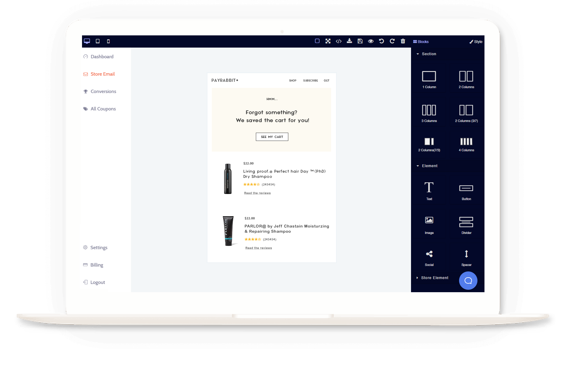
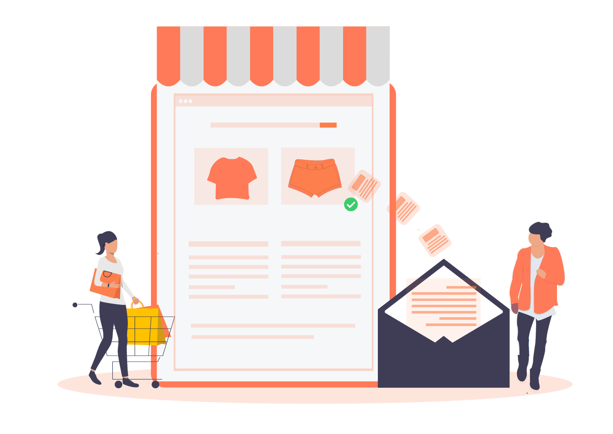
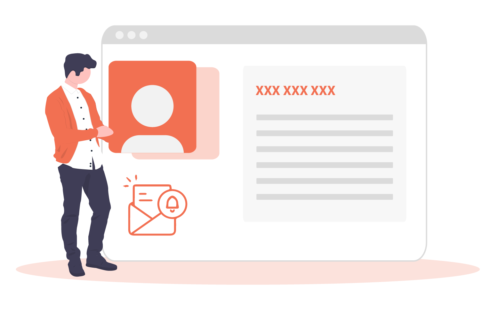

<container>

<headercontent>

# Power your Abandoned cart recovery emails!

Recover lost sales with the most powerful abandoned cart recovery app. Trigger cart recovery emails and motivate customers to buy cart instantly. 
 
<cta url="https://app.retainful.com" target="_blank" rel="noopener">Recover Cart for FREE</cta>

</headercontent>

</container>

<container>

## 1000+ Companies Trust us..

<row class="justify-content-center">

 

<column size="2">

</column>

<column size="2">

</column>

<column size="2">

</column>

</row>

</container>

 
 
 

<container>

<featurecontent featurebodysizeleft="6" featurebodysizerigth="6">

## Automatic email reminders

**Get started IMMEDIATELY with Retainful**

- No need to wait till you draft an email from the scratch! 
- Use drag and drop feature, no need to code. 
- Pre-built, responsive email templates gives insights about successful cart recovery emails with ample scope for customization.
- Starts sending emails after cart gets abandoned
- Stops sending emails after the cart gets recovered
- Plus a series of periodically timed automated emails can be automated
- Enable single-click cart recovery

Automation not just saves your time but gives room for a lot more marketing strategies to be explored.

</featurecontent>

<featurecontent featurebodysizeleft="6" featurebodysizerigth="6">

## Unlimited emails

Retainful offers you unlimited emails for abandoned cart recovery.
Here unlimited refers to both number of mails and designs.

-   You can send as many numbers of emails that you prefer to send for abandoned cart recovery.
    
-   You can design as many designs of emails to be sent.

 There is no cost per email.
Achieve a better outcome with abandoned cart recovery with unlimited number of emails that gives you the uninterrupted freedom to try out which works the best.

</featurecontent>

<featurecontent featurebodysizeleft="6" featurebodysizerigth="6">

## Well timed emails

Mails can be well-timed with this abandoned cart recovery app.
Boost sales using the benefits of well-timed emails because timely actions can reap you immense benefits like following.

-   Chances of your email getting noticed increases.
    
-   Increased chances of getting good responses.
    
-   A set number of emails has got the potential to result in increased conversions.

Figure out the optimal response yielding factors.

Experiment with numbers and time intervals that should be set for abandoned cart recovery. Thereby increase conversion rates for abandoned cart recovery by setting up well-timed emails.

</featurecontent>

<featurecontent featurebodysizeleft="6" featurebodysizerigth="6">

## Personalized reminders

Give the required attention to get back the same.

Create impressive designs along with a tinge of emotional connectivity to get responses for your reminders.

-   Identify your niche customers
    
-   Design unique mails for those particular customers
    
-   Send mails Personally

-   Witness increase in cart abandonment recovery conversion rates
    
-   Make customers respond quickly
    
-   Instill trust and emotional connectivity with customers

Humans like responding to human-like advances rather than a machine-generated pre-typed message. Moreover, it impacts psychologically and more people tend to respond.

</featurecontent>

<featurecontent featurebodysizeleft="6" featurebodysizerigth="6">

## Capture abandoned carts
It is important to make an effort to fetch data regarding all abandoned carts. 

Stay updated with your cart behavior and the stats related to it.

- Fetches data like the product abandoned by users. 
- Fetches data regarding the product details abandoned by all users.
- Fetches data regarding how many users abandoned how many products
This helps to measure your business growth.

</featurecontent>

</container>

<reviews></reviews>

<getstarted></getstarted>
