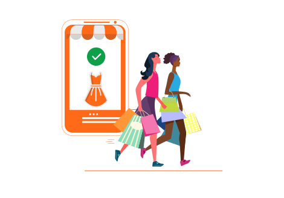
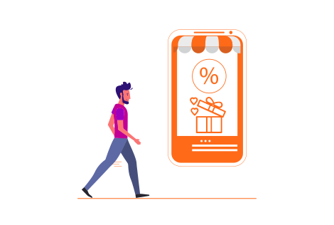
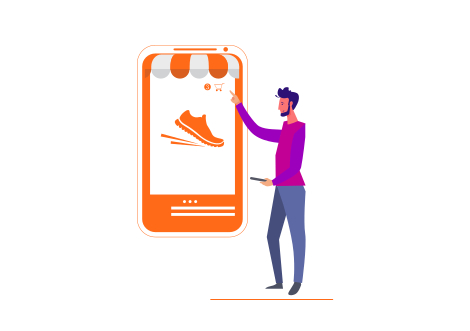

<container>

<headercontent className="container">

Start Recovering Abandoned Carts.    Grow Your Revenue 10x Times.

Retainful helps stores recover lost sales and drive revenue 10x times. Install Retainful to recover abandoned carts on your eCommerce store. Try it yourself now!
 
<cta url="https://app.retainful.com/?utm_source=landing_page&utm_medium=how_it_works&utm_campaign=recover_carts_for_free" target="_blank" rel="noopener">Recover Carts For FREE<feather-icon icon="arrow-right" /> </cta>

</headercontent>

</container>

<row class="align-items-center">
<column size="4">

<strong>Puneet Sahalot</strong>

Founder, IdeaBox Creations

</column>
<column size="8">

<h4>Works like a charm. Perfect for WooCommerce stores.
Retainful is easy to use with a useful UI. Provides a lot of functionality even with the free tier. "Next Order coupon" is a simple and good way to increase the conversions and bring back your customers</h4>

</column>
</row>

<container>

<row class="justify-content-center align-items-center">

<featurecontent featurebodysizeleft="6" featurebodysizerigth="6">

## Connect Your Store

Just install and connect your store with Retainful

<cta url="https://app.retainful.com/?utm_source=landing_page&utm_medium=how_it_works&utm_campaign=get_started_free" target="_blank" class="btn-action">Get started FREE</cta>

<h4>Shopify</h4>

<h4>WooCommerce</h4>

</featurecontent>

</row>

<featurecontent featurebodysizeleft="6" featurebodysizerigth="6">

## Customer abandons a cart

Retainful tracks abandoned carts automatically and captures the customer's email as soon as he enters.

</featurecontent>

<featurecontent featurebodysizeleft="6" featurebodysizerigth="6" orderleft="order-two" orderright="order-one">

## Cart Recovery email is sent automatically

Retainful sends a well-timed, series of emails with a unique link to recover the cart with a single click. Optionally include a coupon.

</featurecontent>

<featurecontent featurebodysizeleft="6" featurebodysizerigth="6">

## Customer recovers the cart & completes purchase

Customer is taken straight to the checkout with a single click and completes the purchase. Your lost sale is recovered!

 

</featurecontent>

</container>

## Next Order Coupon

<container>

<featurecontent featurebodysizeleft="6" featurebodysizerigth="6">

## Customer makes a purchase

Customers buys a product from your store successfully.

</featurecontent>

<featurecontent featurebodysizeleft="6" featurebodysizerigth="6" orderleft="order-two" orderright="order-one">

## Next Order Coupon is generated Automatically

Retainful generates a unique, single-use coupon for the next purchase of the customer. The coupon is included in the "Order notification email" itself.

</featurecontent>

<featurecontent featurebodysizeleft="6" featurebodysizerigth="6">

## Customer comes back & makes a repeat buy

Customer uses the coupon to make his next purchase successfully. And he can get a coupon for his successive purchase.

</featurecontent>

….. And the loop goes on to drive repeat sales on your store!

</container>

<getstarted></getstarted>